# Capitolo 5: SQL

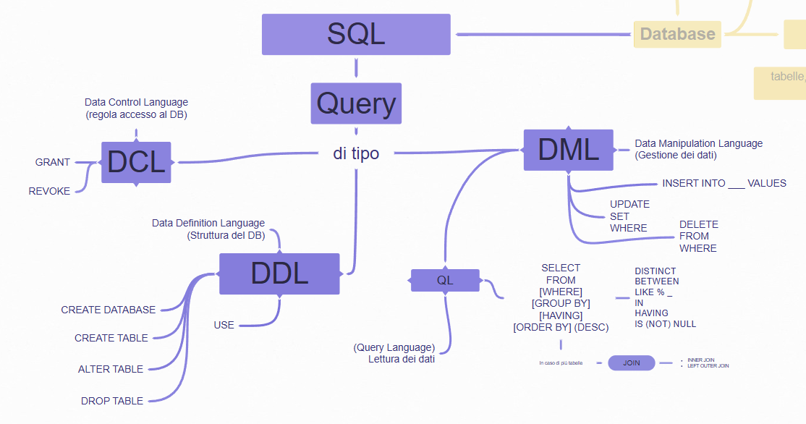
!!! abstract "Definizione"
    <u>Le informazioni su **SQL** contenute in questo libro sono ancora parziali.</u>  
    Per completezza fare riferimento alle ottime slide dell'università di Bologna disponibili a seguire:

    [**<u>Slide 1</u>**](https://drive.google.com/file/d/1yqo3n4jHloZoZ_j3iBXVfbvFmZHeyPNg/view?usp=sharing): query di base: SELECT su una tabella, inserimento, modifica, eliminazione dati. Creazione tabella, vincoli.

    [**<u>Slide 2</u>**](https://drive.google.com/file/d/19rJMPqwjMeIScPbN_iORktVVyr9pTClO/view?usp=sharing): query SELECT su più tabelle: la clausola JOIN

    [**<u>Slide 3</u>**](https://drive.google.com/file/d/1sNDEyhU5ZuyKGHzvcdvnJjSG257LvHQq/view?usp=sharing): Funzioni di aggregazione (MAX,MIN..) , raggruppamento (GROUP BY e HAVING) e viste.

!!! abstract "Definizione"
    **SQL (Structured Query Language)** è un linguaggio utilizzato per comunicare con i database relazionali

SQL si pronuncia nominando le tre lettere ("Essecuelle" in italiano, "Ess-Cue-Ell" in inglese), è diffusa anche la pronuncia non-standard "Siquel".

Il linguaggio SQL è riconosciuto dalla maggior parte dei DBMS relazionali, anche se possono esserci delle leggere differenze (si parla di dialetti).

**Curiosità:** Esistono altre tipologie di database che lavorano con un linguaggio diverso. Sono detti linguaggi NoSQL. Non verranno trattati in questo testo

!!! abstract "Definizione"
    In SQL ogni richiesta, o interrogazione, che facciamo al database si chiama **query.  
    **Le parole chiave del linguaggio vengono solitamente chiamate **clausole.**

Le possibili query sono di inserimento, modifica, eliminazione, selezione dati, ecc…

!!! info "Sintassi - Le query in SQL"
    **Le query in SQL:**

    - **Non sono case-sensitive  
      **non distinguono maiuscole e minuscole. Scriveremo sempre i comandi di SQL in maiuscolo per facilità di lettura

    - **Non distinguono quando andiamo a capo  
      **Volendo potremmo scrivere query in una sola riga**.** Scriveremo query su più righe con una forma specifica per facilità di lettura

    - **Terminano con un punto e virgola  
      **In fondo ad una query SQL dobbiamo sempre inserire il punto e virgola per informare l'interprete che abbiamo terminato la nostra query.

    **Commenti:**

    In SQL vengono accettati due tipi di commento:

    - quello su una sola linea, preceduto da due trattini -- e uno spazio;

    - quello su più linee, anticipato da /\* (sulla linea di inizio) e seguito da \*/ sulla linea di fine

    **Esempio:**

    ```sql
    -- Esempio di commento in una linea all'interno di una query
    SELECT
    FROM libri
    WHERE anno=2010;
    ```

    /\* esempio di commento su più linee.  
    Questo commento termina  
    soltanto quando lo chiudiamo \*/
<!-- REVIEW: tipo di box da confermare --></th>
</tr>
</thead>
<tbody>
</tbody>
</table>

## Le categorie di istruzioni SQL 

Nei database relazionali, ci sono tre categorie principali di query SQL, ognuna delle quali ha un ruolo specifico:

- **DDL (Data Definition Language)** si occupa della definizione e della struttura dei dati, inclusa la creazione e la modifica di tabelle e oggetti di definizione dei dati.

- **DML (Data Manipulation Language)** si concentra sulla manipolazione dei dati, come l'inserimento, l'aggiornamento, l'eliminazione e il recupero dei dati da tabelle.

- **DCL (Data Control Language)** gestisce le autorizzazioni degli utenti e il controllo dell'accesso ai dati.

### DDL (Data Definition Language):

!!! abstract "Definizione"
    I comandi DDL sono quelli che servono per **definire la struttura** del database.**  
    **  
    Con questi comandi creiamo, modifichiamo, eliminiamo database e tabelle.

Le query che appartengono a questa categoria sono:  
  
**Query di gestione database**

- CREATE DATABASE - Creazione database

- USE - Selezione del database

- DROP DATABASE - Eliminazione database

**Query di gestione tabelle**

- CREATE TABLE - Creazione tabella

- ALTER TABLE - Modifica struttura tabella

- DROP TABLE - Eliminazione tabella

#### Operazioni su database 

!!! info "Sintassi - Creare un database"
    **Creare un database**  
    La query per creare un database è molto semplice:

    ```sql
    CREATE DATABASE nomedatabase;
    ```
<p>dove nome_database è il nome che vogliamo dare al db.</p></th>
</tr>
<tr class="odd">
<th></th>
<th><p>Se ad esempio volessi creare un database dal nome dbscuola scriverei</p>
```sql
CREATE DATABASE dbscuola;
```</th>
</tr>
</thead>
<tbody>
</tbody>
</table>

!!! abstract "Definizione"
    **Entrare nel database**  
    Per entrare nel database si utilizza la clausola USE

    ```sql
    USE nomedatabase;
    ```</th>
</tr>
<tr class="odd">
<th></th>
<th><p><strong>Eliminare un database</strong><br />
Per eliminare completamente un database si utilizza la query DROP DATABASE</p>
```sql
DROP DATABASE nomedatabase;
```
<p><u><br />
Cautela nell'utilizzare le query di eliminazione! Se la eseguite per sbaglio rischiate di perdere tutti i dati!</u></p></th>
</tr>
</thead>
<tbody>
</tbody>
</table>

#### Operazioni su tabella

##### Creazione di una tabella

!!! info "Sintassi"
    Per creare una tabella la sintassi generica è

    ```sql
    CREATE TABLE nometabella (
    ```

    nome_colonna1 tipo_dato1 vincoli,  
    nome_colonna2 tipo_dato2 vincoli,  
    ...  

    ```sql
    PRIMARY KEY (unaopiucolonne),
    FOREIGN KEY (chiaveesterna) REFERENCES altratabella (chiaveprimaria)
    );
    ```
<p>Dove:</p>
<ul>
<li><blockquote>
<p><em><strong>nome_colonna</strong></em> è il nome del campo e deve rispettare i vincoli di nomenclatura delle colonne, come descritto nel capitolo <a href="?tab=t.mp0ry8whb25s#heading=h.d21fs4ehlge4"><u>proprietà dei campi</u></a>.</p>
</blockquote></li>
<li><blockquote>
<p><strong><em>tipo_dato</em> è uno dei tipi dato in MySQL</strong>. Vedi <a href="?tab=t.offmuplevmbe"><u>tipi di dato</u></a> nella sezione MySQL</p>
</blockquote></li>
<li><blockquote>
<p><strong>I vincoli sono opzionali</strong>. Alcuni dei più comuni sono</p>
</blockquote>
<ul>
<li><blockquote>
<p><strong>NOT NULL</strong> per indicare che quel campo non può essere NULL, ovvero è un campo obbligatorio (se questo vincolo non è specificato il campo non è obbligatorio)</p>
</blockquote></li>
<li><blockquote>
<p><strong>UNIQUE</strong> identifica un campo i cui valori sono uno diverso dall’altro. Se si tenta di aggiungere un record con lo stesso valore, MySQL genera un errore</p>
</blockquote></li>
<li><blockquote>
<p><strong>AUTO_INCREMENT (</strong>modificatore di tipo numerico) permette di creare un campo numerico che aumenta il suo valore ad ogni nuova riga</p>
</blockquote></li>
<li><blockquote>
<p><strong>DEFAULT</strong> imposta un valore predefinito nel caso il campo fosse lasciato vuoto</p>
</blockquote></li>
</ul></li>
<li><blockquote>
<p><strong>PRIMARY KEY</strong> si usa per specificare quale (o quali) campo rappresenta la chiave primaria. <u>Deve sempre esserci ed è sempre unica!</u> Non possono esserci due PRIMARY KEY in una tabella</p>
</blockquote></li>
<li><blockquote>
<p><strong>FOREIGN KEY</strong> si usa per indicare una chiave esterna, indicando anche a quale chiave_primaria di quale tabella fa riferimento. Può non esserci, possono anche essercene più di una.<br />
La <strong>FOREIGN KEY</strong> è responsabile del vincolo di integrità referenziale, vedi box successivo</p>
</blockquote></li>
</ul></th>
</tr>
</thead>
<tbody>
</tbody>
</table>

!!! example "Esempio 1"
    **Esempio 1  
    **Creiamo due tabelle che seguono il seguente schema relazionale.  
    **AUTORI**(<u>ID</u>, Nome, Cognome, DataNascita)

    **LIBRI**(<u>ISBN</u>, Titolo, AnnoPubblicazione, ID_Autore\*)

    Notiamo che la tabella **Libri ha una chiave esterna** ID_Autore che punta alla chiave primaria ID della tabella Autori. Per questo motivo **è fondamentale creare prima la tabella Autori**

    ```sql
    CREATE TABLE Autori (
    ```

    ID INT AUTO_INCREMENT,  
    Nome VARCHAR(60) NOT NULL,  
    Cognome VARCHAR(60) NOT NULL,  
    DataNascita DATE,  

    ```sql
    PRIMARY KEY (ID)
    );
    ```

    ```sql
    CREATE TABLE Libri (
    ```

    ISBN VARCHAR(20) NOT NULL,  
    Titolo VARCHAR(100) NOT NULL,  
    AnnoPubblicazione YEAR,  
    ID_Autore INT,  

    ```sql
    PRIMARY KEY (ISBN),
    FOREIGN KEY (IDAutore) REFERENCES Autori (ID)
    );
    ```
<p><strong>N.B. DataNascita, AnnoPubblicazione e id_autore sono campi opzionali</strong> perché non hanno il vincolo NOT NULL</p></th>
</tr>
</thead>
<tbody>
</tbody>
</table>

!!! example "Esempio 2 ("
    **Esempio 2 (**Tabella relazione molti a molti: **chiave primaria composta** e **due chiavi esterne**.)

    **AUTORI**(<u>cod_autore</u>, Nome, Cognome)

    **LIBRI**(<u>cod_libro</u>, Titolo)

    **LIBRI_AUTORI**(<u>cod_libro\*, cod_autore\*</u>)

    ```sql
    CREATE TABLE Libri (
    ```

    cod_libro CHAR(16) NOT NULL,  
    titolo VARCHAR(100) NOT NULL,  

    ```sql
    PRIMARY KEY (codlibro)
    );
    ```

    ```sql
    CREATE TABLE Autori (
    ```

    cod_autore CHAR(10) NOT NULL,  
    nome VARCHAR(60) NOT NULL,  
    cognome VARCHAR(60) NOT NULL,  

    ```sql
    PRIMARY KEY (codautore)
    );
    ```

    ```sql
    CREATE TABLE LibriAutori (
    ```

    cod_libro CHAR(16) NOT NULL,  
    cod_autore CHAR(10) NOT NULL,  

    ```sql
    PRIMARY KEY (codlibro, codautore),
    FOREIGN KEY (codlibro) REFERENCES Libri(codlibro),
    FOREIGN KEY (codautore) REFERENCES Autori(codautore)
    );
    ```</th>
</tr>
</thead>
<tbody>
</tbody>
</table>

!!! abstract "Definizione"
    ##### I vincoli di integrità referenziale in SQL

    Abbiamo già definito i [<u>vincoli di integrità referenziale</u>](?tab=t.mp0ry8whb25s#heading=h.u0otxt2tap6s) nella parte generale nei database. Durante la creazione delle tabelle è il vincolo di FOREIGN KEY a garantire l'integrità referenziale:

    Un valore inserito in un campo chiave esterna **deve trovare corrispondenza nel campo chiave primaria** della tabella a cui fa riferimento.

    Cosa succede se il record a cui fa riferimento viene eliminato?

    **Per capirlo, riprendiamo l'esempio dei libri degli autori.**

    Sono <u>state evidenziate le chiavi esterne e le chiavi primarie corrispondenti</u>  
    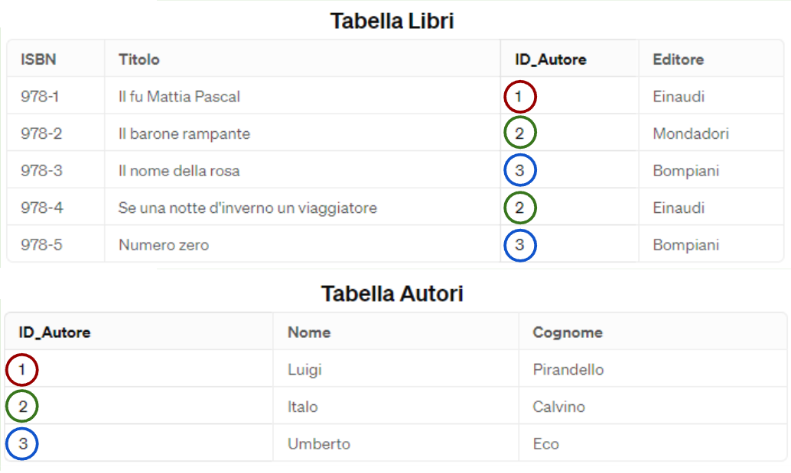

    Cosa succede <u>se proviamo ad eliminare l'autore Luigi Pirandello</u> che ha dei record collegati??

    Il DBMS deve decidere che azione compiere. Le possibilità sono tre:

    1.  **Impedire l'eliminazione**, è l'impostazione di default: **RESTRICT**

    2.  **Eliminare a cascata** anche i libri di quell'autore: **CASCADE**

    3.  **Perdere il riferimento all'autore**, il libro avrà null come chiave esterna: **SET NULL**

    Questa scelta si realizza nella creazione tabella, specificando il comportamento della FOREIGN KEY:

    ```sql
    FOREIGN KEY (IDAutore) REFERENCES Autori (ID)
    ON DELETE \\\ --qui scegliete tra RESTRICT, CASCADE, SET NULL
    ```
<p>Se non specifichiamo il comportamento ON DELETE, in automatico prende RESTRICT.</p>
<p>Lo stesso concetto si replica anche per la modifica. Se cambiamo l'id di Pirandello possiamo scegliere le stesse opzioni:</p>
<ul>
<li><blockquote>
<p><strong>Impedire la modifica</strong>, è l'impostazione di default: <strong>NO ACTION</strong></p>
</blockquote></li>
<li><blockquote>
<p><strong>Modificare a cascata</strong> il riferimento all'autore: <strong>CASCADE</strong></p>
</blockquote></li>
<li><blockquote>
<p><strong>Perdere il riferimento all'autore</strong>, il libro avrà null come chiave esterna: <strong>SET NULL</strong></p>
</blockquote></li>
</ul>
```sql
FOREIGN KEY (IDAutore) REFERENCES Autori (ID)
ON UPDATE \1\1 --qui scegliete tra NO ACTION, CASCADE, SET NULL
```
<p>Se non specifichiamo il comportamento ON UPDATE, in automatico prende RESTRICT.</p>
<p>Si possono anche combinare, scegliendo i due comportamenti. Un esempio potrebbe essere:</p>
```sql
FOREIGN KEY (IDAutore) REFERENCES Autori (ID)
ON DELETE NO ACTION
ON UPDATE CASCADE
```</th>
</tr>
</thead>
<tbody>
</tbody>
</table>

!!! info "Sintassi - Eliminazione di una tabella"
    **Eliminazione di una tabella**

    Per eliminare una tabella la query generica è

    ```sql
    DROP TABLE nometabella;
    ```
<p><mark>⚠️</mark>Attenzione! I comandi di eliminazione vanno utilizzati con attenzione. Eliminando una tabella perdete anche tutti i dati al suo interno</p></th>
</tr>
</thead>
<tbody>
</tbody>
</table>

!!! info "Sintassi - Modifica della struttura di una tabella"
    **Modifica della struttura di una tabella**

    Per modificare la struttura di una tabella la query generica è

    ```sql
    ALTER TABLE nometabella
    ```

    OPERAZIONE;
<p>Dove in OPERAZIONE possiamo aggiungere/rimuovere/modificare colonne, rinominare la tabella. Vediamole nel dettaglio</p>
<p><strong>Aggiungere una colonna</strong></p>
!!! abstract "Definizione"

    ```sql
    ALTER TABLE nometabella
    ```

    ADD nome_colonna tipo_dato;
<p><strong>Rimuovere una colonna</strong></p>
```sql
ALTER TABLE nometabella
DROP COLUMN nomecolonna;
```
<p><strong>Modificare una colonna</strong></p>
!!! abstract "Definizione"

    ```sql
    ALTER TABLE nometabella
    ```

    MODIFY COLUMN nome_colonna nuovo_tipo_dato;
<p><strong>Rinominare la tabella</strong></p>
!!! abstract "Definizione"

    ```sql
    ALTER TABLE nometabella
    ```

    RENAME TO nuovo_nome_tabella;</th>
</tr>
</thead>
<tbody>
</tbody>
</table>

### DML (Data Manipulation Language):

!!! abstract "Definizione"
    I comandi DML vengono utilizzati per **manipolare i dati all'interno del database**. Questi comandi consentono di inserire, aggiornare, eliminare e recuperare dati da una tabella.

Fanno parte di questa categoria le query

- **INSERT INTO**: per inserire nuove tuple nel DB.

- **UPDATE**: per modificare le tuple del DB.

- **SELECT**: per eseguire interrogazioni sul DB.

- **DELETE FROM**: per cancellare tuple da DB.

#### Inserimento dati in tabella

!!! info "Sintassi - Inserire dati in una tabella"
    **Inserire dati in una tabella**  
    Per inserire dati in una tabella in MySQL, si utilizza la query **INSERT INTO**. Ecco la sintassi generica:

    ```sql
    INSERT INTO nometabella (colonna1, colonna2, ...) VALUES (valore1, valore2, ...);
    ```
<p>dove:</p>
<ul>
<li><blockquote>
<p>(colonna1,colonna2, …) è l'elenco delle colonne della tabella</p>
</blockquote></li>
<li><blockquote>
<p>(valore1, valore2, …) sono i diversi campi della riga che vogliamo inserire</p>
</blockquote></li>
</ul>
<p><strong>Inserimento multiplo</strong></p>
<p>Se volessi inserire più righe in una singola query, queste <strong>si separano con una virgola</strong>. <u>Si termina la query con un <strong>;</strong></u></p>
!!! abstract "Definizione"

    ```sql
    INSERT INTO nometabella (colonna1, colonna2, ...) VALUES (valore1, valore2, ...),
    ```

    (secondovalore1, secondovalore2, ...),

    (terzovalore1, terzovalore2, ...) ;</th>
</tr>
<tr class="odd">
<th></th>
<th><p>Per l'inserimento di un libro potremmo eseguire la query:</p>
```sql
INSERT INTO Libri (ISBN, Titolo, AnnoPubblicazione, IDAutore) VALUES ('978-1234567890', 'Il Nome del Vento', 2007, 1);
```
<p>Per l'inserimento di più libri contemporaneamente potremmo eseguire la query:</p>
!!! abstract "Definizione"

    ```sql
    INSERT INTO Libri (ISBN, Titolo, AnnoPubblicazione, IDAutore) VALUES
    ```

    ('978-1234567890', 'Il Nome del Vento', 2007, 1),  
    ('978-0987654321', 'La Paura del Saggio', 2011, 1),  
    ('978-1112131415', 'Le Porte di Pietra', 2023, 1);</th>
</tr>
</thead>
<tbody>
</tbody>
</table>

!!! abstract "Definizione"
    Ipotizziamo di avere una tabella Impiegati in cui realizzare un inserimento

    ```sql
    INSERT INTO Impiegati (ID, Nome, DataAssunzione, Salario) VALUES
    ```

    (1, 'Mario Rossi', '2021-05-01', 30000.25),  
    (2, 'Luca Bianchi', NULL, 28000.55),  
    (3, 'Giulia Verdi', '2022-03-15', NULL);
<p><strong>Osserviamo:</strong></p>
<ul>
<li><blockquote>
<p><strong>Le stringhe e le date si mettono tra apici (o virgolette)<br />
</strong>Va bene anche "Mario Rossi", ma attenzione a non mettere le virgolette ai numeri!</p>
</blockquote></li>
<li><blockquote>
<p><strong>NULL nei campi opzionali<br />
</strong>Se un campo opzionale non ha il valore si inserisce NULL (senza virgolette!). NULL è il valore che MySQL utilizza per i campi vuoti.</p>
</blockquote></li>
<li><blockquote>
<p><strong>Numeri con la virgola<br />
</strong>Il campo Salario della tabella è un DECIMAL(7,2).<br />
L'inserimento di un numero con la virgola si fa utilizzando il punto!<br />
Mi raccomando: la notazione americana usa il punto al posto della virgola per i numeri.</p>
</blockquote></li>
</ul></th>
</tr>
</thead>
<tbody>
</tbody>
</table>

!!! info "Sintassi - Caso speciale - Inserimento con campo AUTO_INCREMENT"
    **Caso speciale - Inserimento con campo AUTO_INCREMENT**

    Supponiamo di avere la tabella impiegati come segue:

    **ID** **Nome** **DataAssunzione** **Salario** 1 Mario Rossi 2021-05-01 30000.25 2 Luca Bianchi NULL 28000.55 3 Giulia Verdi 2022-03-15 NULL 4 Anna Neri 2020-11-20 32000.00 5 Paolo Conti 2019-06-10 35000.75 6 Sara Galli NULL 27000.00
<!-- REVIEW: tipo di box da confermare -->
<p>La query di inserimento sarebbe:</p>
!!! abstract "Definizione"

    ```sql
    INSERT INTO Impiegati (ID, Nome, DataAssunzione, Salario) VALUES
    ```

    (1, 'Mario Rossi', '2021-05-01', 30000.25),  
    (2, 'Luca Bianchi', NULL, 28000.55),  
    (3, 'Giulia Verdi', '2022-03-15', NULL);
<p>Ma se la colonna ID è stata creata con il vincolo AUTO_INCREMENT, <strong>non dobbiamo inserire noi il campo ID. Facciamo direttamente:</strong></p>
!!! abstract "Definizione"

    ```sql
    INSERT INTO Impiegati (Nome, DataAssunzione, Salario) VALUES
    ```

    ('Mario Rossi', '2021-05-01', 30000.25),  
    ('Luca Bianchi', NULL, 28000.55),  
    ('Giulia Verdi', '2022-03-15', NULL);</th>
</tr>
</thead>
<tbody>
</tbody>
</table>

#### Eliminazione dati in tabella

!!! info "Sintassi - Eliminare i dati già presenti"
    **Eliminare i dati già presenti**  
    Per eliminare record da una tabella in MySQL, si utilizza la clausola **DELETE**. Ecco la sintassi generica:

    ```sql
    DELETE FROM nometabella
    WHERE condizione;
    ```
<p>dove la condizione dobbiamo inserire il requisito a cui il record deve rispondere per essere cancellato. Per le condizioni vedi <a href="#le-condizioni-nel-where"><u>Le condizioni possibili nel WHERE</u></a></p>
<p><mark>⚠️</mark><strong>Attenzione!</strong> I comandi di eliminazione vanno utilizzati con attenzione. Eseguendo questa query <strong>verranno eliminati tutti i record</strong> che rispondono al requisito</p></th>
</tr>
<tr class="odd">
<th></th>
<th><p>Questa query elimina dalla tabella libri la riga in cui ISBN ha quel valore</p>
```sql
DELETE FROM Libri
WHERE ISBN = '978-1234567890';
```
<p>Dato che ISBN è chiave primaria della tabella sappiamo che verrà eliminata una sola riga.</p>
<p>Questa query elimina dalla tabella libri i record in cui l'Annopubblicazione è minore di 2000.</p>
```sql
DELETE FROM Libri
WHERE AnnoPubblicazione \< 2000;
```
<p>Non conosciamo i dati all'interno della tabella, ma probabilmente ci saranno diversi record che rispettano il requisito. Tutti quei record verranno eliminati!</p></th>
</tr>
</thead>
<tbody>
</tbody>
</table>

#### Modifica dati in tabella

!!! info "Sintassi - Modificare i dati già presenti"
    **Modificare i dati già presenti**  
    Per modificare record da una tabella in MySQL, si utilizza la clausola **UPDATE**. Ecco la sintassi generica:

    ```sql
    UPDATE nometabella
    SET colonna = valore
    WHERE condizione;
    ```
<p>dove:</p>
<ul>
<li><blockquote>
<p><strong>in SET</strong> si specifica i campi del record che bisogna cambiare e quale è il nuovo valore da impostare</p>
</blockquote></li>
<li><blockquote>
<p><strong>nel WHERE</strong> dobbiamo inserire i requisiti a cui il record deve rispondere per essere modificato. Vedi il capitolo <a href="#le-condizioni-nel-where"><u>Le condizioni possibili nel WHERE</u></a></p>
</blockquote></li>
</ul>
<p><mark>⚠️</mark><strong>Attenzione!</strong> I comandi di modifica vanno utilizzati con attenzione. Eseguendo questa query <strong>verranno modificati tutti i record</strong> che rispondono al requisito</p>
<p>È possibile cambiare anche più colonne contemporaneamente. In tal caso scriveremo:</p>
```sql
UPDATE nometabella
SET colonna1 = valore1, colonna2=valore2, colonna3=valore3
WHERE condizione;
```</th>
</tr>
<tr class="odd">
<th></th>
<th><p>Questa query modifica il titolo delle righe della tabella in cui ISBN ha quel valore</p>
```sql
UPDATE Libri
SET Titolo = 'Il Nome del Vento - Edizione Aggiornata'
WHERE ISBN = '978-1234567890';
```
<p>Dato che ISBN è chiave primaria della tabella sappiamo che verrà modificata una sola riga. A quel dato verrà cambiato il titolo.</p>
<p>Questa query modifica contemporaneamente Titolo, annopubblicazione e autore</p>
```sql
UPDATE Libri
SET Titolo = 'Nuovo Titolo del Libro', AnnoPubblicazione = 2024, IDAutore = 2
WHERE ISBN = '978-1234567890';
```
<p>Questa query mette i libri più vecchi dell'anno 2000 in sconto all'80% del prezzo di partenza</p>
```sql
UPDATE Libri
SET Prezzo = Prezzo \ 80 / 100
WHERE AnnoPubblicazione \< 2000;
```
<p>Notiamo che:</p>
<ul>
<li><blockquote>
<p><strong>All'interno delle query è possibile utilizzare delle formule.</strong><br />
Come per gli altri linguaggi di programmazione il valore a destra viene valutato e salvato sul campo a sinistra.<br />
<em>In questo caso impostiamo il prezzo all'80% del prezzo di partenza.</em></p>
</blockquote></li>
<li><blockquote>
<p><strong>Questa query coinvolge più di un record.<br />
</strong>Presumibilmente avremo più record con AnnoPubblicazione &lt;2000. Questa query coinvolgerà tutti quei record</p>
</blockquote></li>
</ul></th>
</tr>
</thead>
<tbody>
</tbody>
</table>

#### Selezione dati da tabella

Una funzionalità fondamentale dei database è data dalla possibilità di estrarre i dati dalle tabelle in diversi modi secondo le nostre esigenze.

Tale è l'importanza e la vastità dell'argomento che verrà svolto in un capitolo dedicato. Vedi [<u>Le query SELECT</u>](#le-query-select) più avanti.

### DCL (Data Control Language):

!!! abstract "Definizione"
    I comandi DCL sono utilizzati per **gestire le autorizzazioni e i privilegi degli utenti nel database**. Questi comandi consentono di concedere o revocare autorizzazioni specifiche per l'accesso ai dati.

    Con privilegi in SQL si intende ciò che l'utente ha l'autorizzazione a fare. Esempio: il privilegio di fare le SELECT.

Per stabilire cosa l'utente può fare si utilizzano le query GRANT e REVOKE:

- GRANT: Per concedere autorizzazioni agli utenti o ai ruoli.

- REVOKE: Per revocare autorizzazioni precedentemente concesse.

La creazione di utenti e la personalizzazione degli accessi al database è alla base della segregazione e della sicurezza dei dati: ogni utente può visualizzare **esclusivamente** i dati cui ha diritto per il suo ruolo.

#### Creazione utente

!!! info "Sintassi"
    Per creare un utente si utilizza la query

    **CREATE USER nomeutente IDENTIFIED BY password;**  

    (queste sono solo le opzioni base. Per tutte le altre opzioni potete vedere la [<u>documentazione</u>](https://dev.mysql.com/doc/refman/8.0/en/create-user.html))  

    L'operazione di creazione può essere fatta solo da un amministratore o da un utente che ha i permessi per farlo

#### Concedere autorizzazioni

In SQL parliamo di garantire dei privilegi, ovvero dare delle autorizzazioni. Si fa con la query GRANT. La può fare l'amministratore o utenti a cui è stata concessa l'autorizzazione a farlo.

!!! info "Sintassi"
    Per stabilire cosa l'utente può fare si usano le query GRANT .

    **GRANT \*privilegi\* ON \*database.tabella\* TO \*utente\***  
    dove:

    - ***\*privilegi\*:* si mette la lista di quali query l'utente può eseguire**. Esempio, possiamo garantire la sola SELECT e nient'altro, oppure creare tabelle. Possiamo fare GRANT ALL PRIVILEGES per dare tutti i privilegi

    - ***\*database.tabella*\*: stabiliamo su quali tabelle diamo questo privilegio.** Ad esempio potremmo dire ON dbscuola.\* per indicare che ha i privilegi su tutte le tabelle del database dbscuola

    - *\*utente\*:* **a quale utente o ruolo diamo questo privilegio.**

    **Esempio:**

    **GRANT ALL PRIVILEGES ON dbscuola.\* TO utente2**

    Diamo tutti i privilegi all'utente con username utente2 sul database dbscuola

#### Rimuovere autorizzazioni

Per rimuovere l'autorizzazione si usa la query REVOKE che usa una sintassi simile al GRANT

!!! abstract "Definizione"
    La sintassi della query REVOKE è

    **REVOKE \*privilegi\* ON \*database.tabella\* FROM \*utente\*;**

    *(N.B. C'è FROM invece che TO)*

!!! info "Sintassi - Approfondimento - lista di tutti i privilegi"
    **Approfondimento - lista di tutti i privilegi**

    Non sono da memorizzare, sono lasciati qui come riferimento. [<u>Documentazione completa</u>](https://dev.mysql.com/doc/refman/8.0/en/grant.html#grant-overview)

    **Privilegio** **Cosa può fare l'utente** [<u>ALL \[PRIVILEGES\]</u>](https://dev.mysql.com/doc/refman/8.0/en/privileges-provided.html#priv_all) Grant all privileges at specified access level except [<u>GRANT OPTION</u>](https://dev.mysql.com/doc/refman/8.0/en/privileges-provided.html#priv_grant-option) and [<u>PROXY</u>](https://dev.mysql.com/doc/refman/8.0/en/privileges-provided.html#priv_proxy). [<u>ALTER</u>](https://dev.mysql.com/doc/refman/8.0/en/privileges-provided.html#priv_alter) Enable use of [<u>ALTER TABLE</u>](https://dev.mysql.com/doc/refman/8.0/en/alter-table.html). Levels: Global, database, table. [<u>ALTER ROUTINE</u>](https://dev.mysql.com/doc/refman/8.0/en/privileges-provided.html#priv_alter-routine) Enable stored routines to be altered or dropped. Levels: Global, database, routine. [<u>CREATE</u>](https://dev.mysql.com/doc/refman/8.0/en/privileges-provided.html#priv_create) Enable database and table creation. Levels: Global, database, table. [<u>CREATE ROLE</u>](https://dev.mysql.com/doc/refman/8.0/en/privileges-provided.html#priv_create-role) Enable role creation. Level: Global. [<u>CREATE ROUTINE</u>](https://dev.mysql.com/doc/refman/8.0/en/privileges-provided.html#priv_create-routine) Enable stored routine creation. Levels: Global, database. [<u>CREATE TABLESPACE</u>](https://dev.mysql.com/doc/refman/8.0/en/privileges-provided.html#priv_create-tablespace) Enable tablespaces and log file groups to be created, altered, or dropped. Level: Global. [<u>CREATE TEMPORARY TABLES</u>](https://dev.mysql.com/doc/refman/8.0/en/privileges-provided.html#priv_create-temporary-tables) Enable use of [<u>CREATE TEMPORARY TABLE</u>](https://dev.mysql.com/doc/refman/8.0/en/create-table.html). Levels: Global, database. [<u>CREATE USER</u>](https://dev.mysql.com/doc/refman/8.0/en/privileges-provided.html#priv_create-user) Enable use of [<u>CREATE USER</u>](https://dev.mysql.com/doc/refman/8.0/en/create-user.html), [<u>DROP USER</u>](https://dev.mysql.com/doc/refman/8.0/en/drop-user.html), [<u>RENAME USER</u>](https://dev.mysql.com/doc/refman/8.0/en/rename-user.html), and [<u>REVOKE ALL PRIVILEGES</u>](https://dev.mysql.com/doc/refman/8.0/en/revoke.html). Level: Global. [<u>CREATE VIEW</u>](https://dev.mysql.com/doc/refman/8.0/en/privileges-provided.html#priv_create-view) Enable views to be created or altered. Levels: Global, database, table. [<u>DELETE</u>](https://dev.mysql.com/doc/refman/8.0/en/privileges-provided.html#priv_delete) Enable use of [<u>DELETE</u>](https://dev.mysql.com/doc/refman/8.0/en/delete.html). Level: Global, database, table. [<u>DROP</u>](https://dev.mysql.com/doc/refman/8.0/en/privileges-provided.html#priv_drop) Enable databases, tables, and views to be dropped. Levels: Global, database, table. [<u>DROP ROLE</u>](https://dev.mysql.com/doc/refman/8.0/en/privileges-provided.html#priv_drop-role) Enable roles to be dropped. Level: Global. [<u>EVENT</u>](https://dev.mysql.com/doc/refman/8.0/en/privileges-provided.html#priv_event) Enable use of events for the Event Scheduler. Levels: Global, database. [<u>EXECUTE</u>](https://dev.mysql.com/doc/refman/8.0/en/privileges-provided.html#priv_execute) Enable the user to execute stored routines. Levels: Global, database, routine. [<u>FILE</u>](https://dev.mysql.com/doc/refman/8.0/en/privileges-provided.html#priv_file) Enable the user to cause the server to read or write files. Level: Global. [<u>GRANT OPTION</u>](https://dev.mysql.com/doc/refman/8.0/en/privileges-provided.html#priv_grant-option) Enable privileges to be granted to or removed from other accounts. Levels: Global, database, table, routine, proxy. [<u>INDEX</u>](https://dev.mysql.com/doc/refman/8.0/en/privileges-provided.html#priv_index) Enable indexes to be created or dropped. Levels: Global, database, table. [<u>INSERT</u>](https://dev.mysql.com/doc/refman/8.0/en/privileges-provided.html#priv_insert) Enable use of [<u>INSERT</u>](https://dev.mysql.com/doc/refman/8.0/en/insert.html). Levels: Global, database, table, column. [<u>LOCK TABLES</u>](https://dev.mysql.com/doc/refman/8.0/en/privileges-provided.html#priv_lock-tables) Enable use of [<u>LOCK TABLES</u>](https://dev.mysql.com/doc/refman/8.0/en/lock-tables.html) on tables for which you have the [<u>SELECT</u>](https://dev.mysql.com/doc/refman/8.0/en/select.html) privilege. Levels: Global, database. [<u>PROCESS</u>](https://dev.mysql.com/doc/refman/8.0/en/privileges-provided.html#priv_process) Enable the user to see all processes with [<u>SHOW PROCESSLIST</u>](https://dev.mysql.com/doc/refman/8.0/en/show-processlist.html). Level: Global. [<u>PROXY</u>](https://dev.mysql.com/doc/refman/8.0/en/privileges-provided.html#priv_proxy) Enable user proxying. Level: From user to user. [<u>REFERENCES</u>](https://dev.mysql.com/doc/refman/8.0/en/privileges-provided.html#priv_references) Enable foreign key creation. Levels: Global, database, table, column. [<u>RELOAD</u>](https://dev.mysql.com/doc/refman/8.0/en/privileges-provided.html#priv_reload) Enable use of [<u>FLUSH</u>](https://dev.mysql.com/doc/refman/8.0/en/flush.html) operations. Level: Global. [<u>REPLICATION CLIENT</u>](https://dev.mysql.com/doc/refman/8.0/en/privileges-provided.html#priv_replication-client) Enable the user to ask where source or replica servers are. Level: Global. [<u>REPLICATION SLAVE</u>](https://dev.mysql.com/doc/refman/8.0/en/privileges-provided.html#priv_replication-slave) Enable replicas to read binary log events from the source. Level: Global. [<u>SELECT</u>](https://dev.mysql.com/doc/refman/8.0/en/privileges-provided.html#priv_select) Enable use of [<u>SELECT</u>](https://dev.mysql.com/doc/refman/8.0/en/select.html). Levels: Global, database, table, column. [<u>SHOW DATABASES</u>](https://dev.mysql.com/doc/refman/8.0/en/privileges-provided.html#priv_show-databases) Enable [<u>SHOW DATABASES</u>](https://dev.mysql.com/doc/refman/8.0/en/show-databases.html) to show all databases. Level: Global. [<u>SHOW VIEW</u>](https://dev.mysql.com/doc/refman/8.0/en/privileges-provided.html#priv_show-view) Enable use of [<u>SHOW CREATE VIEW</u>](https://dev.mysql.com/doc/refman/8.0/en/show-create-view.html). Levels: Global, database, table. [<u>SHUTDOWN</u>](https://dev.mysql.com/doc/refman/8.0/en/privileges-provided.html#priv_shutdown) Enable use of [**mysqladmin shutdown**](https://dev.mysql.com/doc/refman/8.0/en/mysqladmin.html). Level: Global. [<u>SUPER</u>](https://dev.mysql.com/doc/refman/8.0/en/privileges-provided.html#priv_super) Enable use of other administrative operations such as [<u>CHANGE REPLICATION SOURCE TO</u>](https://dev.mysql.com/doc/refman/8.0/en/change-replication-source-to.html), [<u>CHANGE MASTER TO</u>](https://dev.mysql.com/doc/refman/8.0/en/change-master-to.html), [<u>KILL</u>](https://dev.mysql.com/doc/refman/8.0/en/kill.html), [<u>PURGE BINARY LOGS</u>](https://dev.mysql.com/doc/refman/8.0/en/purge-binary-logs.html), [<u>SET GLOBAL</u>](https://dev.mysql.com/doc/refman/8.0/en/set-variable.html), and [**mysqladmin debug**](https://dev.mysql.com/doc/refman/8.0/en/mysqladmin.html) command. Level: Global. [<u>TRIGGER</u>](https://dev.mysql.com/doc/refman/8.0/en/privileges-provided.html#priv_trigger) Enable trigger operations. Levels: Global, database, table. [<u>UPDATE</u>](https://dev.mysql.com/doc/refman/8.0/en/privileges-provided.html#priv_update) Enable use of [<u>UPDATE</u>](https://dev.mysql.com/doc/refman/8.0/en/update.html). Levels: Global, database, table, column. [<u>USAGE</u>](https://dev.mysql.com/doc/refman/8.0/en/privileges-provided.html#priv_usage) Synonym for “no privileges”
<!-- REVIEW: tipo di box da confermare --></th>
</tr>
</thead>
<tbody>
</tbody>
</table>

## Le query SELECT

!!! abstract "Definizione"
    <u>Le informazioni su **SQL** contenute in questo libro sono ancora parziali.</u>  
    Per completezza fare riferimento alle ottime slide dell'università di Bologna disponibili a seguire:

    [**<u>Slide 1</u>**](https://drive.google.com/file/d/1yqo3n4jHloZoZ_j3iBXVfbvFmZHeyPNg/view?usp=sharing): query di base: SELECT su una tabella, inserimento, modifica, eliminazione dati. Creazione tabella, vincoli.

    [**<u>Slide 2</u>**](https://drive.google.com/file/d/19rJMPqwjMeIScPbN_iORktVVyr9pTClO/view?usp=sharing): query SELECT su più tabelle: la clausola JOIN

    [**<u>Slide 3</u>**](https://drive.google.com/file/d/1sNDEyhU5ZuyKGHzvcdvnJjSG257LvHQq/view?usp=sharing): Funzioni di aggregazione (MAX,MIN..) , raggruppamento (GROUP BY e HAVING) e viste.

!!! info "Sintassi - Estrarre dati"
    **Estrarre dati**  
    Per estrarre dati da una tabella in MySQL, si utilizza la clausola **SELECT**. Ecco la sintassi generica:

    ```sql
    SELECT listacolonne
    FROM nometabella
    WHERE condizioni
    ```
<p>dove:</p>
<ul>
<li><blockquote>
<p><strong>nel SELECT,</strong> in lista_colonne si specificano, separate da una virgola, quali colonne vogliamo visualizzare della tabella. (In questa lista è possibile includere anche <a href="#i-campi-calcolati"><u>campi calcolati</u></a>)<br />
La scelta delle colonne prende il nome di <strong>proiezione.<br />
<br />
</strong><u>Se vogliamo visualizzare tutte le colonne della tabella utilizziamo il simbolo dell'asterisco: *</u></p>
</blockquote></li>
<li><blockquote>
<p><strong>nel FROM</strong> dobbiamo inserire il nome della tabella da cui prendere i dati. Se i dati sono su più tabelle collegate tra loro qui dovremmo specificare tutte le tabelle collegandole con la clausola di JOIN. Dettagli più avanti</p>
</blockquote></li>
<li><blockquote>
<p><strong>nel WHERE</strong> possiamo inserire il requisito a cui il record deve rispondere per essere visualizzato. Se abbiamo più di una condizione queste si collegano con la clausola AND.<br />
<br />
La scelta dei record da mostrare prende il nome di <strong>selezione.<br />
<br />
</strong>Se non vogliamo porre condizioni e vogliamo INVECE mostrare tutte le righe possiamo semplicemente non indicare il WHERE.</p>
</blockquote></li>
</ul></th>
</tr>
<tr class="odd">
<th></th>
<th><p>Questa query mostra Titolo, anno di pubblicazione e id_editore dei libri pubblicati dopo il 2000</p>
```sql
SELECT Titolo, AnnoPubblicazione, IDEditore
FROM Libri
WHERE AnnoPubblicazione \> 2000;
```
<p>Questa query mostra tutte le colonne (*) della tabella libri dove l'autore è quello con ID 1 e l'anno di pubblicazione è il 2010</p>
```sql
SELECT
FROM Libri
WHERE AnnoPubblicazione = 2010 AND IDAutore = 1;
```
<p>N.B: In questa query non c'è una proiezione (infatti stiamo mostrando tutte le colonne con l'asterisco). C'è invece una selezione</p>
<p>Questa query mostra solo i titoli dei libri</p>
```sql
SELECT Titolo
FROM Libri;
```
<p>N.B: In questa query non c'è una selezione (infatti stiamo mostrando tutti i record, non c'è la clausola WHERE).<br />
C'è invece una proiezione, mostriamo solo la colonna Titolo.</p></th>
</tr>
</thead>
<tbody>
</tbody>
</table>

### Le condizioni nel WHERE

Nel WHERE abbiamo diverse possibilità di condizioni:

#### Operatori di confronto

- **Uguale:** si usa il simbolo uguale  
  Esempio: WHERE nome='Mario'

- **Diverso**: Si usa il simbolo != (o anche \<\>)  
  Esempio: WHERE cognome!='Rossi'

- **Maggiore/Maggiore o uguale**: Si usa il simbolo \> o \>=  
  Esempio: WHERE eta\>=18

- **Minore/Minore o uguale**: Si usa il simbolo \< o \<=  
  Esempio: WHERE datanascita\<='2014-11-05'

Come visto dagli esempi gli operatori di confronto funzionano sia con numeri che con stringhe o date.  
Attenzione a inserire le stringhe e le date nel formato giusto e fra virgolette.  
  
**Confronto tra stringhe**

Se l'uguaglianza è chiara, cosa vuol dire scrivere nome\>'Mario'?  
Le stringhe sono ordinate con il cosiddetto **ordine lessicografico**, che è quello del vocabolario. Vengono confrontati i caratteri uno alla volta, a parità del primo si va al secondo, ecc..  
Quindi ad esempio 'Marco' viene prima di 'Mario', mentre 'Marta' viene dopo.

**Attenzione perché è case-sensitive!** Tutte le lettere maiuscole vengono prima di tutte le lettere minuscole! Quindi 'Marco' viene prima di 'giovanna' perché la maiuscola viene sempre prima!

#### Operatori logici

Gli operatori logici sono utilizzati per **combinare più condizioni** nella clausola WHERE, consentendo di creare condizioni complesse per la selezione dei dati.

Gli operatori logici principali utilizzati nella clausola WHERE sono **AND**, **OR** e **NOT**.

!!! abstract "Definizione"
    L'operatore AND viene utilizzato per combinare due o più condizioni nella clausola WHERE, richiedendo che **entrambe le condizioni siano vere** affinché una riga venga inclusa nei risultati.

    Ad esempio, la query seguente selezionerà tuttI libri pubblicati dopo il 2000 e scritti da un autore specifico:

    ```sql
    SELECT
    FROM Libri
    WHERE AnnoPubblicazione \> 2000 AND IDAutore = 1;
    ```</th>
</tr>
</thead>
<tbody>
</tbody>
</table>

!!! info "Sintassi - OR"
    **OR  
    **L'operatore OR viene utilizzato per combinare due o più condizioni nella clausola WHERE, richiedendo che **almeno una delle condizioni siano vere** affinché una riga venga inclusa nei risultati. Ad esempio, la query seguente seleziona i libri scritti da un autore specifico o pubblicati dopo il 2010:

    ```sql
    SELECT
    FROM Libri
    WHERE IDAutore = 2 OR AnnoPubblicazione \> 2010;
    ```
<!-- REVIEW: tipo di box da confermare --></th>
</tr>
</thead>
<tbody>
</tbody>
</table>

```sql
L'operatore NOT viene utilizzato per combinare due o più condizioni nella clausola WHERE, richiedendo che la condizione specificata NON sia vera. Ad esempio, la query seguente seleziona i libri che non sono stati pubblicati prima del 1990:
SELECT
FROM Libri
WHERE NOT AnnoPubblicazione \< 1990;
```
<p>N.B. Spesso si può evitare di usare la condizione NOT mettendo la condizione opposta. Qui potremmo dire WHERE AnnoPubblicazione &gt;= 1990</p></th>
</tr>
</thead>
<tbody>
</tbody>
</table>

!!! abstract "Definizione"
    ##### Caso speciale: combinazione di AND e OR

    È possibile che si trovino più di due condizioni combinate in sequenza.

    ```sql
    SELECT
    FROM Libri
    WHERE AnnoPubblicazione \> 2000 AND IDAutore = 1 AND editore='Zanichelli'
    ```

    ```sql
    AND prezzo\<25;
    ```
<p>In questo caso le condizioni <strong>vengono valutate tutte</strong> nell'ordine in cui le abbiamo scritte. Se abbiamo tutti AND oppure tutti OR non dobbiamo preoccuparci di nulla.</p>
<p><u>Se nella stessa condizione abbiamo AND e OR, occorre di solito mettere delle parentesi per specificare quale richiesta debba avvenire prima.<br />
</u></p>
<p>Ad esempio se richiedo i libri dell'autore 2 pubblicati tra il 2010 e il 2020:</p>
```sql
SELECT
FROM Libri
WHERE IDAutore = 2 OR AnnoPubblicazione \> 2010 AND AnnoPubblicazione \< 2020;
```
<p>Scritta così non darebbe i risultati sperati perché eseguite nell'ordine non danno il risultato giusto. Come in un'operazione matematica, mettiamo le parentesi per specificare di valutare prima l'AND e solo dopo l'OR.</p>
```sql
SELECT
FROM Libri
WHERE IDAutore = 2 OR (AnnoPubblicazione \> 2010 AND AnnoPubblicazione \< 2020);
```</th>
</tr>
</thead>
<tbody>
</tbody>
</table>

#### Clausole particolari

**BETWEEN**

Verifica se un valore è compreso tra i due valori specificati. Si utilizza spesso con i numeri o con le date.

**Esempio con i numeri**

Questa query mostra Titolo, anno di pubblicazione e id_editore dei libri pubblicati dopo il 2000

```sql
SELECT
FROM Libri
WHERE AnnoPubblicazione BETWEEN 2000 AND 2010;
```

!!! abstract "Definizione"
    **Notiamo che la clausola BETWEEN è equivalente a due disuguaglianze con un AND.**

    La stessa richiesta la possiamo fare scrivendo

    ```sql
    SELECT
    FROM Libri
    WHERE AnnoPubblicazione \> 2000 AND AnnoPubblicazione \< 2010;
    ```</th>
</tr>
</thead>
<tbody>
</tbody>
</table>

**Esempio con le date**

Supponendo di avere una tabella Eventi con un campo data potremmo fare

```sql
SELECT
FROM Eventi
WHERE Data BETWEEN '2022-01-01' AND '2022-12-31';
```

**N.B. Il primo valore deve ovviamente essere quello più basso!  
  
**Non funzionerebbe una cosa del tipo: WHERE AnnoPubblicazione BETWEEN 2010 AND 2000;

**IN**

La clausola IN in SQL viene utilizzata per specificare più valori in una condizione di selezione. **Permette di confrontare un valore con una serie di possibili valori** e restituisce righe che corrispondono a uno qualsiasi di quei valori.

La sintassi è nome_colonna IN (primo_valore,secondo_valore,terzo_valore,...)  
  
Ecco un esempio:

```sql
SELECT
FROM Esami
WHERE Materia IN ('Matematica', 'Scienze', 'Storia');
```

Questa query cerca tra i record i valori che abbiano come Materia una di quelle indicate. L'equivalente senza la clausola IN è molto più scomodo:

```sql
SELECT
FROM Esami
WHERE Materia='Matematica' OR Materia='Scienze' OR Materia='Storia';
```

**LIKE**

**L'operatore LIKE in SQL viene utilizzato per cercare pattern** in una colonna di testo.

Si utilizza il LIKE quando la ricerca non è di una stringa esatta, ma di una stringa fatta in un certo modo. Possiamo pensare di cercare una stringa che SOMIGLIA A (looks LIKE).  
**È spesso utilizzato in combinazione con i caratteri jolly % e \_**. Vedere tabella a seguire  
  
**Esempio:**

```sql
-- Cerchiamo tutti i nomi che iniziano per Mar
SELECT
FROM Studenti
WHERE Nome LIKE 'Mar%';
```

**N.B. Con i caratteri Jolly <u>occorre</u> utilizzare la clausola LIKE**

Questa query cerca quell'esatto nome sul database. Probabilmente non lo troverà

```sql
-- Questa query cerca un nome fatto esattamente in quel modo!
SELECT
FROM Studenti
WHERE Nome = 'Mar%'
```

!!! abstract "Definizione"
    I jolly sono caratteri speciali che consentono di creare pattern flessibili durante la ricerca di testo utilizzando l'operatore LIKE in SQL. I due principali jolly sono:

    - **% (percentuale)**: **Questo jolly corrisponde a una qualsiasi sequenza di caratteri**. Può essere utilizzato per cercare una qualsiasi sequenza di zero o più lettere. Ad esempio:

      - **'Mar%'** corrisponde a qualsiasi stringa che inizia con "Mar".

      - **'%lia%'** corrisponde a qualsiasi stringa che contiene "lia" da qualche parte all'interno.

      **\_ (sottolineatura)**: **Questo jolly corrisponde esattamente a un singolo carattere di qualsiasi tipo**. Può essere utilizzato per rappresentare qualsiasi singolo carattere. Ad esempio:

      - **'J_ne'** corrisponde a "Jane", "June", "Jane" e così via.

    I caratteri jolly si usano all'interno della parola per creare un formato con cui cercare le parole. All'interno della stessa stringa possono esserci più caratteri jolly

    **Ecco alcuni esempi per illustrare meglio l'uso dei jolly:**

    - **'Mar%'** corrisponde a "Marco", "Marcella", "Maria", ecc.  
      Tutte le stringhe che hanno 'Mar' all'inizio della stringa

    - **'%eli%'** corrisponde a "Amelia", "Elisabetta", "Melissa", "Noeli" ecc.  
      Tutte le stringhe che hanno 'eli' in qualunque punto del testo

    - **'\_o%'** corrisponde a "Tom", "Bob", "Joe", ecc.  
      Tutte le stringhe che hanno come seconda lettera una o

    - **'M_r_o'** corrisponde a "Marco", "Mirco", "Morto","Marzo" ecc.  
      Stringhe di 5 lettere che hanno una M come prima, una r come terza e una o come quinta. Seconda e quarta lettera possono essere qualunque carattere.

#### Ricerca di valori nulli

Quando abbiamo dei campi opzionali c'è la possibilità di voler **cercare tutti i record in cui quel campo è vuoto.**

Ricordiamo che il valore utilizzato nei database per indicare un valore vuoto è NULL. Non si usa però l'operatore uguale, per la ricerca di valori vuoti si scrive **IS NULL**.

!!! abstract "Definizione"
    Supponiamo di avere una tabella chiamata Studenti con una colonna chiamata Email che contiene gli indirizzi email degli studenti.

    Vogliamo selezionare tutti gli studenti che non hanno un indirizzo email specificato (cioè il valore nella colonna Email è nullo).

    ```sql
    SELECT
    FROM Studenti
    WHERE Email IS NULL;
    ```</th>
</tr>
</thead>
<tbody>
</tbody>
</table>

Per trovare i campi pieni dobbiamo invece cercare quelli che non sono vuoti, quindi non sono null. Si scrive **IS NOT NULL**

```sql
Vogliamo selezionare tutti gli studenti che hanno un indirizzo email specificato (cioè il valore nella colonna Email non è nullo).
SELECT
FROM Studenti
WHERE Email IS NOT NULL;
```</th>
</tr>
</thead>
<tbody>
</tbody>
</table>

#### Ordinare i risultati - ORDER BY

Quando eseguiamo una query di selezione, i record restituiti **non sono garantiti in un ordine specifico**.  
Se vogliamo visualizzare i risultati in un ordine preciso (ad esempio dal più recente al più vecchio, dal prezzo più basso al più alto, ecc.) dobbiamo utilizzare la clausola **ORDER BY**.

La clausola ORDER BY permette di **ordinare le righe del risultato** in base al valore di una o più colonne.

```sql
La sintassi generale è:
SELECT listacolonne
FROM nometabella
WHERE condizioni
ORDER BY colonna;
```</th>
</tr>
</thead>
<tbody>
</tbody>
</table>

Se non specificato diversamente, per default l’ordinamento è **crescente** (ASC, ascending).

```sql
Visualizzare i libri ordinati per anno di pubblicazione dal più vecchio al più recente:
SELECT Titolo, AnnoPubblicazione
FROM Libri
ORDER BY AnnoPubblicazione;
```</th>
</tr>
</thead>
<tbody>
</tbody>
</table>

**Ordinamento crescente e decrescente**

Possiamo specificare esplicitamente il tipo di ordinamento utilizzando le parole chiave:

- **ASC** → ordine crescente (valore predefinito)

- **DESC** → ordine decrescente

```sql
Ad esempio, per visualizzare i libri più recenti per primi:
SELECT Titolo, AnnoPubblicazione
FROM Libri
ORDER BY AnnoPubblicazione DESC;
```
<h3 id="section-16"></h3></th>
</tr>
</thead>
<tbody>
</tbody>
</table>

### Ordinare su più colonne

È possibile ordinare i risultati in base a **più colonne**, specificando una lista separata da virgole.

In questo caso si ordina in base alla prima colonna, a parità di valore, si usa la seconda colonna.

```sql
Esempio, libri ordinati prima per autore e poi per anno di pubblicazione:
SELECT Titolo, IDAutore, AnnoPubblicazione
FROM Libri
ORDER BY IDAutore, AnnoPubblicazione DESC;
```
<h1 id="section-17"></h1></th>
</tr>
</thead>
<tbody>
</tbody>
</table>

!!! info "Sintassi - Ordinamento e tipo di dato"
    **Ordinamento e tipo di dato**

    Il comportamento della clausola **ORDER BY** dipende dal **tipo di dato** della colonna su cui viene applicata.

    - **Campi numerici  
      **L’ordinamento avviene in base al **valore numerico** reale.

    - **Campi testuali  
      **L’ordinamento segue l’**ordine lessicografico** (ordine alfabetico, quello del dizionario).  
      L’ordinamento è **case-sensitive**: le lettere maiuscole vengono ordinate prima delle minuscole.

    - **Campi data  
      **L’ordinamento avviene in base alla **data in ordine cronologico**.

    - **Valori NULL  
      **I valori NULL rappresentano campi **senza valore.**  
      In ordine **crescente** vengono mostrati per primi, in ordine **decrescente** per ultimi.
<!-- REVIEW: tipo di box da confermare -->

### I campi calcolati

All’interno di una query SELECT è possibile **calcolare nuovi valori** a partire dai dati presenti nelle colonne della tabella. Questi valori non vengono salvati nel database, ma **esistono solo nel risultato della query**.  
I campi ottenuti in questo modo prendono il nome di **campi calcolati**.

Un campo calcolato è il risultato di un’espressione che può includere:

- operatori aritmetici (+, -, \*, /) tra colonne della tabella colonne della tabella;

- valori costanti.

- Funzioni di MYSQL (vedi capitolo successivo)

!!! info "Sintassi - Utilizzo dei campi calcolati nella SELECT"
    **Utilizzo dei campi calcolati nella SELECT**

    I campi calcolati si scrivono direttamente nella lista delle colonne della SELECT, come qualunque altro campo, specificando la formula ed eventualmente dando un ALIAS.

    L’espressione viene valutata **riga per riga**: per ogni record SQL calcola il valore e lo mostra nel risultato.
<!-- REVIEW: tipo di box da confermare -->

Ad esempio possiamo calcolare uno sconto, un aumento di prezzo, una differenza tra due valori, un prodotto, ecc. Vediamo un esempio di sconto

!!! abstract "Definizione"
    Vediamo un esempio in cui, accanto al prezzo originale mostriamo un **prezzo scontato all'80%**

    ```sql
    SELECT Titolo, Prezzo, Prezzo \ 80 / 100
    FROM Libri
    ```</th>
</tr>
</thead>
<tbody>
</tbody>
</table>

**Assegnare un nome al campo calcolato (alias)**

Per rendere il risultato più leggibile, è possibile assegnare un **nome al campo calcolato** utilizzando la parola chiave **AS**. Il nome assegnato prende il nome di **alias**.

!!! abstract "Definizione"
    Vediamo un esempio in cui, accanto al prezzo originale mostriamo un prezzo scontato all'80%. **Diamo un ALIAS PrezzoScontato**

    ```sql
    SELECT Titolo, Prezzo, Prezzo \ 80 / 100 AS PrezzoScontato
    FROM Libri
    ```</th>
</tr>
</thead>
<tbody>
</tbody>
</table>

**Nota bene:** ricordiamo che il campo calcolato non modifica la **struttura** della tabella, quindi **non viene creato permanentemente un campo** con il nome che diamo nell'alias!

**Campi calcolati e WHERE**

Un campo calcolato **non può essere usato direttamente nella clausola WHERE**, perché il WHERE viene valutato prima della SELECT. Se vogliamo filtrare in base a un’espressione, dobbiamo **riscrivere l’espressione nel WHERE**.

!!! abstract "Definizione"
    Vediamo un esempio in cui, accanto al prezzo originale mostriamo un prezzo scontato all'80%. Mostriamo quelli il cui **PrezzoScontato sia minore di 50  
    **

    Vediamo prima un **Esempio di utilizzo sbagliato:**

    ```sql
    SELECT Titolo, Prezzo, Prezzo \ 80 / 100 AS PrezzoScontato
    FROM Libri
    ```

    ~~WHERE PrezzoScontato \< 50~~ **\#QUESTO DAREBBE ERRORE**
<p>Dobbiamo invece riscrivere l'intera formula nel WHERE.</p>
```sql
SELECT Titolo, Prezzo, Prezzo \ 80 / 100 AS PrezzoScontato
FROM Libri
WHERE Prezzo \ 80 / 100 \< 50
```</th>
</tr>
</thead>
<tbody>
</tbody>
</table>

!!! abstract "Definizione"
    **HAVING in MySQL**

    In MySQL possiamo effettuare le condizioni sugli alias dei campi calcolati utilizzando **la clausola HAVING.** Questo è un **comportamento specifico di MySQL**, negli altri DBMS relazionali la clausola HAVING è utilizzata solo per fare condizioni su funzioni aggregate (che vedremo dopo nel capitolo)

    Quindi in MySQL possiamo scrivere:

    ```sql
    SELECT Titolo, Prezzo, Prezzo \ 80 / 100 AS PrezzoScontato
    FROM Libri
    HAVING PrezzoScontato \< 50
    ```</th>
</tr>
</thead>
<tbody>
</tbody>
</table>

**Campi calcolati e ORDER BY**

Al contrario del WHERE, l'ordinamento avviene dopo la SELECT, quindi è possibile utilizzare l'ALIAS direttamente nell'ORDER BY

```sql
Vediamo un esempio in cui, accanto al prezzo originale mostriamo un prezzo scontato all'80% in ordine di prezzo scontato
SELECT Titolo, Prezzo, Prezzo \ 80 / 100 AS PrezzoScontato
FROM Libri
ORDER BY PrezzoScontato;
```</th>
</tr>
</thead>
<tbody>
</tbody>
</table>

## Principali funzioni in MySQL

### Funzioni scalari

**UPPER(***campotestuale***)**- Restituisce il campo testuale tutto in maiuscolo  
**LOWER(***campotestuale***)** - Restituisce il campo testuale tutto in minuscolo  
**LENGTH(***campotestuale***)** - Restituisce la lunghezza di un campo di testo  
**ROUND(***camponumerico,numerocifredecimali***)** - Arrotonda un campo numerico al numero di cifre specificato *(ES: ROUND(prezzo,2);)  
***FLOOR(***camponumerico***)** - Restituisce il numero arrotondato per difetto  
**CEIL(***camponumerico***)** - Restituisce il numero arrotondato per eccesso

### Funzioni data

**NOW()** - Restituisce data e ora corrente  
**CURDATE() -** Restituisce data corrente  
**CURTIME() -** Restituisce ora corrente  
**YEAR(***data***) -** Restituisce l'anno della data nel formato YYYY  
**MONTH(***campodata***) -** Restituisce il mese della data nel formato MM  
**DAY(***campodata***) -** Restituisce il giorno della data nel formato DD  
**DATEDIFF(***datafinale***,** *datainiziale***)** restituisce la differenza in giorni tra le due date  
  
Esempi di utilizzo:

- <u>FLOOR(DATEDIFF(data1, data2)/365)</u> differenza in anni tra le due date

- FLOOR(<u>DATEDIFF(CURDATE(), datanascita)/365)</u> anni compiuti alla data di oggi (calcolo impreciso per via degli anni bisestili)

- YEAR(dataevento) con, nell'esempio, il campo dataevento che contiene la data "2015-08-17". Restituisce l'intero 2015

## Database con più tabelle - La clausola JOIN

Questo capitolo è ancora provvisorio, è scritto in forma di sintesi. Vedere le slide n.2: [<u>Linguaggio_SQL_parte2_di_3.pdf</u>](https://drive.google.com/file/d/19rJMPqwjMeIScPbN_iORktVVyr9pTClO/view?usp=sharing)

Occorre realizzare una JOIN quando abbiamo una SELECT che vuole recuperare dati da due o più tabelle. Prendiamo come riferimento le tabelle **Studenti** e **Progetti** con il seguente schema relazionale

Studenti(<u>id</u>, nome, cognome, corso_di_laurea)  
Progetti(<u>id</u>, titolo, studente_id\*)

Visualizziamo le tabelle, aggiungendo delle frecce rosse che indicano in maniera visiva **le chiavi esterne**


### CROSS JOIN

Corrisponde al prodotto cartesiano: si prendono **tutte le combinazioni possibili** dei dati della prima tabella con tutti i dati della seconda tabella.

!!! info "Sintassi - Scrittura in SQL della CROSS JOIN"
    **Scrittura in SQL della CROSS JOIN** Si scrivono i nomi delle due tabelle con una virgola  

    ```sql
    SELECT
    FROM Progetti, Studenti Oppure equivalentemente
    ```

    ```sql
    SELECT
    FROM Progetti CROSS JOIN Studenti
    ```

    Con i dati di prima queste sarebbero le prime righe del risultato:

    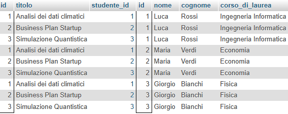
<!-- REVIEW: tipo di box da confermare -->

Questo tipo di JOIN solitamente non viene utilizzato perché ignora completamente le relazioni, creando delle righe che non conservano il senso di collegamento della tabella dato dalla chiave esterna.

### INNER JOIN

Quando vogliamo invece mostrare **solamente le righe** collegate tra loro dalla relazione della chiave esterna dobbiamo utilizzare la INNER JOIN.

Prima di poter procedere dobbiamo capire come facciamo a indicare dei campi in una SELECT quando abbiamo più di una tabella. <u>Dobbiamo sempre specificare da quale tabella stiamo prendendo il campo</u>

!!! abstract "Definizione"
    #### Selezionare i campi da più tabelle

    Se la mia query di selezione avviene su più tabelle e voglio specificare un campo devo sempre, per evitare ambiguità, indicare da quale tabella sto prendendo il campo. **Per farlo dobbiamo indicare, prima del nome del campo, il nome della tabella seguito da un punto.**

    **Esempio  
    **

    **SELECT** progetti.id, progetti.titolo, studenti.nome, studenti.cognome  
    **FROM** Progetti, Studenti
<h4 id="utilizzare-gli-alias-per-rinominare-le-tabelle">Utilizzare gli alias per rinominare le tabelle</h4>
<p>Dato che è spesso laborioso riscrivere ogni volta l'intero nome della tabella si preferisce rinominare le due tabelle alla loro iniziale usando la clausola AS. In questo modo invece che riscrivere l'intero nome della tabella possiamo utilizzare solo la sua iniziale</p>
<p><strong>da un punto.</strong></p>
!!! example "Esempio"
    **Esempio  
    **

    **SELECT** p.id, p.titolo, s.nome, s.cognome  
    **FROM** Progetti **AS** p , Studenti **AS** s
<p><em>N.B. Se due tabelle hanno la stessa iniziale, come ad esempio progetti e persone non possiamo usare la stessa iniziale. Faremo ad esempio progetti AS pr, persone AS pe.</em></p></th>
</tr>
</thead>
<tbody>
</tbody>
</table>

Ora che sappiamo accedere ai singoli campi delle tabelle, vediamo come realizzare la INNER JOIN. Dovremo specificare, utilizzando la clausola **ON**, quali sono i campi **chiave esterna** e **chiave primaria** tra loro collegati con il vincolo di FOREIGN KEY.

In questo caso saranno i campi studente_id dalla tabella progetti e il campo id della tabella studenti.

Vediamo come si scrive in SQL:

!!! info "Sintassi - Scrittura in SQL della INNER JOIN"
    **Scrittura in SQL della INNER JOIN**

    Mettendo insieme quanto visto impariamo a scriverlo  

    **SELECT** \*  
    **FROM** Progetti **AS** p **INNER JOIN** Studenti **AS** s **ON** p.studente_id=s.id;

    La parola **INNER** si può omettere, in quel caso SQL la darà per sottintesa. Scriviamo

    **SELECT** \*  
    **FROM** Progetti **AS** p **JOIN** Studenti **AS** s **ON** p.studente_id=s.id;

    Il risultato di questa query sarebbe:

    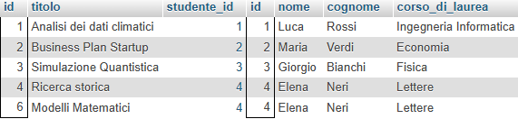
<!-- REVIEW: tipo di box da confermare -->

**Notare che:**

1.  Vengono mostrati **esclusivamente i dati collegati tra loro**. <u>I progetti senza studenti o gli studenti senza progetti non vengono mostrati</u>

2.  In ogni riga troviamo il progetto con lo studente associato, infatti **studente_id e id sono uguali!**

3.  In ogni query di selezione, **la JOIN avviene sempre tra una chiave esterna e la chiave primaria a cui fa riferimento**

Come visto, con una INNER JOIN, otteniamo solamente i dati che hanno un collegamento con l'altra tabella. In termini insiemistici possiamo dire che i dati di una **INNER JOIN sono quelli che si trovano nell "intersezione" tra le due tabelle**

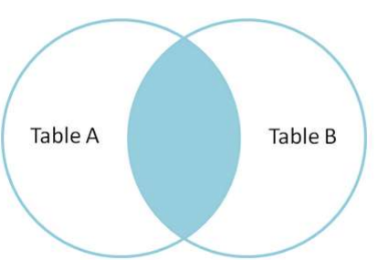

### OUTER JOIN

Mentre con una INNER JOIN otteniamo tutti i dati che hanno un collegamento, a volte vogliamo anche avere quelli che non hanno un collegamento.

In termini insiemistici potremmo volere **tutti i dati da una delle tabelle assieme a tutti i dati dell'altra tabella che vi sono collegati**

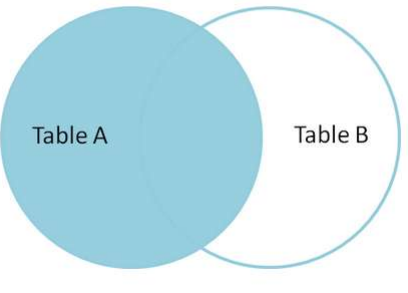

Questo risultato si raggiunge con la LEFT OUTER JOIN.

!!! info "Sintassi - Scrittura in SQL della OUTER JOIN"
    **Scrittura in SQL della OUTER JOIN**

    La **LEFT OUTER JOIN** prende <u>**tutte** le righe della prima tabella</u> e solo quelle della seconda per cui è rispettato il vincolo di chiave esterna messo nella clausola ON.  
    Scriviamo

    **SELECT** \*  
    **FROM** Progetti **AS** p **LEFT OUTER JOIN** Studenti **AS** s **ON** p.studente_id=s.id;

    La parola **OUTER** si può omettere, in quel caso SQL la darà per sottintesa. Scriviamo

    **SELECT** \*  
    **FROM** Progetti **AS** p **LEFT** **JOIN** Studenti **AS** s **ON** p.studente_id=s.id;

    Questo è il risultato della query
<!-- REVIEW: tipo di box da confermare -->

**Osservazioni:**

1.  **Dove non c'è il collegamento**, **SQL riempie il record con dei NULL.  
    **In questo esempio nella riga del progetto 5 che non ha uno studente associato, tutti i campi dello studente sono valorizzati a NULL.

2.  Si chiama **LEFT** OUTER JOIN perché prende tutte le righe della tabella che si trova "a sinistra" della clausola JOIN.  
    Se vogliamo prendere l'altra tabella basta scambiare l'ordine delle tabelle nella clausola.  
      
    Esiste anche la possibilità di usare RIGHT OUTER JOIN, ma non tutti i DBMS lo supportano.

#### Un caso speciale: OUTER JOIN con solo i record **<u>senza</u>** collegamento

In termini insiemistici vogliamo solo i record della tabella A che NON hanno un collegamento con la tabella B

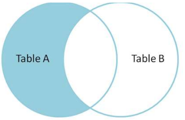

Sfruttiamo quanto visto nell'osservazione precedente: la LEFT OUTER JOIN restituisce dei NULL nei campi corrispondenti alla seconda tabella. Basta quindi realizzare una condizione che selezioni quelli che hanno NULL nell'altra tabella. Scriveremo:

!!! info "Sintassi - Scrittura in SQL della LEFT JOIN"
    **Scrittura in SQL della LEFT JOIN**

    Scrivere una query di selezione che prenda soltanto i progetti che non hanno uno studente assegnato**  
    **

    **SELECT** \*  
    **FROM** Progetti **AS** p **LEFT** **JOIN** Studenti **AS** s **ON** p.studente_id=s.id

    **WHERE** s.id **IS** NULL;

    Il risultato di questa query sarebbe:

    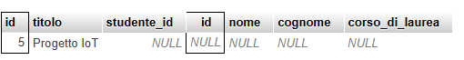
<!-- REVIEW: tipo di box da confermare -->

!!! info "Sintassi - Non mostrare i campi NULL"
    **Non mostrare i campi NULL**

    Dato che la tabella studenti ha i valori NULL in questa query, posso decidere nella SELECT di mostrare solo i campi della tabella progetti

    **SELECT p.**\*  
    **FROM** Progetti **AS** p **LEFT** **JOIN** Studenti **AS** s **ON** p.studente_id=s.id

    **WHERE** s.id **IS** NULL;

    Ottenendo

    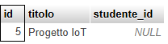
<!-- REVIEW: tipo di box da confermare -->

!!! abstract "Definizione"
    Come ultimo esempio di **LEFT JOIN** vediamo cosa succede cambiando l'ordine di studenti e progetti nella **LEFT JOIN**

    **SELECT** \*  
    **FROM** Studenti **AS** s **LEFT** **JOIN** Progetti **AS** p **ON** p.studente_id=s.id;

    **Otteniamo tutti gli studenti e i loro progetti (oppure NULL)**

    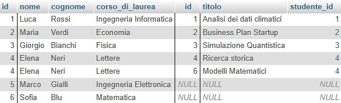

    **Prendiamo ora tutti gli studenti che non hanno un progetto  
    **

    **SELECT** s.\*  
    **FROM** Studenti AS s LEFT JOIN Progetti AS p ON p.studente_id=s.id  
    **WHERE** p.id **IS NULL**;

    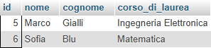

### Domande di comprensione sulle JOIN

**Domande a risposta multipla**

1.  Quale tipo di JOIN restituisce **tutte le combinazioni possibili** tra i record di due tabelle?

    1.  INNER JOIN

    2.  CROSS JOIN

    3.  LEFT JOIN

    4.  NATURAL JOIN

2.  Quale delle seguenti query restituisce **solo i progetti che non hanno studenti assegnati**?

    1.  SELECT \* FROM Progetti JOIN Studenti ON Progetti.studente_id = Studenti.id;

    2.  SELECT \* FROM Progetti LEFT JOIN Studenti ON Progetti.id = Studenti.studente_id;

    3.  SELECT \* FROM Progetti LEFT JOIN Studenti ON Progetti.studente_id = Studenti.id WHERE Studenti.id IS NULL;

    4.  SELECT \* FROM Progetti RIGHT JOIN Studenti ON Progetti.studente_id = Studenti.id;

3.  Nella seguente query, quali tabelle sono coinvolte?

```sql
SELECT p.id, s.nome
FROM Progetti AS p JOIN Studenti AS s ON p.studenteid = s.id;
```

1.  Solo la tabella Progetti

2.  Le tabelle Progetti e Studenti

3.  solo la tabella Studenti

4.  Le tabelle Progetti e Esami

<!-- -->

4.  In una LEFT JOIN tra Studenti e Progetti, se uno studente **non ha progetti**, cosa conterranno i campi relativi ai progetti?

    1.  NULL

    2.  Valori di default

    3.  Zeri

    4.  Non saranno mostrati

5.  Qual è il risultato della seguente query?

SELECT s.\*

FROM Studenti AS s LEFT JOIN Progetti AS p ON p.studente_id = s.id

WHERE p.id IS NULL;

1.  Tutti gli studenti con almeno un progetto

2.  Solo gli studenti che hanno più progetti

3.  Gli studenti senza alcun progetto

4.  Tutti i progetti con almeno uno studente

<!-- -->

6.  Qual è l’effetto della clausola AS nella JOIN seguente?

FROM Progetti AS p JOIN Studenti AS s ON p.studente_id = s.id

1.  Filtra i dati

2.  Rende i nomi dei campi maiuscoli

3.  Sostituisce la clausola WHERE

4.  Rinomina temporaneamente le tabelle

<!-- -->

7.  A cosa serve una JOIN in SQL?

    1.  A creare nuove tabelle nel database

    2.  A confrontare due colonne della stessa tabella

    3.  A combinare dati provenienti da più tabelle relazionate

    4.  A cancellare record duplicati tra più tabelle

8.  Quale clausola è necessaria per specificare il legame tra due tabelle in una JOIN?

    1.  WHERE

    2.  ORDER BY

    3.  GROUP BY

    4.  ON

9.  Quale tipo di JOIN mostra solo i record che hanno corrispondenza in **entrambe** le tabelle?

    1.  INNER JOIN

    2.  LEFT JOIN

    3.  RIGHT JOIN

    4.  FULL JOIN

10. Quando si usa una LEFT JOIN, cosa succede ai record della prima tabella che **non hanno corrispondenze** nella seconda?

    1.  Vengono mostrati con i campi della seconda tabella valorizzati a NULL

    2.  Vengono ignorati

    3.  Vengono duplicati

    4.  Vengono scartati e poi aggiornati

11. Cosa indica il termine "chiave esterna" nel contesto delle JOIN?

    1.  Un campo che contiene valori univoci

    2.  Un campo che collega due tabelle tramite relazioni

    3.  Un campo utilizzato per ordinare i dati

    4.  Un campo usato solo per la creazione di viste

12. Quale tipo di JOIN **non considera affatto** le relazioni tra le tabelle?

    1.  INNER JOIN

    2.  CROSS JOIN

    3.  LEFT JOIN

    4.  OUTER JOIN

13. Qual è una conseguenza dell’uso di JOIN senza specificare i campi di collegamento?

    1.  L’errore di sintassi

    2.  L’eliminazione dei dati duplicati

    3.  L’ottenimento di un prodotto cartesiano non controllato

    4.  Nessuna, la query funziona normalmente

14. In SQL, cosa si ottiene da una JOIN fatta correttamente tra una chiave primaria e una chiave esterna?

    1.  Dati ordinati

    2.  Dati aggregati

    3.  Dati eliminati automaticamente

    4.  Dati collegati logicamente

Risposte corrette

1.  B

2.  C

3.  B

4.  A

5.  C

6.  D

7.  C

8.  D

9.  A

10. A

11. B

12. B

13. C

14. D

**Domande Vero/Falso**

1.  La clausola JOIN serve per combinare i dati di più tabelle in un’unica query. **(V/F)**

2.  La CROSS JOIN restituisce solo i record con corrispondenza tra le tabelle collegate. **(V/F)**

3.  La INNER JOIN mostra anche i record che non hanno corrispondenze nell’altra tabella. **(V/F)**

4.  Con l’uso di alias è possibile semplificare la scrittura dei nomi delle tabelle nella query. **(V/F)**

5.  La clausola ON in una JOIN specifica il legame tra chiave primaria e chiave esterna. **(V/F)**

6.  La LEFT JOIN mostra tutti i record della tabella di destra, anche se non hanno corrispondenze. **(V/F)**

7.  In una JOIN tra le tabelle “Studenti” e “Progetti”, se uno studente non ha progetti, sarà comunque mostrato in una INNER JOIN. **(V/F)**

8.  La condizione s.id IS NULL è utile per trovare i record della prima tabella che non hanno corrispondenza nella seconda. **(V/F)**

Risposte corrette

1.  Vero

2.  Falso

3.  Falso

4.  Vero

5.  Vero

6.  Falso

7.  Falso

8.  Vero

## Funzioni di aggregazione in SQL

Vedere la slide n.3: [<u>Linguaggio_SQL_parte3_di_3.pdf</u>](https://drive.google.com/file/d/1sNDEyhU5ZuyKGHzvcdvnJjSG257LvHQq/view)

Nel capitolo precedente abbiamo imparato a eseguire query di selezione per ottenere dati da **una o più tabelle** tramite JOIN.

Una grande utilità dei dati è rappresentata spesso non dal **dettaglio** dei singoli dati, ma da informazioni di **sintesi**.Ad esempio, potrei non essere interessato all'età di **ogni singolo** utente nel mio database, ma mi può interessare **l'età media.**

Si possono per questo utilizzare le funzioni di aggregazione (COUNT, SUM, AVG, MIN, MAX) che permettono di ottenere dei risultati aggregati.

Impareremo poi a raggruppare queste aggregazioni utilizzando GROUP BY e a filtrare i risultati con HAVING.

!!! info "Sintassi - Le funzioni di aggregazione"
    **Le funzioni di aggregazione**  
    In SQL, una **funzione di aggregazione** è un operatore che esegue un calcolo su un insieme di valori (contenuti in una colonna o derivanti da un'espressione) e restituisce un **singolo valore riassuntivo**.

    Le funzioni principali sono:

    **Funzione** **Descrizione** COUNT(\*) **Conta** tutte le **righe** COUNT(colonna) **Conta** solo le righe in cui colonna non è NULL SUM(colonna) **Somma** dei valori di colonna. *(Solo campi numerici)* AVG(colonna) **Media** aritmetica di colonna *(Solo campi numerici)* MIN(colonna) Valore **minimo** di colonna. *(Campi numerici, testi e date)* MAX(colonna) Valore **massimo** di colonna *(Campi numerici, testi e date)*
<!-- REVIEW: tipo di box da confermare -->
<blockquote>
<p><strong>Nota:</strong> tutte le funzioni ignorano i valori NULL, tranne COUNT(*) che conta comunque le righe.</p>
</blockquote></th>
</tr>
</thead>
<tbody>
</tbody>
</table>

!!! example "Esempio di conteggio (COUNT)"
    **Esempio di conteggio (COUNT)**

    Supponiamo di avere la tabella **Impiegati**:

    **ID** **Nome** **Reparto** **Salario** 1 Mario Rossi Amministrazione 30000 2 Luca Bianchi Vendite 28000 3 Giulia Verdi Vendite NULL 4 Anna Neri IT 32000
<p>Non siamo interessati al dettagli degli impiegati. Vogliamo solo sapere <strong>quanti impiegati</strong> abbiamo. Utilizziamo la funzione COUNT. Vediamo nelle due varianti</p>
!!! abstract "Definizione"
    **Conteggio con COUNT(\*)**

    Conta il numero di righe nella tabella

    ```sql
    SELECT COUNT(\) AS TotDipendenti
    FROM Impiegati;
    ```
<p><strong>Il risultato</strong> di questa query è <strong>4</strong></p></th>
<th><p><strong>Conteggio con COUNT(salario)</strong></p>
<p>Conta il numero di righe in cui salario non è NULL</p>
```sql
SELECT COUNT(Salario) AS DipConSalario
FROM Impiegati;
```
<p><strong>Il risultato</strong> di questa query è <strong>3<br />
</strong>(ignora il NULL di Giulia)</p></th>
</tr>
</thead>
<tbody>
</tbody>
</table></th>
</tr>
</thead>
<tbody>
</tbody>
</table>

!!! example "Esempio di Somma e media (SUM e AVG)"
    **Esempio di Somma e media (SUM e AVG)**

    Sulla stessa tabella **Impiegati** calcoliamo somma e media del salario (ignora il NULL di Giulia):

    **Somma (SUM)**

    ```sql
    SELECT SUM(Salario) AS SommaSalari
    FROM Impiegati;
    ```
<p><strong>Risultato</strong>: 30000 + 28000 + 32000 = <strong>90000</strong></p></th>
<th><p><strong>Media (AVG)</strong></p>
```sql
SELECT AVG(Salario) AS SalarioMedio
FROM Impiegati;
```
<p><strong>Risultato</strong>: 90000 / 3 = <strong>30000</strong></p></th>
</tr>
</thead>
<tbody>
</tbody>
</table></th>
</tr>
</thead>
<tbody>
</tbody>
</table>

!!! example "Esempio di Minimo e massimo (MIN e MAX)"
    **Esempio di Minimo e massimo (MIN e MAX)**

    In una sola query è possibile utilizzare anche più funzioni di aggregazione. Vediamo un esempio in cui calcoliamo sia il minimo che il massimo

    ```sql
    SELECT MIN(Salario) AS SalMinimo, MAX(Salario) AS SalMassimo
    FROM Impiegati;
    ```
<p>Il <strong>risultato</strong> della query sarà <strong>28000</strong> e <strong>32000</strong></p></th>
</tr>
</thead>
<tbody>
</tbody>
</table>

### **Osservazione importante**: SELECT e aggregazione

Come visto nell'ultimo esempio è possibile, nella stessa SELECT, affiancare più funzioni aggregate

!!! abstract "Definizione"
    **Non è possibile affiancare funzioni aggregate a campi non aggregati**

    Vediamo un **<u>esempio errato</u>**

    ```sql
    SELECT nome, cognome, MIN(Salario) AS SalMinimo
    FROM Impiegati;
    ```
<p>nome e cognome fanno riferimento a <strong>singoli record</strong> e hanno <u>diversi risultati</u>, mentre il <strong>MIN</strong> fa riferimento ad una <strong>aggregazione</strong> e restituisce un <u>singolo valore</u>.</p></th>
</tr>
</thead>
<tbody>
</tbody>
</table>

### GROUP BY - Raggruppare i dati

In molti contesti vorremmo avere la possibilità di poter effettuare un calcolo per ogni "gruppo di dati omogeneo".

In altre parole, invece che effettuare un solo calcolo per tutta la tabella, divido questo calcolo per righe

!!! info "Sintassi - La clausola GROUP BY"
    **La clausola GROUP BY**  
    La clausola **GROUP BY** viene utilizzata in SQL per raggruppare le righe che condividono gli stessi valori in colonne specifiche. Questo permette di applicare le funzioni di aggregazione (SUM, AVG, COUNT, ecc.) non più all'intero set di dati, ma a singoli "sotto-insiemi" o categorie.

    Il **GROUP BY** indica **la colonna** (o le colonne) su cui identificare i sottogruppi omogenei di calcolo.

    **Ordine delle clausole:**  
    In una select la clausola **GROUP BY** si può utilizzare dopo la clausola **WHERE**
<!-- REVIEW: tipo di box da confermare -->

Quando vogliamo ottenere riepiloghi **per categoria**, utilizziamo la clausola GROUP BY. Essa raggruppa le righe con lo stesso valore in una o più colonne, e le funzioni di aggregazione operano **su ogni gruppo**.

**Nota bene**: **I campi indicati nel GROUP BY** vanno anche indicati nel **SELECT** per mostrare nei risultati il valore per cui si sta raggruppando.Vediamo qualche esempio

!!! example "Esempio di Raggruppamento"
    **Esempio di Raggruppamento**

    Contare il numero di dipendenti **per ogni reparto**

    ```sql
    SELECT Reparto, COUNT(\) AS NumDipendenti
    FROM Impiegati
    GROUP BY Reparto;
    ```
!!! info "Sintassi - ID"
    **ID** **Nome** **Reparto** **Salario** 1 Mario Rossi **Amministrazione** 30000 2 Luca Bianchi **Vendite** 28000 3 Giulia Verdi **Vendite** NULL 4 Anna Neri **IT** 32000
<!-- REVIEW: tipo di box da confermare -->
<p><strong>Prima</strong> di effettuare il conteggio, <strong>raggruppiamo</strong> per i record che hanno lo stesso valore nel campo per cui stiamo raggruppando (Reparto). Solo a quel punto effettuiamo il calcolo, ottenendo il seguente risultato</p>
!!! abstract "Definizione"
    **Reparto** **NumDipendenti** Amministrazione 1 Vendite 2 IT 1</th>
</tr>
</thead>
<tbody>
</tbody>
</table>

!!! example "Esempio di Raggruppamento -2"
    **Esempio di Raggruppamento -2**

    Sia data la tabella Vendite così fatta

    **ID_Vendita** **Prodotto** **Categoria** **Importo** 1 MacBook Pro Elettronica 2500 2 iPhone 15 Elettronica 1000 3 Scrivania Arredamento 200 4 Sedia Ergonomica Arredamento 150 5 Monitor 4K Elettronica 400 6 Kit Lego Giocattoli 80
```sql
SELECT Categoria,COUNT(\) AS NumeroVendite, SUM(Importo) AS TotaleFatturato
FROM Vendite
GROUP BY Categoria;
```
<p>Raggruppando per categoria, troviamo un conteggio per ogni diverso valore nella colonna categoria</p>
!!! abstract "Definizione"
    **Categoria** **NumeroVendite** **TotaleFatturato** Elettronica 3 3900 Arredamento 2 350 Giocattoli 1 80</th>
</tr>
</thead>
<tbody>
</tbody>
</table>

### HAVING - Filtrare i risultati

Nel **mostrare** i risultati abbiamo la possibilità di filtrare secondo determinate condizioni. Abbiamo già imparato a filtrare i risultati usando la clausola WHERE.

La clausola WHERE filtra le **righe** **prima** del raggruppamento. Non è possibile quindi effettuare una condizione sui risultati delle funzioni aggregate nella clausola WHERE, perché questi ancora non esistono.

Per fare dei filtri sui risultati si utilizza la clausola HAVING. HAVING filtra i **gruppi** dopo l’aggregazione. Nella query SELECT, la clausola HAVING si trova dopo il GROUP BY

!!! abstract "Definizione"
    Vediamo nella tabella dell'ultimo esempio la seguente query:

    **Numero vendite e totale fatturato per ogni categoria**, ma <u>solo per le categorie che hanno almeno 2 vendite</u>

    ```sql
    SELECT Categoria, COUNT(\) AS NumeroVendite, SUM(Importo) AS TotaleFatturato
    FROM Vendite
    GROUP BY Categoria
    ```

    **HAVING NumeroVendite\>=2;**
<p>Vengono mostrate solo le righe in cui il NumeroVendite è &gt;=2</p>
!!! abstract "Definizione"
    **Categoria** **NumeroVendite** **TotaleFatturato** Elettronica 3 3900 Arredamento 2 350</th>
</tr>
</thead>
<tbody>
</tbody>
</table>

!!! example "Esempio sbagliato"
    **Esempio sbagliato** (utilizzo di WHERE invece di HAVING)

    Vediamo un **<u>esempio errato</u>**

    ```sql
    SELECT Categoria, COUNT(\) AS NumeroVendite, SUM(Importo) AS TotaleFatturato
    FROM Vendite
    ```

    ```sql
    WHERE NumeroVendite\>=2
    GROUP BY Categoria;
    ```
<p>Non è possibile realizzare una condizione sul campo NumeroVendite nella clausola WHERE.</p></th>
</tr>
</thead>
<tbody>
</tbody>
</table>

### ORDER BY - Ordinare i risultati aggregati

Per ordinare il risultato di una query con raggruppamento, utilizziamo ORDER BY **dopo** HAVING.

```sql
Calcoliamo la media stipendio per ogni reparto in ordine decrescente
SELECT Reparto, AVG(Salario) AS MediaSalario
FROM Impiegati
GROUP BY Reparto
ORDER BY MediaSalario DESC;
```
!!! abstract "Definizione"
    **Reparto** **MediaSalario** IT 32000 Amministrazione 30000 Vendite 28000</th>
</tr>
</thead>
<tbody>
</tbody>
</table>

### Esempio Completo

Abbiamo visto diverse clausole nel SELECT. Non sempre si utilizzano tutte, ma se ci sono il loro ordine deve rispettare il seguente:

**SELECT \> FROM \> WHERE \> GROUP BY \> HAVING \> ORDER BY\>LIMIT**

```sql
Esempio di query completa
Scenario: tabelle Impiegati e Sedi, vogliamo il salario medio per sede di Milano con almeno 2 dipendenti, ordinate per stipendio medio.
SELECT I.Sede, AVG(I.Salario) AS MediaSalario
FROM Impiegati AS I JOIN Sedi AS S ON I.Sede = S.Codice
WHERE S.Citta = 'Milano'
GROUP BY I.Sede
HAVING COUNT(\) \>= 2
ORDER BY MediaSalario DESC;
```
<p>Con una tabella dei risultati come segue</p>
!!! abstract "Definizione"
    **Sede** **MediaSalario** S01 31000 S03 10000</th>
</tr>
</thead>
<tbody>
</tbody>
</table>
