# Capitolo 7: le reti di computer

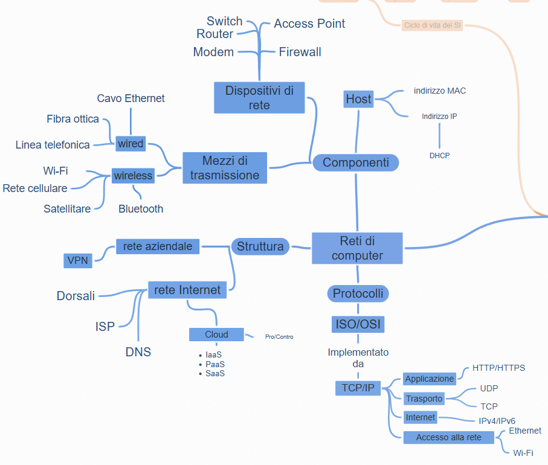
## 7.0 Introduzione

In questo capitolo affronteremo la struttura delle reti di computer.

Il nostro obiettivo è comprendere il funzionamento di internet e della tecnologia che tutti i giorni ci permette di mandare email, messaggi su Whatsapp, guardare Netflix, fare pagamenti online, ecc…

In un mondo in cui anche il frigorifero si può connettere ad internet diventa di fondamentale importanza comprendere come funziona!

Il nostro percorso si articolerà in tre fasi:

1.  **Capitolo 7.1** [<u>I componenti di una rete.</u>](#i-componenti-di-una-rete)  
    Come si realizza una rete di computer dal punto di vista fisico/dell'infrastruttura? Vedremo quindi quali sono i componenti di una rete, esplorando gli **apparati e i mezzi di trasmissione necessari** a realizzarla.

2.  **Capitolo 7.2** [<u>Internet e reti aziendali</u>](#reti-aziendali-e-la-rete-internet)  
    Dopo aver visto quali sono i componenti, vediamo come questi sono utilizzati per creare una rete aziendale che risponda alle esigenze e come in generale vengano sfruttate per realizzare la rete globale, internet.

3.  **Capitolo 7.3** [<u>I protocolli di internet</u>](#i-protocolli-di-internet)  
    Come viaggiano le informazioni sulla rete? Vedremo i **protocolli** che regolano la trasmissione dei dati.

### Definizione di rete

Partiamo dalla definizione:

!!! abstract "Definizione"
    Le reti di computer (network) consistono in due o più elaboratori connessi tra loro per **condividere risorse** (come stampanti e file), **scambiare informazioni o servizi.**

**N.B.** Nella definizione si parla esplicitamente di rete di **<u>computer</u>.**  
Con l'evoluzione della tecnologia non sono più solo i computer ad essere connessi alla rete: abbiamo smartphone, laptop, stampanti, televisori, telecamere, termostati. Si parla adesso di **Internet of Things (IoT)**.

Teniamo quindi presente che mentre nella trattazione parleremo principalmente di computer, questi potranno essere <u>qualunque tipo di dispositivo che si può connettere in rete</u>.

Ognuno di questi dispositivi viene più generalmente chiamato **host.**

## 7.1 I componenti di una rete

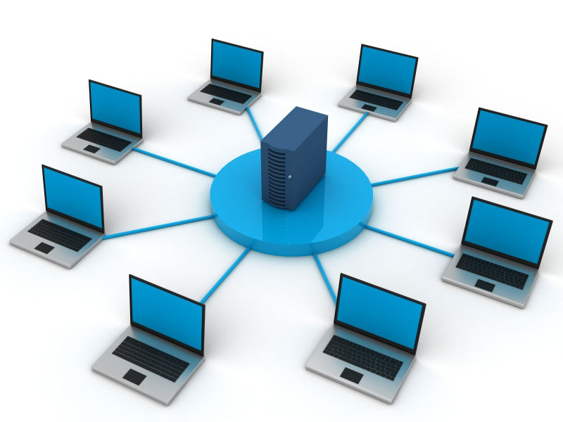
Vediamo quali sono i componenti principali di una rete di computer

!!! abstract "Definizione"
    **I componenti principali delle reti**

    I protagonisti principali della nostra rete di computer sono:

    - Gli **host** (o endpoint), sono gli utilizzatori finali della rete: computer, laptop, stampanti, videocamere, televisori, client, server, ecc…

    - I **dispositivi di rete**, ovvero gli apparati che permettono la creazione e il funzionamento della rete. Tra questi troviamo switch, access point, router, modem, ecc…

    - I **mezzi di collegamento,** ovvero gli strumenti attraverso cui vengono trasmesse le informazioni. Tra questi troviamo: cavi (cavo ethernet, fibra ottica, ADSL) e senza cavo (Wi-Fi, bluetooth, satellitare, dati mobili, ecc…)

Vediamoli nel dettaglio:

### 7.1.1 Gli host

Gli host, conosciuti anche come endpoint, sono i dispositivi utilizzatori finali all'interno di una rete. Questi includono:

- **Computer e Laptop**: Utilizzati dagli utenti per accedere alle risorse di rete, navigare su Internet, eseguire applicazioni e comunicare.

- **Stampanti di Rete**: Permettono a più utenti di condividere una singola stampante, migliorando l'efficienza e riducendo i costi.

- **Videocamere e Televisori Connessi:** Offrono servizi di sorveglianza e intrattenimento attraverso la rete.

Per potersi connettere alla rete, ognuno di questi dispositivi ha bisogno di avere una **scheda di rete** che nella maggior parte dei computer è integrata già nella scheda madre.

!!! abstract "Definizione"
    La **scheda di rete** è un componente hardware che è provvisto di una porta (nel caso di connessioni cablate) o un antenna (nel caso di connessioni wireless) e che è in grado di gestire lo scambio di dati con la rete.  
      
      
    Nell'immagine vediamo una scheda di rete con porta Ethernet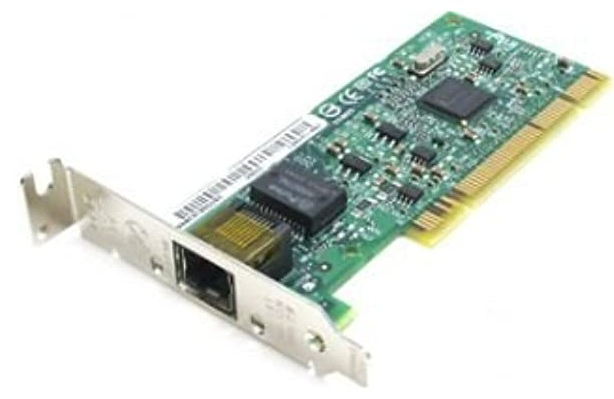

#### Identificazione degli host sulla rete

Per poter individuare e distinguere gli host sulla rete e poter quindi gestire in maniera ordinata il traffico di dati abbiamo bisogno di identificatori che permettano di indirizzare in maniera univoca i messaggi. Abbiamo due diversi indirizzi: l'indirizzo MAC e l'indirizzo IP.

##### Indirizzo MAC

!!! abstract "Definizione"
    L'**indirizzo MAC** (MAC address) è un indirizzo **univoco** assegnato  
    ad ogni scheda di rete dal produttore al momento della fabbricazione della stessa.  
      
    L'indirizzo MAC viene detto anche **indirizzo fisico** perché identifica in maniera univoca un componente fisico (la scheda di rete) e viene utilizzato nelle reti locali per poter individuare un determinato computer.

In un certo senso l'indirizzo MAC rappresenta per una scheda di rete quello che il codice fiscale rappresenta per un cittadino: non possono esistere due schede di rete con lo stesso indirizzo MAC (in tutto il mondo!).

!!! abstract "Definizione"
    **Approfondimento**  
    Il MAC address ha la forma di 12 cifre esadecimali (da 0 ad F) separate da un trattino ogni 2 cifre.  
    Esempio: 00-B0-D0-63-C2-26.

Sulla rete internet tutte le comunicazioni avvengono tramite il protocollo TCP/IP (più dettagli nel [<u>capitolo dedicato</u>](#tcpip)). Per poter utilizzare questo protocollo e poter ricevere le comunicazioni, ogni dispositivo connesso in rete ha un **indirizzo IP (Internet Protocol**

##### Indirizzo IP

Riportiamo qui solo le informazioni fondamentali sugli indirizzi IP necessari per capire le strutture delle reti. Maggiori dettagli si trovano nel capitolo dedicato al [<u>livello IP</u>](#internet) del protocollo TCP/IP.

Esistono due versioni di indirizzi IP, IPv4 e IPv6. Parleremo qui dell'IPv4.

!!! abstract "Definizione"
    **Un indirizzo IP** è un numero che identifica in maniera univoca un host connesso ad una rete informatica.
    >
    **Nella versione IPv4** l'indirizzo è costituito da 4 numeri da 0 a 255 separati da un punto.  
      
    *Esempio: 192.168.0.2 è un indirizzo IPv4 ben formato, come 10.25.250.25*

**N.B.** Mentre il MAC Address è **univoco per ogni scheda di rete** ed è una caratteristica intrinseca del dispositivo, l'indirizzo IP è un indirizzo che **viene assegnato all'host** quando si connette alla rete.

Quindi:

- il **MAC address** esiste anche se il **dispositivo è disconnesso** ed è un indirizzo fissato.

- **L'indirizzo IP** viene assegnato solo se il **dispositivo si connette** e può variare se ci si connette su diverse reti o anche sulla stessa rete in momenti diversi.

!!! abstract "Definizione"
    **Approfondimento - il comando ipconfig  
      
    **Su macchine con il sistema operativo Windows è possibile scoprire l'indirizzo IP assegnato ad ogni scheda di rete del proprio computer utilizzando nel *Prompt dei comandi* il comando **ipconfig**
    >
    Se vogliamo vedere anche il MAC Address delle schede possiamo utilizzare il comando **ipconfig /all**
    >
    Su sistemi operativi Linux e Mac il comando è invece **ifconfig**

###### Assegnazione degli indirizzi IP

Come viene assegnato un indirizzo IP ai dispositivi in rete?  
Esistono due modalità:

- **Assegnazione statica degli indirizzi IP**: l'amministratore della rete assegna ad ogni dispositivo nella rete un **indirizzo IP fisso**.  
  Associa ad ogni MAC address un indirizzo IP, in modo che quando questo si collega riceverà sempre lo stesso indirizzo IP.

- **DHCP (Assegnazione dinamica degli indirizzi IP)**: esiste un servizio (di solito è integrato nel router) che automaticamente fornisce ai dispositivi che si connettono alla rete un indirizzo IP.

!!! abstract "Definizione"
    Nel laboratorio d'informatica della scuola ciascuno dei 18 computer si collega sempre con lo stesso indirizzo IP. Ad esempio il PC numero 1 si collega con l'indirizzo 192.168.201.1, il 2 con 192.168.201.2  
    **Questo è un esempio di assegnazione statica**

    Nelle nostre reti domestiche solitamente non abbiamo configurato gli indirizzi IP in modo statico, quindi quando il nostro smartphone si connette riceve automaticamente dal router il primo indirizzo IP disponibile. Esempio: 192.168.0.4.  
    La prossima volta che il nostro smartphone si connette potrebbe non trovare libero quell'indirizzo IP e potrebbe essergli assegnato ad esempio 192.168.0.5.  
    **Questo è un esempio di DHCP**

!!! abstract "Definizione"
    **Approfondimento - Risorsa video  
    **<u>Il DHCP spiegato molto bene</u>
    >
    [<u>DHCP Explained - Dynamic Host Configuration Protocol</u>](https://youtu.be/e6-TaH5bkjo?si=1D5_u2ct6R2WCpEP)(10:09)  
    <u>Il video è in inglese, mettete i sottotitoli</u>

La scelta della modalità di assegnazione degli indirizzi IP è dettata da diversi fattori, uno di questi è il **ruolo** che l'host ricopre nella rete. I due ruoli principali che un host può ricoprire sono **Client** e **Server:**

#### Client e Server

Distinguiamo tra client e server in base al ruolo che il dispositivo ricopre nella rete

!!! abstract "Definizione"
    Un **server** è un dispositivo che mette a disposizione delle risorse sulla rete.
    >
    Un **client** è un dispositivo che accede alle risorse di un server tramite la rete.

!!! abstract "Definizione"
    Youtube ha diversi **server** su cui ospita tutta l'infrastruttura per mettere a disposizione degli utenti lo streaming di video.

    Quando noi apriamo il nostro dispositivo e ci colleghiamo a Youtube, il nostro dispositivo è un **client** che fa la richiesta al server e ottiene la risorsa cercata.

Come si può notare dalla definizione il server e il client non sono delle tipologie particolari di dispositivo. Come già detto, i termini denotano piuttosto un **ruolo** che il dispositivo ricoprono nella rete.

In particolare il client riveste un ruolo **attivo**: è il client a iniziare la comunicazione richiedendo le risorse al server.  
Il server riveste un ruolo **passivo**: rimane in attesa e risponde alle richieste dei client.

<u>Solitamente il server è un computer molto potente</u> in grado di gestire tante richieste contemporaneamente, ma qualunque dispositivo potrebbe essere un server, se configurato per tale scopo.

In base al servizio offerto si parla di diverse tipologie di server. Alcune sono :

- **Server Web:** Server che ospita un sito web e restituisce il sito web richiesto dall'utente. Di solito l'utente si collega a un server web utilizzando un browser sul proprio client.

- **Server Database:** è un server che ospita un database e risponde alle richieste degli utenti che possono interagire tramite interfaccia o tramite query SQL.

- **Server VPN:** è un server che consente il collegamento tramite VPN.

- **Server DNS:** fornisce il servizio di Domain Name System. Solitamente questo è fornito dal proprio ISP, ma si possono utilizzare server [<u>DNS</u>](#dns-domain-name-system) di altri operatori

- **Server di Applicazioni:** supporta l'esecuzione di applicazioni specifiche. Quello di Youtube prima è un esempio, ma un altro esempio potrebbe essere il server per i videogiochi online

!!! abstract "Definizione"
    **Osservazione: modalità di assegnazione degli indirizzi IP in base al ruolo**

    **Un server** **deve essere sempre raggiungibile e rintracciabile sulla rete,** gli altri host devono conoscere con certezza l'indirizzo IP a cui trovarlo. Per un server l'indirizzo IP <u>non può variare</u> ad ogni collegamento.

    Dall'altra parte abbiamo i **client** che si connettono in rete come utilizzatori, per loro non è necessario mantenere un IP fisso e riconoscibile.

    In fase di assegnazione quindi:

    - Per un **server** è fondamentale utilizzare **l'assegnazione statica degli indirizzi**

    - Per i **client** è possibile e spesso comodo utilizzare **l'assegnazione dinamica degli indirizzi IP** (DHCP).

### 7.1.2 I dispositivi di rete

I dispositivi di rete facilitano la creazione, la gestione e il funzionamento delle reti. Tra questi troviamo:

#### Switch

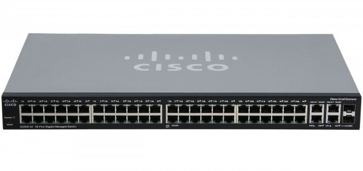
Lo switch di rete è un dispositivo fondamentale nelle reti informatiche e **permette di connettere tra loro diversi computer tramite cavo ethernet**.

Ogni switch è dotato di un numero di porte che caratterizza il **massimo numero di dispositivi** che possono essere collegati contemporaneamente.

!!! info "Sintassi - Il numero di porte è cruciale"
    **Il numero di porte è cruciale**  
    Se ad esempio ho bisogno di connettere fra loro 10 dispositivi, dovrò assicurarmi di avere a disposizione uno switch che abbia almeno 10 porte
<!-- REVIEW: tipo di box da confermare -->

Lo switch è un dispositivo "intelligente", riconosce i dispositivi connessi nella rete ed è in grado di inviare il messaggio **esclusivamente al destinatario**. Per farlo utilizza il MAC address del dispositivo.

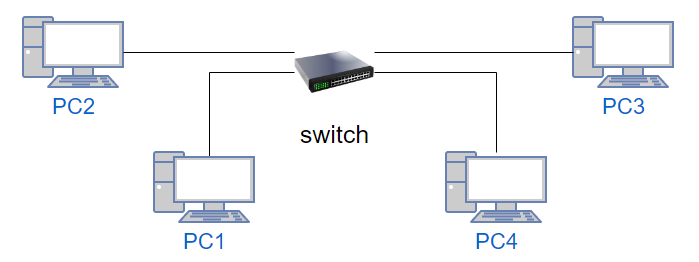

!!! abstract "Definizione"
    **Switch vs Hub**  
    In passato si avevano gli **hub**, dei dispositivi con funzioni analoghe a quelle dello switch ma meno intelligenti.  
    Come lo switch, anche l'hub permette la connessione di diversi computer tramite cavo ethernet, ma non è in grado di distinguere il destinatario.
    >
    Al contrario dello **switch**, ogni messaggio che passa per **l'hub** viene inviato contemporaneamente **a tutti i dispositivi connessi.**  
    Questo comporta molto traffico inutile sulla rete e potenzialmente problemi di sicurezza.
    >
    **L'hub è stato sostituito in tutto e per tutto dallo switch**.  
    L'unico vantaggio era il costo inferiore di un hub rispetto ad uno switch, ma con il progresso tecnologico il costo degli switch è sceso al punto in cui non ha più davvero senso comprare un hub.
    >
    Il motivo per cui viene citato in questo testo è per sottolineare come gli switch siano intelligenti nel mandare il messaggio solo al destinatario.

**N.B. Importante!**

Uno switch ci permette di collegare diversi dispositivi tra loro **all'interno della stessa rete** (tipicamente una rete locale). Per poter collegare dispositivi su reti diverse, ad esempio Internet serve un router (vedi capitolo a seguire)

#### Access Point

Un **Access Point** (spesso abbreviato in AP) è un dispositivo di rete che consente ai dispositivi di connettersi **tramite una connessione wireless** ad una rete.  
  
In questo testo parleremo degli Access Point più comuni che sono quelli Wi-Fi, ma esistono anche AP Bluetooth e altre più di nicchia.

Nello specifico i dispositivi wireless si connettono all'Access Point tramite Wi-Fi, l'Access Point è connesso al resto della rete tramite cavo ethernet. L'AP Fa in questo senso da ponte tra rete wireless e rete cablata.

!!! abstract "Definizione"
    Un laptop e uno smartphone sono connessi tramite Wi-Fi ad un Access Point.  
    L'AP è connesso allo switch tramite cavo ethernet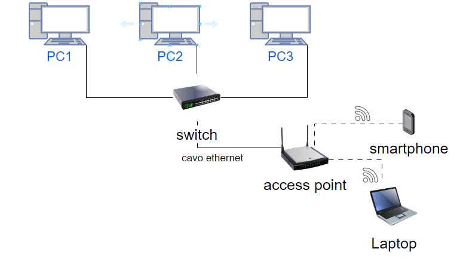

L'Access Point è un dispositivo di importanza strategica in una rete perché permette di connettere dispositivi tra loro senza l'esigenza di dover cablare le stanze e stendere tutti i cavi ethernet necessari ad una rete cablata.

**Vediamo Pro e contro di una rete Wireless**

!!! info "Sintassi - Pro"
    **Pro** **Contro**

    - **Facilità di installazione  
      **L'installazione non richiede cablature della stanza, se non quella di collegare l'AP allo switch.

    - **Facilità di connessione**  
      I dispositivi possono essere collegati senza limitazione nel movimento

    <!-- -->

    - **Meno sicuro  
      **I dati che viaggiano su una rete wireless possono essere facilmente intercettati

    - **Meno stabile  
      **I dati viaggiano sotto forma di onde elettromagnetiche che possono soffrire di interferenza

    - **Portata limitata**

    Il Wi-Fi ha una portata limitata che viene ulteriormente diminuita da muri e ostacoli
<!-- REVIEW: tipo di box da confermare -->

!!! abstract "Definizione"
    **Attenzione alla disposizione fisica degli Access Point!**
    >
    Per ovviare alla portata limitata del Wi-Fi, è possibile mettere **più Access Point** nella rete.
    >
    Tanta attenzione va messa anche sulla **collocazione fisica** dell'AP all'interno dell'edificio. **La loro posizione va studiata in base alla conformazione dell'area da coprire** e alle esigenze della rete.

**Esempio pratico:**  
Immaginate un edificio come la nostra scuola, disposto su più piani, diversi corridoi e diverse aule. Abbiamo bisogno di una serie di Access Point opportunamente dislocati per riuscire a coprire l'intero edificio.

Nella fattispecie la nostra scuola ha circa 60 AP disposti nelle diverse aule e nei diversi corridoi. Riuscite a trovarli?

#### Router

Mentre lo switch (o l'hub) si occupa di smistare i dati tra i diversi computer <u>all'interno di una rete locale</u>, abbiamo bisogno di un dispositivo più sofisticato per permetterci di inviare dati su una rete diversa (ad esempio dalla nostra rete locale ad internet).

Questo è il ruolo del Router. Termine che viene dall'inglese "route"="percorso", il router è il dispositivo che si occupa di decidere il percorso che i dati devono seguire per arrivare a destinazione. Si dice che il router si occupa **dell'instradamento del traffico.**

Diamo quindi una definizione

!!! abstract "Definizione"
    Un **router** è un dispositivo di rete che si occupa di inoltrare pacchetti dati attraverso diverse reti informatiche.
    >
    Il router si trova quindi all'interno di **due reti diverse** ( esempio classico: rete locale e rete internet) e **si occupa di instradare i pacchetti da una rete verso l'altra** indirizzando il pacchetto verso la rete in cui si trova il destinatario.

Come detto il router opera in generale tra due reti diverse, ma il caso più comune è quello in cui una è la rete locale, l'altra è la rete internet. Il resto della trattazione lavorerà su questo caso, ma <u>ricordiamo che non è l'unico</u>: Un router può connettere tra loro anche due reti locali o due reti con la stessa tecnologia di trasmissione. In effetti l'intera rete internet è costituita da sottoreti connesse tra loro tramite router. Soffermiamoci sul caso del router come <u>strumento per la connessione della rete locale ad internet</u>

**Due reti: due indirizzi IP.**  
Mentre lo switch, come detto, si trova all'interno di una rete locale. Il router si trova su due reti, si può pensare come **un'interfaccia tra la rete locale e la rete internet**.

Per essere collegato ad entrambe le reti il router è fornito di **due porte diverse**: tipicamente almeno una porta ethernet per il collegamento alle rete locale e una porta per la fibra ottica (o qualunque altra tecnologia porti internet nella nostra rete locale).

Il router è quindi collegato a due reti contemporaneamente:

!!! abstract "Definizione"
    Trovandosi su due reti, **il router ha due indirizzi IP**, uno in ogni rete.

    Avrà quindi un indirizzo IP nella **rete locale** (lo chiamiamo IP privato) e un indirizzo IP nella **rete internet** (IP pubblico)**.  

    Richieste verso l'esterno  
    **Ogni richiesta su Internet fatta da un dispositivo nella rete locale passa per il router e arriva su Internet con l'**indirizzo IP pubblico.**  
    <u>Tutti i dispositivi della rete locale hanno lo stesso IP pubblico verso l'esterno!</u>

    **Richieste verso l'interno  
    **Della mia intera rete locale all'esterno è visibile solo l'**indirizzo IP pubblico.** È a quell'indirizzo che vengono inviati i dati destinati ai singoli dispositivi.  
    <u>È compito del router instradare i pacchetti verso il dispositivo all'interno della rete locale che deve ricevere il pacchetto</u>

    Utilizzare diversi indirizzi **IP privati** nella rete privata e un solo **IP pubblico** nella rete Internet è uno dei modi principali con cui riusciamo a non esaurire gli indirizzi IPv4. Maggiori dettagli nel capitolo apposito [<u>più avanti</u>](#importante---come-ipv4-risparmia-indirizzi-ip)

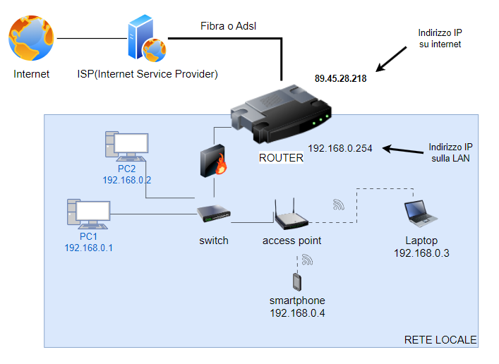

!!! abstract "Definizione"
    **Risorsa video  
    **In questo video viene spiegato molto bene come funziona un hub, uno switch e un router con delle ottime animazioni che aiutano a capire il compito ed il funzionamento dei singoli dispositivi**  
    **[<u>Hub, Switch, & Router Explained - What's the difference?</u>](https://www.youtube.com/watch?v=1z0ULvg_pW8&ab_channel=PowerCertAnimatedVideos)(07:22)  
    <u>Il video è in inglese, mettete i sottotitoli</u>

!!! abstract "Definizione"
    **Approfondimento: il NAT (Network Address Translation)**
    >
    Come detto, il router lavora su due reti con due set di indirizzi IP diversi. **Tra i compiti del router c'è quello di tradurre gli indirizzi IP privati in indirizzi IP pubblici e viceversa.**
    >
    Questa operazione prende il nome di NAT (Network Address Translation) ed è fondamentale per il funzionamento del sistema.  
      
    Maggiori dettagli sulla pagina [<u>Wikipedia</u>](https://it.wikipedia.org/wiki/Network_address_translation)

#### Modem

!!! abstract "Definizione"
    Un **modem** (un termine derivato da "modulatore-demodulatore") è un dispositivo di rete che converte (modula) **i dati da una forma digitale ad una analogica e viceversa** (demodula).

    È un dispositivo essenziale per connettere reti domestiche o aziendali a Internet attraverso linee telefoniche (DSL) o fibra ottica.

Più nello specifico quando deve trasmettere **un dato in uscita**, il modem converte il segnale digitale, utilizzato dai computer, in una forma analogica compatibile con le linee telefoniche o cavi per la trasmissione;  
accade l'opposto **in ricezione**: il modem converte il segnale analogico in un segnale digitale (demodula).

N.B. <u>I modem sono spesso integrati nel router</u>.  
In effetti il router rappresentato nell'immagine della sezione precedente fa anche da modem: ha infatti già la porta della fibra ottica e si occupa lui stesso di convertire il segnale Ethernet (digitale) nel segnale luminoso della fibra ottica (analogico)

!!! abstract "Definizione"
    **Approfondimento - Risorsa video  
    **video animato con dimostrazione del funzionamento di modem e router**  
    **[<u>Modem vs Router - What's the difference?</u>](https://www.youtube.com/watch?v=Mad4kQ5835Y) (07:00)  
    <u>Il video è in inglese, mettete i sottotitoli</u>

#### Firewall

L'ultimo dispositivo di rete che vediamo è legato alla sicurezza della rete.

!!! info "Sintassi - Un firewall è un dispositivo di sicurezza"
    **Un firewall è un dispositivo di sicurezza** che monitora e controlla il traffico in entrata e in uscita secondo delle regole di sicurezza definite.

    Può essere sia un dispositivo fisico che essere implementato a livello di software.  
    <u>Si trova spesso integrato nei router</u>
<!-- REVIEW: tipo di box da confermare -->

Un firewall ha quindi la grande responsabilità di controllare il traffico di rete e proteggere la rete locale da accessi non richiesti.

Nella sua configurazione di default il firewall **blocca tutte le connessioni in entrata**, lasciando passare soltanto quelle specificatamente concesse dall'amministratore.

Il firewall può essere utilizzato anche per bloccare **connessioni in uscita**.  
Un esempio potrebbe essere quello di un'azienda che voglia impedire ai propri dipendenti l'accesso a specifiche applicazioni o specifici siti, come i social network.

##### La DMZ e la Trusted Zone

Tramite Firewall è possibile segmentare la propria rete interna in due aree:

- Una **Trusted Zone**, zona sicura, in cui il firewall opera normalmente bloccando tutte le connessioni.  
  Metteremo in questa area tutti i dispositivi della rete interna che ospitano dati sensibili o che comunque non devono essere accessibili da internet.

- Una **DMZ** (DeMilitarized Zone, ovvero zona demilitarizzata), in cui il firewall lascia libere le connessioni in ingresso.  
  Metteremo in questa area tutti i dispositivi che vogliamo rendere raggiungibili dall'esterno, come ad esempio un server web

!!! abstract "Definizione"
    **Approfondimento - Risorsa video  
    **[<u>What is a DMZ? (Demilitarized Zone)</u>](https://www.youtube.com/watch?v=dqlzQXo1wqo)(07:00)

#### Il caso domestico

Abbiamo visto diversi dispositivi: switch, access point, router, modem, firewall.

Nel caso di una rete locale di grandi dimensioni, come può essere una rete aziendale questi **sono quasi sempre dispositivi distinti**. Nel caso domestico (o comunque di reti semplici) si utilizzano dispositivi che svolgono tutte queste funzioni contemporaneamente.

Il dispositivo che utilizziamo in casa e che chiamiamo router o modem:

- ha uno **Switch** integrato, di solito con 4 porte ethernet

- fa da **Router,** smistando il traffico tra la rete interna e internet

- fa da **Modem**. Si collega infatti direttamente alla rete (fibra o telefono, o altro)

- ha un **Access Point**. Offre di solito la connessione Wi-Fi

- ha un **firewall** integrato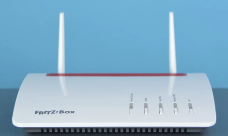

Ricordiamoci però che, anche se il nostro Router è anche un Modem ed è anche un Access Point, **queste sono funzionalità diverse e sono offerte da dispositivi diversi**.

Nel caso di una grossa rete non è pensabile realizzare tutto tramite un unico dispositivo di rete, serviranno diversi switch e diversi access point per riuscire a connettere tutti gli host che possono esserci.

### 7.1.3 I mezzi di collegamento

I mezzi di collegamento, o mezzi trasmissivi, **sono i canali fisici attraverso cui i dati vengono inviati da un punto all'altro in una rete.**

La scelta del mezzo è determinante per la velocità, affidabilità e sicurezza della trasmissione. Vedremo in questo capitolo i principali canali, facendo la distinzione tra mezzi cablati (*wired*) e non cablati (*wireless*)

#### Cablati

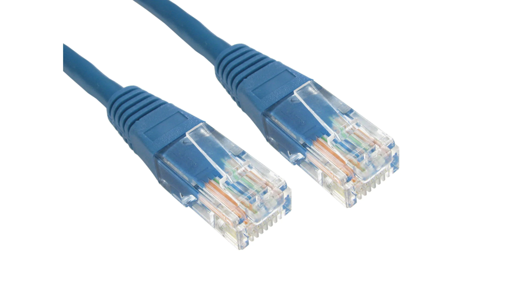
##### Cavo Ethernet.

Il cavo ethernet è lo standard più diffuso nelle reti di computer locali (reti LAN). È costituito da una coppia di cavi di rame intrecciati tra loro.

Lo spinotto utilizzato dai cavi ethernet prende il nome di **RJ45**.

La **lunghezza massima per un cavo ethernet è di 100 metr**i, motivo per cui è utilizzato <u>esclusivamente in reti locali.</u>

In base alle diverse versioni di cavo Ethernet (Cat5, Cat 5e, Cat6) **la velocità può variare da 100Mbit/s (Megabit al secondo) fino a 10 Gbit/s (Gigabit al secondo)**.

##### Linea telefonica.

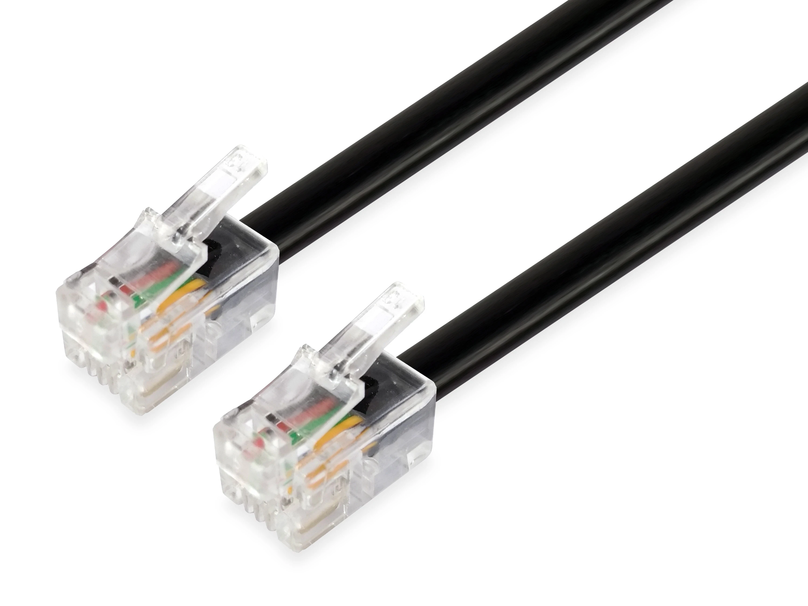
È il **primo mezzo trasmissivo** utilizzato nelle connessioni dial-up (modem 56k) e DSL.  
Alla creazione delle prime reti di computer si cercava un modo per connettere tra loro dispositivi lontani: a quel punto il telefono <u>era già presente in praticamente tutte le case</u>, si è quindi fatto affidamento alla tecnologia di cavi già esistente e diffusa.

I cavi del telefono sono solitamente realizzati in rame e gli impulsi viaggiano come segnali elettrici.

È utilizzato per connettere dispositivi su grandi distanze, ha l'enorme vantaggio di essere già diffuso in tutte le case e non dover richiedere particolari lavori strutturali.

La velocità massima raggiungibile tramite ADSL è solitamente intorno ai 24 Mbps in download e 4 Mbps in upload.  
Su distanze molto molto brevi si può arrivare anche fino ai 100Mbps.

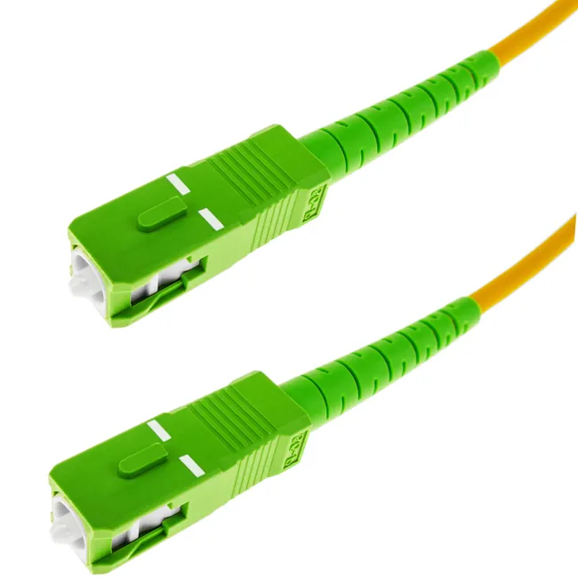

##### Fibra ottica

È la tecnologia via cavo più veloce in assoluto ed è il principale mezzo trasmissivo utilizzato sulle grandi connessioni a lunga distanza della rete Internet.

La fibra ottica è più veloce perché, mentre i cavi in rame sfruttano segnali elettrici per la trasmissione, **la fibra ottica utilizza segnali luminosi.**

La trasmissione dei dati avviene quindi tramite impulsi luminosi alla **velocità della luce** *(la velocità nella fibra ottica è di circa 200.000 km/s)*.  
La luce risente molto meno della resistenza e dell'interferenza elettromagnetica rispetto all'utilizzo di segnali elettrici in un cavo di rame.

La fibra ottica è realizzata con dei sottili filamenti di vetro che hanno la caratteristica di "intrappolare" la luce al suo interno.

La luce che entra da un'estremità del filo uscirà soltanto dall'altra estremità:

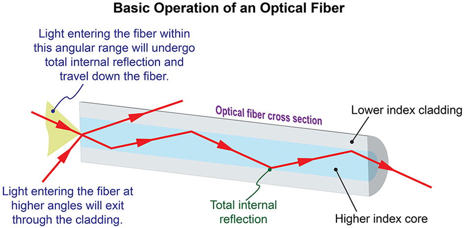

Esempio di utilizzo della fibra ottica è la lampada con filamenti di fibra ottica

Questo principio viene sfruttato per creare dei lunghi cavi di fibra ottica che permettono la trasmissione quasi istantanea di informazioni anche da una parte all'altra del mondo.

**La fibra ottica in casa**

Quando sottoscrivete un contratto di fibra ottica a casa avete diverse opzioni:

- **FTTH** (Fiber To The Home) - La fibra ottica arriva fino in casa vostra fino al vostro router. **Questa è l'opzione preferibile:** l'intera connessione è in fibra e avete la velocità di una connessione in fibra ottica.

- **FTTC** (Fiber To The Cabinet) - La fibra ottica arriva fino ad una cabina sulla strada nel vostro quartiere. L'ultimo pezzo, dalla cabina alla vostra casa, è realizzato con il doppino in rame del telefono. C'è una significativa perdita di velocità nell'ultimo tratto. <u>Si utilizza quando non è possibile portare la fibra fino in casa</u>

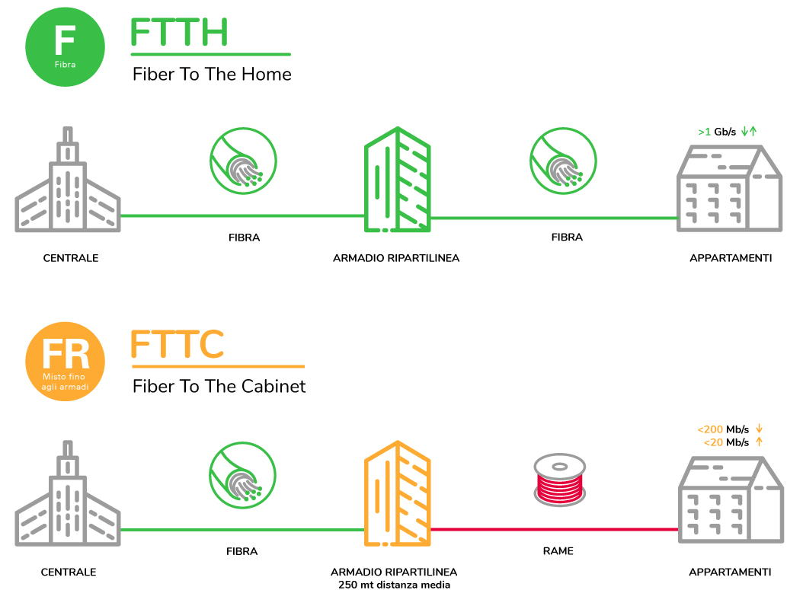

!!! abstract "Definizione"
    **Risorsa video  
      
    **La differenza tra connessione via cavo, via telefono e via fibra spiegata con delle **ottime animazioni**.  
    **Iniziate a guardare da 2:24**. La connessione via cavo non è diffusa in Italia. Si appoggia al sistema di TV via cavo che è molto diffuso negli USA

    [<u>Cable vs DSL vs Fiber Internet Explained</u>](https://www.youtube.com/watch?v=qQYiwmamq38&ab_channel=PowerCertAnimatedVideos)(6:46)  
    <u>Il video è in inglese, mettete i sottotitoli</u>

#### Non cablati

##### Wireless o Wi-Fi?

Cominciamo con l'osservare che i termini wireless e Wi-Fi <u>non sono tra loro sinonimi.</u>

- **Wireless** indica in generale una tecnologia di trasmissione senza fili.

- Il **Wi-Fi** è una specifica tecnologia di trasmissione wireless. Sono wireless anche il bluetooth, gli infrarossi, il satellitare, la rete dati del telefono, ecc..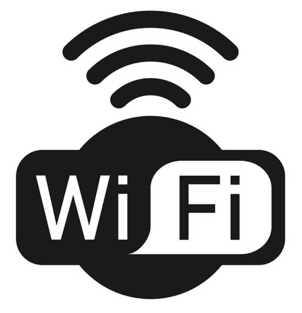

##### Wi-Fi

**Il Wi-Fi è una tecnologia di comunicazione wireless** che permette a dispositivi elettronici di scambiarsi dati o connettersi a internet **tramite onde radio**.

È una delle tecnologie senza fili più diffuse al mondo, utilizzata sia in ambienti domestici che professionali per fornire accesso a internet senza la necessità di connessioni cablate.

Per poter garantire l'accesso alla rete tramite Wi-Fi abbiamo già visto che **occorre utilizzare un [<u>Access Point</u>](#access-point)**. Abbiamo esplorato in quel capitolo anche i vantaggi e gli svantaggi di offrire una connessione wireless nella nostra rete.

Esploriamo meglio il funzionamento del Wi-Fi. Parleremo in particolare del Wi-Fi 4 e 5, le versioni attualmente più diffuse:

**2.4GHz vs 5GHz  
**Il Wi-Fi funziona utilizzando bande di frequenza radio, principalmente 2,4 GHz e 5 GHz.

Le due frequenze danno origine a due segnali con una lunghezza d'onda diversa. La 2.4GHz è più lunga e lenta, mentra la 5GHz è più corta e veloce.

- La banda 2.4GHz offre una **connessione più lenta**, ma grazie alla sua lunghezza d'onda ha **una portata maggiore**, avendo anche maggiore penetrazione sui muri.  
  <u>È una frequenza molto affollata</u>, anche le microonde e il bluetooth utilizzano frequenze simili c'è quindi il rischio di interferenza.  
  La velocità massima teorica raggiunge i 500-600 Mbps, solitamente si raggiungono effettivi circa 100-200 Mbps

- La banda 5GHz offre una **connessione più veloce**, ma la sua **portata è ridotta** e risente molto di muri e ostacoli.  
  La velocità massima teorica è di 3,46 Gbps, ma solitamente si raggiungono effettivi circa 500-800 Mbps

Da pochi anni (2020) si inizia a diffondere anche il Wi-Fi 6 che offre anche una banda a 6GHz e velocità attese molto più alte

!!! abstract "Definizione"
    **Approfondimento - Risorse video  
      
    **Due video con ottime animazioni che spiegano la differenza tra 2.4GHz e 5GHz

    [<u>2.4 GHz vs 5 GHz WiFi: What is the difference?</u>](https://www.youtube.com/watch?v=J_bf_KE5llQ&ab_channel=PowerCertAnimatedVideos)

    e cosa è un hotspot  
    [<u>What is a Hotspot?</u>](https://www.youtube.com/watch?v=ktxC3vDukbc)  
    <u>Il video è in inglese, mettete i sottotitoli</u>

##### Bluetooth

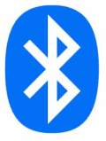
Il Bluetooth è una tecnologia di comunicazione wireless progettata per lo scambio di dati **su brevi distanze** tra dispositivi.
>
È stata concepita inizialmente come alternativa alla connessione con cavo, è diventata adesso praticamente uno standard per l'interconnessione di dispositivi elettronici quali smartphone, dispositivi audio, automobili, domotica, smartwatch e smartband, ecc…
>
Il bluetooth ha il grande vantaggio di essere facilmente utilizzabile per l'utente e, specialmente nelle ultime versioni, bassi consumi, bassa latenza e ottima fedeltà audio.
>
Il bluetooth utilizza onde radio a frequenze tra 2,402 e 2,480 GHz per connettere dispositivi entro un raggio di azione tipicamente di 10 metri

!!! abstract "Definizione"
    **Curiosità  
    **La tecnologia **Bluetooth** è stata sviluppata negli anni '90 da un gruppo di ingegneri che lavoravano per Ericsson, un'azienda svedese.
    >
    Il nome "**Bluetooth**" è ispirato al re vichingo Harald "Bluetooth" Gormsson, noto per aver unito le tribù danesi e norvegesi nel X secolo.
    >
    Analogamente, la tecnologia **Bluetooth** è stata creata per "unire" diversi dispositivi permettendo loro di comunicare senza cavi.

##### Rete mobile cellulare (4G/5G)

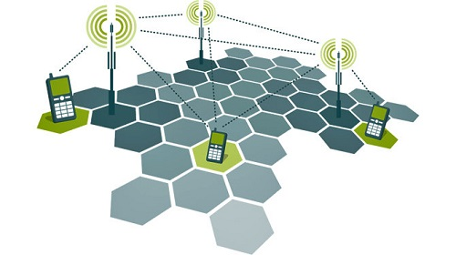
La **rete mobile cellulare** è una tecnologia complessa che fa utilizzo di onde elettromagnetiche per offrire la connessione a dei dispositivi **mobili**. Il sistema si basa su una rete di zone, denominate "celle" (da cui il termine "cellulare"), ognuna con una sua antenna e una sua stazione base.

La grossa sfida rispetto alle altre reti è che la rete cellulare deve gestire dei dispositivi **mobili**, garantendo al dispositivo la connessione all'antenna più vicina e **garantendo la continuità** della connessione nel caso in cui l'utente si muova da una cella all'altra.

!!! example "Esempio: Pensate ad un viaggio in treno"
    **Esempio: Pensate ad un viaggio in treno.**

    Durante il viaggio il vostro smartphone cambierà cella diverse volte e dovrà ogni volta collegarsi ad una nuova antenna e farlo, possibilmente, senza interrompere la vostra chiamata!

!!! abstract "Definizione"
    **Risorsa video: il viaggio del segnale sulla rete cellulare  
      
    **[<u>Cosa c'è dietro le nostre chiamate e internet? Fermiamo il tempo e seguiamo il percorso del segnale</u>](https://www.youtube.com/watch?v=B_pOf8Muv88)

La **rete mobile cellulare** utilizzata dai nostri smartphone per le telecomunicazioni, offre in maniera sempre crescente la possibilità di comunicare: la tecnologia si è evoluta tantissimo negli ultimi 50 anni, con ogni generazione successiva che estende le possibilità e le capacità rispetto alla precedente, partendo dalle sole chiamate vocali ad una connessione ad internet sempre più veloce.

!!! abstract "Definizione"
    **Approfondimento - Breve storia della trasmissione di dati tramite rete mobile:**

    - **1G - anni '80**: prime reti cellulari. Possibile la trasmissione di **voce** tramite rete mobile

    - **2G - Inizio anni '90**: GSM e GPRS, è possibile la prima navigazione e l'invio di dati anche testuali: nascono **gli SMS**!

    - **3G - Fine anni '90/inizio 2000**: con il 3G, si inizia ad avere delle connessioni internet vere e proprie: nascono i primi **smartphone!**

    - **4G - 2010:** Grosso salto tecnologico con la connessione via dati che raggiunge velocità teoriche fino a Gbps. Si possono adesso trasmettere **video, immagini**, giochi tramite rete mobile

    - **5G - 2019:** Grazie alla nuova tecnologia si possono arrivare a velocità teoriche fino a 20Gbps. Una crescente quantità di dispositivi si connette ad internet, abbiamo l'Internet delle cose **(Internet of Things IoT)**

##### Connessione Satellitare

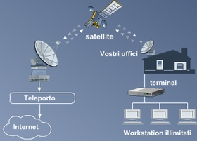
Le tecnologie di comunicazione satellitare sfruttano l'utilizzo di satelliti artificiali in orbita attorno alla Terra per trasmettere e ricevere segnali.

Il vantaggio principale rispetto alle altre tipologie di connessione è sicuramente la **copertura**: la connessione via satellite è disponibile in qualunque parte del mondo, in alta montagna come in aperta campagna, in alto mare come ad esempio in mezzo al continente africano.

Questo perché non è necessario stendere dei cavi o avere un'antenna trasmettitrice nelle vicinanze. <u>Il satellite alto nel cielo è solitamente visibile da qualunque punto della superficie terrestre.</u>

Lo svantaggio di solito è l'**alta latenza**: la richiesta deve arrivare ai satelliti, in orbita a migliaia di km di quota, e poi tornare indietro sulla terra ad una stazione attrezzata per connettersi al resto della dorsale di internet.

Le ultime tecnologie, come Starlink di SpaceX, stanno migliorando questo aspetto sfruttando dei satelliti a quote più basse, riducendo il tempo necessario per il viaggio dell'informazione.

### 7.1. Domande di comprensione

#### Domande a crocette

**1. Parlando di come riconoscere un dispositivo in rete, quale di queste affermazioni spiega correttamente la differenza tra indirizzo MAC e indirizzo IP?**

A\) L'indirizzo IP è fisso per ogni dispositivo, mentre l'indirizzo MAC cambia se mi collego a un'altra rete.
>
B\) L'indirizzo MAC serve per navigare su Internet, l'indirizzo IP solo nella rete locale.
>
C\) Il servizio DHCP assegna gli indirizzi MAC ai computer collegati.
>
D\) L'indirizzo MAC è come un "codice fiscale" fisso della scheda di rete, mentre l'indirizzo IP è come un indirizzo postale che viene assegnato quando il dispositivo si collega a una rete.

**2. Quando usi il browser sul tuo PC per visitare un sito web ospitato su un computer remoto, quale ruolo state svolgendo?**

A\) Il tuo PC è il server perché invia la richiesta iniziale.
>
B\) Sia il tuo PC sia il computer remoto sono contemporaneamente client e server.
>
C\) Il tuo PC è il client (chiede la pagina), il computer remoto è il server (fornisce la pagina).
>
D\) Il ruolo dipende solo da chi ha la connessione internet più veloce.

**3. In una rete, quale compito svolge principalmente uno Switch e quale un Router?**

A\) Lo Switch collega i dispositivi all'interno della stessa rete locale usando gli indirizzi MAC, il Router collega reti diverse (come la rete locale e Internet) usando gli indirizzi IP.
>
B\) Il Router collega i PC vicini tra loro, lo Switch collega reti geograficamente distanti.
>
C\) Lo Switch collega alla linea telefonica, il Router gestisce le stampanti.
>
D\) Entrambi servono solo a creare la connessione Wi-Fi.

**4. Se devi coprire con il Wi-Fi un ufficio grande con muri spessi, quale aspetto devi considerare attentamente riguardo agli Access Point (AP)?**

A\) Usare solo la frequenza 5 GHz perché è la più veloce, anche se il segnale arriva debole.
>
B\) Mettere un solo AP molto costoso sperando che copra tutto.
>
C\) Ricordare che il segnale Wi-Fi (soprattutto a 5 GHz) fatica ad attraversare i muri, quindi potrebbero servire più AP messi nei punti giusti.
>
D\) Non usare gli switch, ma collegare gli AP direttamente al computer principale.

**5. Il "modem/router" che abbiamo solitamente a casa per la connessione Internet è un dispositivo multifunzione. Quale delle seguenti funzioni *non* è tipicamente inclusa?**

A\) Fare da piccolo Switch con alcune porte per collegare dispositivi via cavo.
>
B\) Fare da Access Point per fornire il segnale Wi-Fi.
>
C\) Fare da Server Web per creare e pubblicare un proprio sito internet.
>
D\) Fare da Firewall per proteggere la rete da accessi indesiderati.

**6. Perché la Fibra Ottica che arriva fino a casa (FTTH) è molto più veloce dell'ADSL che usa la linea del telefono?**

A\) La fibra usa un voltaggio elettrico maggiore rispetto al cavo telefonico.
>
B\) La fibra trasmette i dati con segnali di luce, che sono più veloci e meno disturbati dei segnali elettrici usati dal cavo telefonico in rame.
>
C\) Il cavo della fibra è più spesso e quindi passano più dati insieme.
>
D\) L'ADSL ha bisogno di un filtro sulla presa telefonica, la fibra no.

**7. Quale vantaggio principale offre la rete mobile (4G/5G) per uno smartphone rispetto al collegamento Wi-Fi di casa o dell'ufficio?**

A\) La rete mobile permette di rimanere connessi quasi ovunque, anche spostandosi, passando automaticamente da un'antenna all'altra.
>
B\) La rete mobile è sempre gratuita, mentre il Wi-Fi si paga.
>
C\) Il Wi-Fi consuma molta più batteria dello smartphone rispetto al 4G/5G.
>
D\) Per usare il Wi-Fi serve per forza un abbonamento con SIM.

**8. Cos'è la DMZ (DeMilitarized Zone) che si può impostare su un firewall?**

A\) Una funzione per rendere il Wi-Fi più veloce.
>
B\) Un'area della rete, separata da quella interna principale, dove mettere i server (es. web server) che devono essere raggiungibili da Internet in modo controllato.
>
C\) Un sistema per bloccare la pubblicità sui siti web.
>
D\) La lista dei dispositivi autorizzati a collegarsi alla rete locale.

**9. Quando scegli tra usare la frequenza Wi-Fi a 2.4 GHz o quella a 5 GHz, quale compromesso devi considerare?**

A\) La 2.4 GHz è sempre più veloce ma meno stabile.
>
B\) La 5 GHz arriva più lontano e attraversa meglio i muri.
>
C\) La 5 GHz è compatibile solo con i computer fissi, non con gli smartphone.
>
D\) La 2.4 GHz copre un'area più ampia e attraversa meglio i muri, ma di solito è più lenta della 5 GHz.

**10. Un indirizzo come 192.168.0.25 a cosa corrisponde solitamente?**

A\) All'indirizzo MAC di una stampante.
>
B\) All'indirizzo IP pubblico della tua connessione Internet.
>
C\) A un indirizzo IP privato, usato per identificare un dispositivo all'interno della tua rete locale.
>
D\) A un indirizzo web completo di un sito.

#### Domande Vero/Falso

1.  L'indirizzo IP di un computer è un codice fisso assegnato in fabbrica alla scheda di rete e non cambia mai. **V/F**

2.  In una rete, un Server è un dispositivo che solitamente risponde alle richieste fatte dai Client, offrendo risorse o servizi. **V/F**

3.  Uno Switch serve principalmente a collegare tra loro reti diverse, come la rete di casa e Internet, usando gli indirizzi IP. **V/F**

4.  La Fibra Ottica FTTC (Fiber To The Cabinet) porta il cavo in fibra ottica direttamente dentro casa dell'utente finale. **V/F**

5.  Il Bluetooth è una tecnologia wireless pensata per collegare dispositivi a breve distanza, come cuffie allo smartphone. **V/F**

6.  L'assegnazione statica degli indirizzi IP significa che un server (come il DHCP) fornisce un indirizzo IP a caso a ogni dispositivo ogni volta che si collega. **V/F**

7.  Un cavo Ethernet standard può essere lungo anche diverse centinaia di metri senza problemi di trasmissione dati. **V/F**

8.  Il termine "Wireless" e "Wi-Fi" sono sinonimi e indicano esattamente la stessa tecnologia. **V/F**

9.  Il Modem si occupa principalmente di convertire i segnali digitali in analogici (e viceversa) per la trasmissione su certi tipi di linee, come quella telefonica. **V/F**

10. Un Firewall è un dispositivo hardware o software che aiuta a velocizzare lo scaricamento dei file da Internet. **V/F**

#### Domande di rielaborazione

<u>Queste domande testano la vostra conoscenza e la vostra abilità di rielaborazione in un formato discorsivo, come potrebbe essere una domanda di un'interrogazione o una traccia di un esame di stato</u>

1.  Descrivi i tre componenti fondamentali di una rete di computer (host, dispositivi di rete, mezzi di collegamento), fornendo esempi specifici per ciascuna categoria e spiegando brevemente il ruolo di ognuno.

2.  Illustra le differenze fondamentali tra indirizzo MAC e indirizzo IP. Spiega perché entrambi sono necessari per la comunicazione in rete, specificando in quali contesti prevale l'uso dell'uno o dell'altro e come vengono assegnati gli indirizzi IP (statico vs. DHCP).

3.  Spiega i ruoli distinti di Client e Server in un'architettura di rete. Fornisci almeno tre esempi di tipi diversi di server, descrivendo la funzione specifica di ciascuno.

4.  Confronta le funzioni di uno Switch e di un Router all'interno di una rete. Spiega su quali tipi di indirizzi opera ciascun dispositivo e in quale ambito della rete (locale vs. interconnessione di reti) è primariamente impiegato.

5.  Descrivi il ruolo di un Access Point (AP) in una rete. Discuti i vantaggi e gli svantaggi dell'utilizzo di una rete Wi-Fi rispetto a una rete cablata in termini di installazione, sicurezza, stabilità e portata.

6.  Analizza le principali tecnologie di connessione cablata (Ethernet, linea telefonica/DSL, fibra ottica), evidenziando per ciascuna le caratteristiche principali, i vantaggi, gli svantaggi e gli ambiti di utilizzo tipici.

7.  Illustra le diverse tecnologie di connessione non cablata (Wi-Fi, Bluetooth, Rete Mobile, Satellitare) , spiegando per ognuna il principio di funzionamento generale, il raggio d'azione tipico e i principali casi d'uso.

**Risposte corrette. Evidenziare con il mouse per vedere le risposte**

**Crocette:**

1.  D

2.  C

3.  A

4.  C

5.  C

6.  B

7.  A

8.  B

9.  D

10. C

**Vero/Falso:**

1.  **Falso** (È l'indirizzo MAC ad essere fisso e assegnato in fabbrica; l'IP viene assegnato alla connessione).

2.  **Vero**.

3.  **Falso** (Questo è il ruolo del Router; lo Switch collega dispositivi nella stessa rete locale usando indirizzi MAC).

4.  **Falso** (FTTC arriva alla cabina stradale; è FTTH che arriva in casa).

5.  **Vero**.

6.  **Falso** (L'assegnazione statica significa che l'indirizzo IP è fisso e configurato manualmente; è il DHCP che assegna indirizzi dinamicamente ).

7.  **Falso** (La lunghezza massima per un cavo Ethernet è di 100 metri ).

8.  **Falso** (Wireless è un termine generale per "senza fili", Wi-Fi è una specifica tecnologia wireless).

9.  **Vero**.

10. **Falso** (Un Firewall serve per la sicurezza, monitorando e controllando il traffico ).

## 7.2 Reti aziendali e la rete Internet

Vediamo adesso come tutti questi dispositivi e mezzi di trasmissione si utilizzano per realizzare delle reti. Nel dettaglio vedremo prima una rete locale, nello specifico una rete aziendale, e poi vedremo come questa si connetta ad internet, cercando di comprendere il funzionamento della rete globale.

### 7.2.1 La rete aziendale

Abbiamo visto nel capitolo 7.1.2 i diversi dispositivi di rete. Facciamo un breve riassunto e poi analizziamo come questi si possano disporre in base alle esigenze aziendali

- **Switch:** connessione in una rete locale tramite cavi ethernet

- **Access Point**: connessione al resto della rete cablata tramite Wi-Fi

- **Router:** interfaccia tra rete locale e rete internet. Ipotizziamo in questo capitolo che il modem sia integrato nel router.

- **Firewall:** dispositivo di sicurezza che blocca le connessioni indesiderate

Conoscendo i dispositivi abbiamo la possibilità di strutturare la rete aziendale secondo le richieste. Vediamo come realizzare la rete locale in base ad alcune esigenze più comuni in un formato di elenco di requisiti. Vediamo poi un po' di esempi pratici.

#### Elenco di possibili requisiti

1.  Connettere **diversi computer** ad internet

2.  Disporre di una **rete wireless**

3.  Disporre di un **server database** o un server applicazioni interno

4.  Disporre di un **server web pubblico**

5.  Dare la possibilità di **telelavoro:** un dipendente che si trova in casa propria può accedere alla rete locale protetta (utilizzeremo una [**<u>VPN</u>**](#la-vpn-virtual-private-network))

!!! note "Osservazione"
    **Osservazione**: **questi requisiti possono essere composti a piacere!**  
    Non è detto che una rete locale debba avere una rete wireless o che debba disporre di un server web pubblico. <u>A priori non è neanche detto che la rete locale debba poter andare su Internet!</u>

    Si possono avere **tutti** questi requisiti, **solo uno**, oppure solo alcuni. Dobbiamo analizzare la situazione e capire dai requisiti quali dispositivi utilizzare.

    <u>Nessun dispositivo è obbligatorio a prescindere</u>

Vediamo la soluzione per le prime 4 ed esploriamo separatamente la quinta, andando ad analizzare cos'è una VPN.

1.  **Requisito**: Diversi computer connessi ad internet  
    **Soluzione**: utilizziamo **uno o più switch** in base al numero di dispositivi da connettere e alle stanze in cui dobbiamo portare la rete. Poiché è richiesta una connessione ad internet, dobbiamo assicurarci di avere un **router** e un abbonamento ad un ISP.

2.  **Requisito**: Rete wireless  
    **Soluzione**: poiché è richiesta una rete wireless dovremmo utilizzare **uno o più Access Point**. Il numero di Access Point va ragionato in base all'estensione dell'area da coprire e al numero atteso di dispositivi. Una buona indicazione può essere 20/30 dispositivi per ogni AP

3.  **Requisito:** Disporre di un server database o un server applicazioni interno  
    **Soluzione**: se la rete **non è connessa** a Internet, non occorre prendere altre precauzioni: il server database è raggiungibile solo dalla rete locale.  
    Se la rete locale **è connessa** ad internet, occorre configurare un **firewall** e posizionare i dispositivi nella **trusted zone** della rete.

4.  **Requisito:** Disporre di un server web pubblico  
    **Soluzione**: perché il server sia pubblico si intende intanto che ci debba essere un **router** e quindi un **firewall** per garantire la sicurezza della rete interna.  
    Per far sì che il server web resti raggiungibile dall'esterno bisogna posizionarlo nella **DMZ.  
    **Avendo un Firewall e una DMZ, lasciamo che il server sia accessibile senza compromettere la sicurezza della rete interna.

Vediamo un diagramma che rappresenta una rete che risponde a questi quattro requisiti. Resta al lettore per esercizio disegnare una rete con solo alcuni dei requisiti.

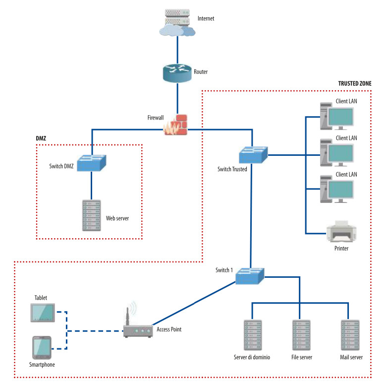

!!! info "Sintassi - Diagramma di una rete locale completa"
    **Diagramma di una rete locale completa  
    **Osservazioni:

    1.  I diversi computer della rete locale sono collegati ad uno **Switch**, assieme ad una stampante.

    2.  Un **Access Point** garantisce la connessione Wi-Fi a un tablet e a uno smartphone

    3.  Un **Firewall** garantisce la sicurezza nella Trusted Zone, dove troviamo i server ad uso interno dell'azienda

    4.  Il **Firewall** è configurato in modo da avere una DMZ dove troviamo il web server, raggiungibile dall'esterno.
<!-- REVIEW: tipo di box da confermare -->

Affrontiamo adesso l'ultimo requisito lasciato indietro.  
  
**Requisito:** il telelavoro.  
Vogliamo dare la possibilità al dipendente di collegarsi alla rete locale dell'azienda da un altro luogo.

**Soluzione 1**: **una connessione dedicata**  
Una prima possibilità è avere una connessione dedicata:

Se ad esempio un'azienda ha due sedi dislocate potrebbe commissionare dei lavori e fare stendere un cavo dedicato, probabilmente in fibra ottica, che colleghi le due sedi senza passare per la rete internet.

Questa opzione è molto sicura, perché nessuno, tranne l'azienda stessa, ha accesso a quel cavo. Questa opzione è anche molto molto **costosa**!

**Soluzione 2**: utilizzare sulla rete internet una VPN (Virtual Private Network)

#### La VPN (Virtual Private Network)

La **VPN (Virtual Private Network)** è una tecnica che crea una connessione sicura su una rete non sicura come internet utilizzando la crittografia e il concetto di **tunneling.**

Creiamo quindi su internet (una rete per definizione **pubblica**) una **rete privata virtuale** sicura.  
La rete è **Privata** perché tramite crittografia l'accesso è consentito soltanto agli utenti in possesso delle credenziali necessarie.  
La rete è **Virtuale** perché non è una rete reale realizzata effettivamente con dei cavi o dei dispositivi di rete specifici, è invece una rete locale *simulata* tramite il software

Un utilizzo della VPN è quello di estendere virtualmente la rete locale aziendale attraverso internet. Lo facciamo in questo modo:

1.  Installare un **server VPN** all'interno della rete locale dell'azienda. Lo possiamo inserire nella DMZ o nella trusted zone (configurando adeguatamente il firewall).

2.  Configurare la lista di utenti che possono accedere alla VPN.

3.  Fornire agli utenti da remoto un client VPN che si colleghi al server assieme a delle credenziali con username e password necessarie per stabilire la connessione.

Cosa accade quando un client si collega alla VPN?

1.  **Tunneling.** Tutte le trasmissioni del computer del client vengono cifrate ed indirizzate al server VPN. Durante tutto il percorso su internet la trasmissione è cifrata.

2.  **Decifrazione**. Il server VPN riceve i pacchetti e li decifra all'interno della rete locale aziendale dove prosegue il suo normale percorso sulla rete.

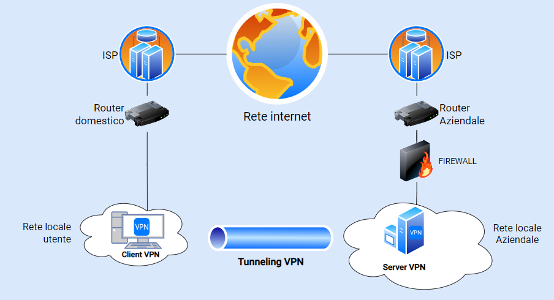

In questo modo è a tutti gli effetti come se il computer del client si trovasse all'interno della rete locale aziendale, potendo accedere a tutte le sue risorse in maniera sicura e protetta

**Attenzione:** <u>anche il traffico su internet risulta come proveniente dalla rete locale aziendale</u> quindi se, ad esempio, l'utente si trova a Bologna e la sede dell'azienda è a Berlino, le richieste su internet fatte dall'utente verranno visualizzate dal server come richieste da Berlino!

!!! abstract "Definizione"
    **Approfondimento - La VPN commerciale**
    >
    Su Internet e sui video di Youtube si sente spesso parlare di VPN come una soluzione sicura per il traffico su Internet.
    >
    Il sistema è quello appena descritto, ma invece di avere un server VPN all'interno di una rete di un'azienda, ci connettiamo al server VPN di chi offre questo servizio.
    >
    I vantaggi descritti sono:

    1.  **Protezione** - Come abbiamo visto il traffico viene cifrato ulteriormente, utile se per qualche ragione i nostri dati viaggiavano non cifrati.

    2.  **Privacy** - Quando siamo connessi ad una VPN i siti web non vedono il nostro indirizzo IP, vedono invece quello del server VPN a cui siamo connessi. Questo in teoria permette di rimanere anonimi.

    3.  **Aggirare blocchi geografici** - Per la stessa ragione di prima, possiamo aggirare dei blocchi geografici.  
        Prendiamo come esempio lo streaming dei programmi BBC (principale canale TV del Regno Unito): dal sito della BBC è possibile visionare in diretta i canali, ma **soltanto se ti trovi in UK**. Se io dall'Italia volessi vedere quel canale potrei connettermi ad un server VPN che si trova in UK e visualizzare lo stesso il contenuto.  
        Con lo stesso concetto è possibile vedere i contenuti delle piattaforme di streaming disponibili solo all'estero  
        **<u>N.B. Queste pratiche spesso violano i termini di utilizzo del servizio</u>**

    Gli svantaggi sono:

    - **Connessione più lenta**: ovviamente la connessione diventa più lenta perché i dati devono fare diversi passaggi in dovendo raggiungere ogni volta il server VPN e poi essere reindirizzati verso il destinatario.

    - **Dati di navigazione**: l'azienda che ospita il server VPN può monitorare tutto il nostro traffico e sapere cosa facciamo. Se utilizziamo dei server VPN non sicuri, o di ignoti proprietari, siamo paradossalmente più a rischio.

!!! info "Sintassi - Approfondimento 2 - Il vero funzionamento di una VPN"
    **Approfondimento 2 - Il vero funzionamento di una VPN  
    **Dal diagramma precedente sembra che ci sia un tunnel che connette direttamente la rete locale dell'utente alla rete aziendale senza passare da ISP e rete internet.

    Quella rappresentazione schematica serve per trasmettere l'idea di una connessione 'diretta' e 'privata' alla rete aziendale

    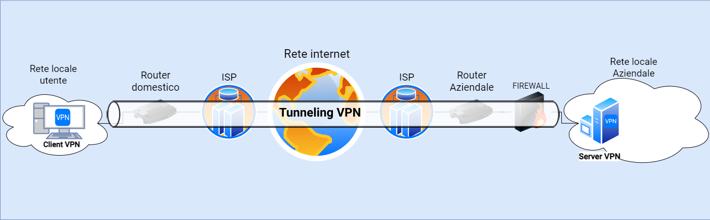

    Questa rappresentazione risulta forse meno immediata ma è più fedele alla realtà.

    **Il tunneling avviene attraverso la rete internet**

    I pacchetti vengono **cifrati dal client VPN** e passano comunque per l'ISP (il provider), che vede come destinatario del pacchetto il server VPN.

    Si parla di tunneling non perché ci sia una trasmissione diretta di dati tra client e server, ma perché tutti gli host intermedi tra il client e il server VPN non possono sapere nulla del pacchetto **cifrato**.

    **Risorsa video: [<u>VPN (Virtual Private Network) Explained</u>](https://www.youtube.com/watch?v=R-JUOpCgTZc&ab_channel=PowerCertAnimatedVideos)**
<!-- REVIEW: tipo di box da confermare -->

###  7.2.2 La rete internet

La rete Internet è un complesso sistema globale che collega miliardi di dispositivi tra loro. È costituita da una vasta rete di infrastrutture fisiche e tecnologie di trasmissione dati che lavorano insieme per facilitare la comunicazione e lo scambio di informazioni.  
Vediamo come prima la sua colonna vertebrale.

#### La dorsale di internet

Con dorsale di internet (in inglese [<u>Internet backbone</u>](https://en.wikipedia.org/wiki/Internet_backbone)) si fa riferimento alle **principali vie di trasmissioni dati ad alta velocità** che in un certo senso formano l'ossatura (la spina dorsale) dell'intera rete.

**Sono principalmente cavi in fibra ottica** che collegano i principali nodi di rete, server, data center, ISP (Internet Service Provider).

Questi sono cavi molto grossi e molto lunghi, disposti in modo da collegare le diverse aree geografiche e sono <u>spesso dei cavi sottomarini.</u> Un esempio è quello che collega l'Europa agli Stati Uniti che è stato disposto sul fondo dell'Oceano Atlantico.

!!! abstract "Definizione"
    **Risorsa video: i cavi sottomarini  
      
    **[<u>CAVI SOTTOMARINI - la fibra ottica del mondo passa in fondo agli oceani, altro che satelliti - Ep-1</u>](https://www.youtube.com/watch?v=SSvCMJTLbFY)

Questa è una mappa delle principali dorsali al momento.  
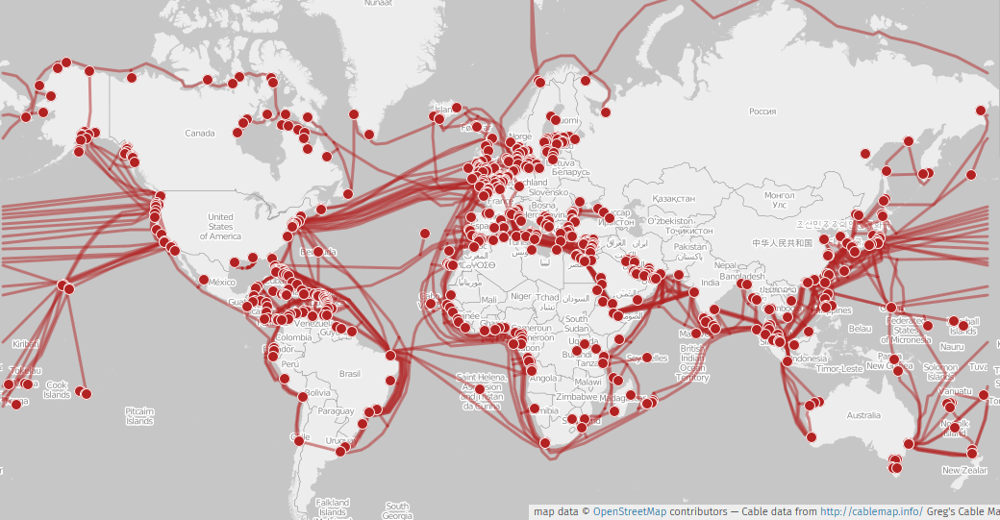

#### Provider di Servizi Internet (ISP)

Gli ISP collegano gli utenti finali alla backbone di Internet, agendo come intermediari.  
  
Forniscono accesso a Internet a clienti residenziali, aziendali e governativi utilizzando una varietà di tecnologie, inclusi cavi in rame (DSL), fibra ottica (FTTH, FTTB), e connessioni wireless (Wi-Fi, 4G/5G).

In Italia i principali sono Tim, Vodafone, Fastweb, Windtre, ecc…

#### Internet come rete di reti

Abbiamo visto prima come collegare una rete locale ad internet grazie ad un ISP

**Ma cos'è quindi internet?**

Internet è un insieme di reti connesse tra loro, dove i grandi ISP e data center si occupano di smistare il traffico tra le diverse reti.

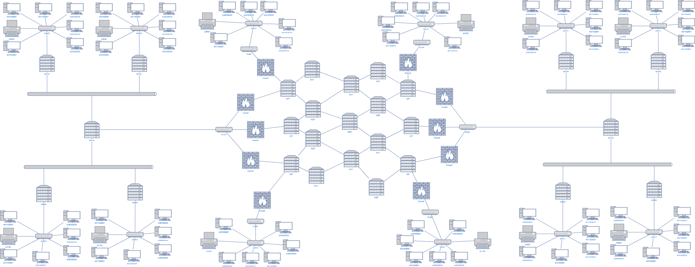

Esempio di uno schema di reti. Per l'immagine a dimensioni originali potete cliccare [<u>qui</u>](https://learnlearn.uk/gcsecs/wp-content/uploads/sites/8/2019/01/Internet-Diagram.png)

**Domanda.**Vediamo se avete studiato: qual è il dispositivo che si occupa di smistare il traffico tra le diverse reti? Ma è il router ovviamente!

Quindi abbiamo una rete, composta da tantissime reti connesse tra loro e tantissimi router che, conoscendo l'indirizzo IP del destinatario, smistano il traffico indirizzandolo verso la rete che contiene quell'indirizzo IP.

!!! abstract "Definizione"
    **Approfondimento: il comando tracert  
    **Per vedere tutti i passaggi nella rete che vengono fatti ad ogni richiesta possiamo usare il comando *tracert* sul prompt dei comandi di Windows.
    >
    Si apre il prompt dei comandi e si digita tracert seguito dall'host a cui vogliamo collegarci.
    >
    **Esempio:**
    >
    *tracert [<u>https://www.salvemini-bo.edu.it/</u>](https://www.salvemini-bo.edu.it/)*
    >
    Mostrerà tutti i passaggi necessari per raggiungere il server che ospita il sito web della scuola.

Come faccia un pacchetto a trovare la sua destinazione su una rete di queste dimensioni è un problema piuttosto complesso, di cui non discuteremo qui (si parla di **protocolli di routing).**

Cerchiamo almeno di capire come fa un **utente** a trovare un determinato server.

#### DNS (Domain Name System)

Abbiamo compreso finora che tutta la navigazione su internet funziona tramite indirizzi IP, quindi per trovare una risorsa servirebbe teoricamente conoscere l'indirizzo IP della macchina che ospita quella risorsa.

Difficilmente si può pensare di ricordare gli indirizzi IP dei diversi server, in questo viene incontro il sistema dei **nomi di dominio**.

!!! info "Sintassi - Il nome di dominio"
    **Il nome di dominio** è un indirizzo web leggibile dall'uomo che identifica in modo univoco un sito su internet.

    Esempio di nome di dominio è **www.google.it**

    In questo nome di dominio abbiamo

    - **www:** la tipologia di servizio

    - **Google:** dominio di secondo livello

    - **.it:** dominio di primo livello,

    
<!-- REVIEW: tipo di box da confermare -->

L'utente può quindi ricordare il nome di dominio di un sito, si occuperà poi la macchina di ottenere il suo indirizzo IP. Per fare ciò deve ricorrere a un **DNS**

!!! abstract "Definizione"
    Il **DNS** è un servizio in cui **ad ogni nome di dominio è associato il corrispettivo indirizzo IP.**

    Il server DNS utilizzato nelle configurazioni solite è quello fornito dal ISP. Si può scegliere di cambiare la configurazione per utilizzare il server DNS di terze parti.

Fondamentalmente il DNS è come una grossa rubrica telefonica, in cui ad ogni nome di dominio corrisponde l'indirizzo IP.

In questo modo all'utente non serve ricordare l'indirizzo IP, ma basta il nome.

!!! abstract "Definizione"
    **Un utente vuole visitare il sito Google per fare una ricerca.**

    Se non esistesse il DNS, **l'utente avrebbe bisogno di conoscere l'indirizzo IP** corrispondente al server che ospita il sito di Google (in questo momento è 142.251.163.94) e digitarlo nella barra indirizzi del proprio browser.

    Con il sistema del DNS l'utente deve ricordare solamente il nome di dominio **www.google.it**. Digita questo indirizzo nella barra di navigazione del browser e automaticamente la macchina trova l'indirizzo.

    Più nello specifico:

    1.  La richiesta arriva al **server DNS** del nostro ISP (se non abbiamo scelto un DNS diverso, tipo OpenDNS o il DNS offerto da Google)**.**

    2.  Il server DNS traduce il dominio www.google.it nell'indirizzo IP 142.251.163.94

    3.  Avendo adesso l'indirizzo IP la macchina dell'utente riesce a stabilire una connessione con il server di Google e visitare la pagina.

!!! info "Sintassi - Una soluzione anti-pirata: bloccare il DNS"
    **Una soluzione anti-pirata: bloccare il DNS**

    **Osservazione**: il DNS è il sistema con cui a nome di dominio corrisponde indirizzo IP.

    <u>Quando le forze dell'ordine rendono indisponibile un sito solitamente vanno ad agire sui DNS</u>

    Se ci pensate, un sito illegale molto spesso ha i server in **nazioni diverse dall'Italia**. La nostra Guardia di Finanza non può fisicamente andare dove si trova il server, sequestrare le macchine e staccare i cavi: **Il sito web non viene fisicamente disconnesso da internet**.

    Solitamente la GdF chiede agli ISP italiani che venga rimossa la voce dal DNS. **In questo modo il sito, per quanto ancora online, risulta irraggiungibile dall'Italia.**

    Un altro modo per ottenere questo effetto è il **blocco dell'IP** che può portare a diversi danni collaterali nel caso di hosting condivisi. In Italia è interessante il caso di [<u>Piracy Shield che blocca Google Drive</u>](https://www.wired.it/article/piracy-shield-blocco-google-drive-download/)
<!-- REVIEW: tipo di box da confermare -->

### Visita di un sito web: il percorso completo

Vediamo nel dettaglio il percorso di una richiesta su internet per visitare un sito web. Nell'esempio a seguire il sito web sarà [<u>www.youtube.com</u>](http://www.youtube.com). Si ipotizza la configurazione di default con il DNS dell'ISP

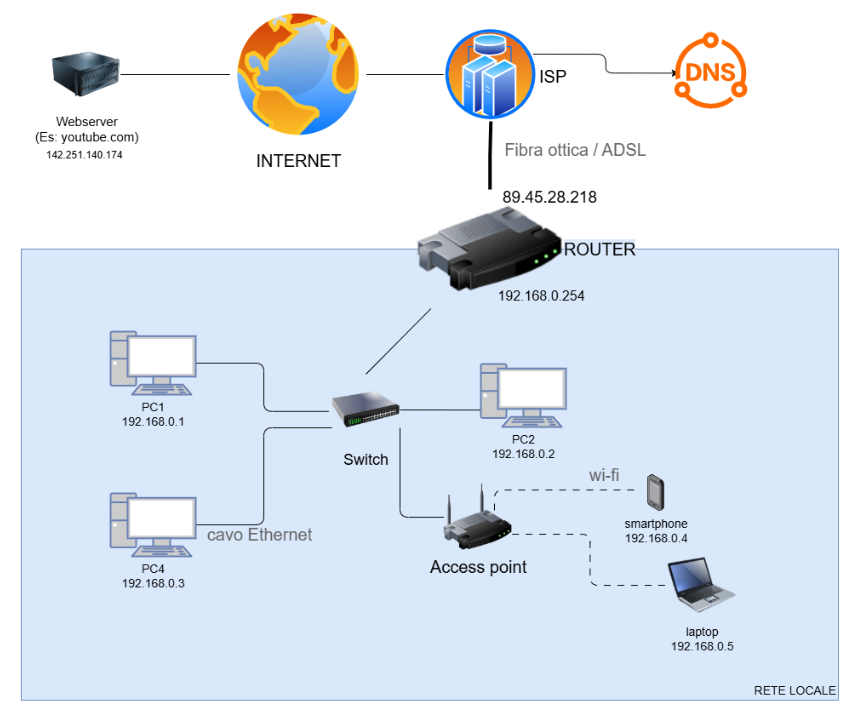

L'utente sul PC4 vuole visitare il sito web www.youtube.com

1.  Digita sul suo browser l'indirizzo

2.  La richiesta parte dal PC4 e, tramite lo switch, arriva al router.

3.  Il router gira la richiesta dell'utente sulla rete internet, inviandola all'ISP.

4.  L'ISP fa riferimento al DNS per tradurre il nome di dominio nel corrispondente indirizzo IP

5.  Tramite l'indirizzo IP la richiesta può raggiungere il server di www.youtube.com.

6.  Il server riceve la richiesta e risponde inviando la pagina richiesta dall'utente.

7.  La pagina arriva all'ISP che lo gira al nostro router che lo gira al PC4

## 7.2.3 Server in locale VS Server in Cloud 

Nei capitoli precedenti abbiamo esplorato come costruire una rete locale e come questa si connette alla rete globale, Internet. Una decisione fondamentale per qualsiasi organizzazione che necessiti di fornire servizi (come siti web, database, applicazioni gestionali) riguarda dove posizionare e come gestire l'infrastruttura server necessaria. Storicamente, l'unica opzione era quella di avere server fisici all'interno della propria struttura aziendale. Oggi, l'alternativa predominante è rappresentata dai servizi Cloud.

In questo capitolo confronteremo questi due approcci principali: mantenere i server "in locale" (on-premises) rispetto all'utilizzo di server "in Cloud".

### Il Server in Locale (In-house)

Questo è l'approccio tradizionale alla gestione dell'infrastruttura IT.

!!! info "Sintassi - Gestione In locale"
    **Gestione In locale** (oppure *In-House* o anche *on-premises*)

    Modello in cui un'organizzazione acquista, installa e gestisce la propria infrastruttura hardware (server, storage, apparati di rete) all'interno dei propri locali fisici (uffici, sala server dedicata).
<!-- REVIEW: tipo di box da confermare -->

**Come funziona:** L'azienda è responsabile di tutto il ciclo di vita dell'hardware: acquisto, installazione, configurazione, manutenzione, aggiornamento e smaltimento. Il personale IT interno gestisce il sistema operativo, il software applicativo, la sicurezza fisica e logica, l'alimentazione elettrica (spesso con gruppi di continuità), il raffreddamento e la connettività di rete interna ed esterna.

!!! info "Sintassi - Vantaggi"
    **Vantaggi** **Svantaggi**

    - **Controllo Totale:** L'azienda ha il pieno controllo sull'hardware, sul software, sui dati e sulle policy di sicurezza.

    - **Personalizzazione:** Possibilità di configurare l'hardware e il software in modo estremamente specifico per le proprie esigenze.

    - **Sicurezza (per alcuni aspetti):** I dati risiedono fisicamente all'interno dell'azienda, il che può essere percepito come più sicuro o richiesto da normative specifiche per dati sensibili. L'accesso fisico è controllato direttamente.

    - **Prestazioni (per accesso locale):** L'accesso ai server dalla rete locale (LAN) può essere estremamente veloce, non dipendendo dalla qualità della connessione Internet esterna.

    - **Indipendenza dai fornitori (hardware):** Una volta acquistato, l'hardware è di proprietà, senza dipendenze da canoni di noleggio per l'infrastruttura fisica.

    <!-- -->

    - **Costi Iniziali Elevati (CapEx):** Richiede un investimento iniziale significativo per l'acquisto di server, licenze software, apparati di rete e infrastrutture di supporto (alimentazione, raffreddamento).

    - **Costi Operativi (OpEx):** Costi continui per energia elettrica, manutenzione hardware, aggiornamenti software, personale IT qualificato per la manutenzione del sistema.

    - **Scalabilità Complessa:** Aumentare le risorse (CPU, RAM, storage) richiede l'acquisto e l'installazione di nuovo hardware, un processo che può essere lento e costoso. Ridurre le risorse è difficile (l'hardware acquistato rimane).

    - **Manutenzione:** Richiede personale dedicato per monitoraggio, aggiornamenti, backup, gestione guasti.

    - **Spazio Fisico:** Necessità di locali adeguati (sale server) con sistemi di raffreddamento e alimentazione dedicati.

    - **Disaster Recovery/Business Continuity:** Implementare soluzioni efficaci richiede infrastrutture ridondate, spesso in sedi separate, aumentando ulteriormente i costi e la complessità.
<!-- REVIEW: tipo di box da confermare -->

### Il Server in Cloud (Cloud Computing)

Il Cloud Computing rappresenta un paradigma diverso, basato sull'erogazione di risorse IT come servizio tramite Internet.

!!! info "Sintassi - Cloud Computing"
    **Cloud Computing**

    Modello che permette l'accesso on-demand tramite la rete a un insieme condiviso di risorse di calcolo configurabili (es. reti, server, storage, applicazioni, servizi) che possono essere rapidamente erogate e rilasciate con minimo sforzo di gestione o interazione con il provider.
<!-- REVIEW: tipo di box da confermare -->

**Come funziona:** Invece di acquistare e gestire hardware fisico, le aziende affittano le risorse di cui necessitano da un provider Cloud (come AWS, Google Cloud, Microsoft Azure, Aruba Cloud, ecc.). L'accesso a queste risorse avviene tramite Internet. Il modello di costo è tipicamente **pay-as-you-go**, ovvero si paga solo per le risorse effettivamente consumate e per il tempo di utilizzo. Il provider si occupa della gestione dell'infrastruttura fisica sottostante (data center, server fisici, rete, raffreddamento, alimentazione).

!!! info "Sintassi - Vantaggi"
    **Vantaggi** **Svantaggi**

    - **Scalabilità ed Elasticità:** Possibilità di aumentare o diminuire le risorse (CPU, RAM, storage) rapidamente e facilmente in base alle necessità, pagando solo per ciò che si usa.

    - **Costi Iniziali Ridotti:** Nessun investimento iniziale in hardware (modello OpEx predominante).

    - **Accessibilità:** Le risorse sono accessibili da qualsiasi luogo tramite Internet.

    - **Manutenzione Ridotta:** Il provider gestisce l'infrastruttura fisica, gli aggiornamenti hardware, la manutenzione dei data center.

    - **Affidabilità e Disponibilità:** I grandi provider cloud offrono infrastrutture ridondate e Service Level Agreement (SLA) che garantiscono elevati livelli di uptime.

    - **Disaster Recovery / Business Continuity:** Facilità nel configurare soluzioni di backup e ripristino in diverse aree geografiche.

    <!-- -->

    - **Costi Operativi a Lungo Termine:** Se non gestiti attentamente, i costi ricorrenti (OpEx) possono diventare significativi.

    - **Minore Controllo:** Controllo limitato o nullo sull'hardware fisico sottostante e sulle policy operative del data center del provider.

    - **Dipendenza dal Provider (Vendor Lock-in):** Migrare da un provider cloud a un altro può essere complesso e costoso.

    - **Sicurezza e Conformità:** La responsabilità della sicurezza è condivisa tra provider e cliente. È necessario comprendere bene il modello di responsabilità e assicurarsi che il provider rispetti le normative richieste (es. GDPR).

    - **Dipendenza dalla Connettività:** Le prestazioni e l'accessibilità dipendono interamente dalla qualità e stabilità della connessione Internet.
<!-- REVIEW: tipo di box da confermare -->

#### **Modelli di Servizio Cloud:** 

Il Cloud si articola principalmente in tre modelli di servizio:

- **IaaS (Infrastructure as a Service):** Il provider fornisce le risorse **infrastrutturali** fondamentali (macchine virtuali, storage, reti). Il cliente ha il controllo sul sistema operativo, sullo storage, sulle applicazioni installate e, potenzialmente, su alcuni componenti di rete (es. firewall virtuali). È il modello più flessibile e quello più simile alla gestione di server tradizionali, ma senza l'onere dell'hardware fisico.

- **PaaS (Platform as a Service):** Il provider fornisce una **piattaforma** che include sistema operativo, ambienti di programmazione, database e web server. Il cliente sviluppa e distribuisce le proprie applicazioni sulla piattaforma, senza doversi preoccupare dell'infrastruttura sottostante.

- **SaaS (Software as a Service):** Il provider fornisce applicazioni **software** complete, accessibili via web browser o app dedicate (es. Gmail, Salesforce, Microsoft 365). Il cliente utilizza semplicemente il software, senza gestire né l'infrastruttura né la piattaforma.

!!! info "Sintassi - Approfondimento: Hosting e Housing nel Contesto Cloud (IaaS)"
    **Approfondimento: Hosting e Housing nel Contesto Cloud (IaaS)**

    Come si collocano i concetti di Hosting e Housing visti in precedenza nel mondo Cloud? Principalmente nel modello IaaS:

    - **Hosting nel Cloud (IaaS):** Quando si affitta una Macchina Virtuale (VM) preconfigurata da un provider cloud, con un sistema operativo già installato e risorse definite (CPU, RAM, disco), l'esperienza è molto simile a quella di un Hosting VPS (Virtual Private Server) o Dedicato. Si gestisce il software sulla macchina virtuale, ma l'infrastruttura virtuale (e quella fisica sottostante) è gestita dal provider.

    - **Housing nel Cloud (IaaS):** Il concetto di "housing" fisico (portare il proprio server) non si applica direttamente al cloud pubblico. Tuttavia, il livello di controllo offerto da IaaS può avvicinarsi a quello desiderato in uno scenario di housing. Si possono creare VM da zero installando il proprio sistema operativo, configurare reti virtuali complesse (VPC - Virtual Private Cloud), gestire storage avanzato e policy di sicurezza granulari. Si ha un controllo quasi totale sull'ambiente virtuale, pur senza possedere l'hardware fisico, replicando la flessibilità dell'housing ma sull'infrastruttura del provider. Alcuni provider offrono anche "Bare Metal Servers" nel cloud, server fisici dedicati affittati dal cliente, che si avvicinano ulteriormente al concetto di housing, ma sono gestiti tramite le interfacce del cloud provider.
<!-- REVIEW: tipo di box da confermare -->

### Confronto Diretto: Locale vs. Cloud

| Caratteristica           | **Server in Locale (On-Premises)**                  | **Server in Cloud**                                             |
|--------------------------|-----------------------------------------------------|-----------------------------------------------------------------|
| **Costi Iniziali**       | Elevati (CapEx)                                     | Bassi (OpEx)                                                    |
| **Costi Ricorrenti**     | Manutenzione, energia, personale IT                 | Canoni basati sul consumo (OpEx)                                |
| **Controllo**            | Totale (Hardware & Software)                        | Limitato sull'hardware, variabile sul software (IaaS/PaaS/SaaS) |
| **Scalabilità**          | Lenta, costosa, pianificata                         | Rapida, flessibile, on-demand                                   |
| **Manutenzione**         | A carico dell'azienda (Hardware & Software)         | A carico del provider (Hardware), condivisa (Software)          |
| **Sicurezza Fisica**     | Responsabilità dell'azienda                         | Responsabilità del provider                                     |
| **Sicurezza Logica**     | Responsabilità dell'azienda                         | Responsabilità condivisa (Provider/Cliente)                     |
| **Accessibilità**        | Primariamente locale (accesso remoto configurabile) | Globale via Internet                                            |
| **Competenze Richieste** | Elevate (Gestione HW, SW, Rete, Sicurezza)          | Variabili (Configurazione Cloud, Sviluppo, DevOps)              |
| **Disaster Recovery**    | Complesso e costoso da implementare                 | Più semplice ed economico da configurare                        |

#### Conclusioni

La scelta tra un'infrastruttura server on-premises e una basata su cloud non ha una risposta univoca "migliore". Dipende da una valutazione attenta delle esigenze specifiche dell'organizzazione:

- **On-Premises** può essere preferibile per aziende con requisiti di controllo molto stringenti, dati estremamente sensibili, normative rigide, personale IT altamente qualificato e un budget iniziale consistente, o dove la latenza verso i servizi locali è un fattore critico.

- **Cloud** è spesso la scelta ideale per startup, aziende in crescita, organizzazioni che necessitano di flessibilità e scalabilità rapide, chi vuole ridurre l'investimento iniziale e delegare la gestione dell'infrastruttura fisica, e per sfruttare servizi innovativi (AI, Big Data) offerti dai provider.

Esistono anche **soluzioni ibride**, che combinano infrastrutture on-premises con servizi cloud, cercando di ottenere il meglio da entrambi i mondi (es. mantenendo dati sensibili in locale e utilizzando il cloud per scalabilità o disaster recovery). La comprensione delle differenze fondamentali è il primo passo per una scelta strategica consapevole.

## 7.2. Domande di comprensione

#### Domande a crocette

**1. Un'azienda vuole permettere ai propri dipendenti di lavorare da casa collegandosi alla rete aziendale in modo sicuro, come se fossero in ufficio. Quale tecnologia è più indicata per questo scopo?**

A\) L'acquisto di un abbonamento Internet con fibra ottica FTTH.
>
B\) L'installazione di più Access Point Wi-Fi.
>
C\) L'utilizzo di una VPN (Virtual Private Network).
>
D\) Un server DNS dedicato.

**2. Qual è il ruolo principale di un ISP (Internet Service Provider)?**

A\) Creare i nomi di dominio per i siti web.
>
B\) Gestire la sicurezza fisica dei data center della dorsale Internet.
>
C\) Fornire l'hardware server per le aziende (housing).
>
D\) Fornire la connessione a Internet agli utenti finali (case, aziende) collegandoli alla rete globale.

**3. Cosa si intende quando si dice che Internet è una "rete di reti"?**

A\) Che Internet è formata dall'interconnessione di tante reti più piccole (aziendali, degli ISP, ecc.) collegate tra loro tramite router.
>
B\) Che esistono due versioni di Internet: una cablata e una wireless.
>
C\) Che tutta Internet usa solo cavi in fibra ottica sottomarini.
>
D\) Che ogni sito web ha una propria rete interna separata.

**4. Quando digiti "www.esempio.com" nel browser, cosa fa principalmente il sistema DNS?**

A\) Assegna un indirizzo IP temporaneo al tuo computer.
>
B\) Verifica se hai pagato l'abbonamento per visitare quel sito.
>
C\) Controlla se il sito è sicuro e protetto da firewall.
>
D\) Trova l'indirizzo IP numerico corrispondente al nome "www.esempio.com" per permettere al computer di localizzare il server.

**5. In cosa consiste principalmente la "dorsale Internet" (Internet backbone)?**

A\) Nelle principali vie di comunicazione ad alta velocità (spesso in fibra ottica, anche sottomarine) che collegano i nodi principali della rete globale.
>
B\) Nei server che ospitano i siti web più importanti.
>
C\) Nel protocollo Wi-Fi che permette la connessione senza fili.
>
D\) Nell'insieme di tutti i router domestici connessi nel mondo.

**6. Qual è uno dei principali vantaggi dell'avere un server "in locale" (On-Premises) rispetto a usare un servizio Cloud?**

A\) Scalabilità immediata delle risorse senza acquisti aggiuntivi.
>
B\) Completo controllo diretto sull'hardware fisico, sul software e sulla sicurezza dei dati all'interno dell'azienda.
>
C\) Costi iniziali molto più bassi per l'hardware.
>
D\) Manutenzione dell'hardware e del data center gestita da un fornitore esterno.

**7. Quale modello di servizio Cloud (come IaaS, PaaS, SaaS) offre il maggior livello di controllo sull'infrastruttura virtuale (sistema operativo, rete virtuale, storage), simile a gestire un proprio server ma senza possedere l'hardware fisico?**

A\) SaaS (Software as a Service)
>
B\) BPaaS (Business Process as a Service)
>
C\) IaaS (Infrastructure as a Service)
>
D\) PaaS (Platform as a Service)

**8. Un vantaggio chiave dell'usare server in Cloud rispetto a quelli on-premises è:**

A\) Il pieno controllo fisico sulla posizione geografica esatta dei server.
>
B\) Non dipendere mai dalla connessione Internet per accedere ai dati.
>
C\) Avere la certezza che i costi mensili saranno sempre fissi e prevedibili.
>
D\) La facilità e rapidità con cui si possono aumentare o diminuire le risorse (scalabilità) pagando solo per quello che si usa.

**9. Se un'azienda decide di usare un servizio di Housing/Colocation (come descritto nel capitolo precedente), cosa sta effettivamente facendo?**

A\) Affittando spazio fisico in un data center esterno per installare e gestire i propri server.
>
B\) Utilizzando un software specifico via Internet fornito da un provider (SaaS).
>
C\) Creando una rete Wi-Fi aziendale sicura.
>
D\) Affittando un server di proprietà del provider, gestito dal provider stesso.

**10. Considerando l'accesso remoto sicuro tramite VPN, cosa succede al traffico internet dell'utente mentre è connesso alla VPN aziendale?**

A\) La VPN aumenta la velocità della connessione internet dell'utente.
>
B\) Il traffico passa attraverso la rete aziendale e appare su Internet come se provenisse dalla sede dell'azienda.
>
C\) Il traffico internet continua a passare direttamente dall'ISP dell'utente, senza coinvolgere la rete aziendale.
>
D\) Il traffico internet viene bloccato per motivi di sicurezza.

#### Domande Vero/Falso

1.  Una VPN (Virtual Private Network) rende la navigazione su Internet meno sicura perché aggiunge passaggi intermedi. **V/F**

2.  Gli ISP (Internet Service Provider) sono le aziende che creano fisicamente i cavi sottomarini della dorsale Internet. **V/F**

3.  Il sistema DNS serve a tradurre l'indirizzo IP numerico di un server nel nome di dominio corrispondente (es. da 142.251.163.94 a www.google.it). **V/F**

4.  Quando le autorità bloccano un sito illegale, spesso chiedono agli ISP italiani di rimuovere l'associazione tra il nome del sito e il suo indirizzo IP dal DNS. **V/F**

5.  Scegliere una soluzione "On-Premises" (server in locale) significa avere costi iniziali molto bassi ma canoni mensili elevati per l'affitto dell'hardware. **V/F**

6.  Il Cloud Computing permette alle aziende di affittare risorse informatiche (come server o storage) da un fornitore esterno, pagando in base all'uso. **V/F**

7.  Il modello IaaS (Infrastructure as a Service) nel Cloud è quello che offre meno controllo all'utente, fornendo solo software pronti all'uso. **V/F**

8.  Uno dei principali vantaggi del Cloud è la scalabilità, cioè la possibilità di aumentare o diminuire facilmente le risorse necessarie. **V/F**

9.  Utilizzando un server in Cloud, l'azienda non deve più preoccuparsi della manutenzione dell'hardware fisico su cui girano le sue applicazioni. **V/F**

10. La "dorsale Internet" (backbone) è costituita principalmente da connessioni wireless a corto raggio tra i vari continenti. **V/F**

####  Domande di rielaborazione

<u>Queste domande testano la vostra conoscenza e la vostra abilità di rielaborazione in un formato discorsivo, come potrebbe essere una domanda di un'interrogazione o una traccia di un esame di stato</u>

1.  Descrivi come progetteresti la struttura di base di **una rete locale (LAN)** per una piccola azienda che necessita di: accesso a Internet per tutti i dipendenti, una rete Wi-Fi per ospiti e dispositivi mobili, una stampante di rete condivisa e un server interno per i file aziendali. Specifica quali dispositivi di rete (Switch, Router, AP, Firewall) utilizzeresti e come li collegheresti.

2.  Spiega cos'è una **VPN (Virtual Private Network)** e come funziona il concetto di "tunneling". Descrivi almeno due scenari di utilizzo principali per una VPN (es. telelavoro, accesso a contenuti con restrizioni geografiche ).

3.  Descrivi la **struttura generale di Internet**, includendo i concetti di dorsale Internet (backbone), il ruolo degli ISP (Internet Service Provider) e come Internet possa essere vista come una "rete di reti" interconnesse.

4.  Spiega la funzione del **DNS** (Domain Name System). Descrivi il processo che avviene quando un utente digita un nome di dominio (es. www.google.it) nel browser, illustrando come il DNS interviene per permettere la connessione al server corretto.

5.  Confronta l'approccio "**Server in locale**" (On-Premises) con l'approccio "**Server in Cloud**" per la gestione dell'infrastruttura IT aziendale. Discuti vantaggi e svantaggi di ciascuna soluzione in termini di costi (iniziali e operativi), controllo, scalabilità, manutenzione e sicurezza.

**Risposte corrette. Evidenziare con il mouse per vedere le risposte**

**Crocette**

**1.** C **2.** D **3.** A **4.** D **5.** A **6.** B **7.** C **8.** D **9.** A **10.** B

**Vero/Falso:**

1.  **Falso** (Una VPN crea una connessione sicura e cifrata su una rete pubblica come Internet).

2.  **Falso** (Gli ISP collegano gli utenti alla dorsale, ma non necessariamente costruiscono la dorsale stessa).

3.  **Falso** (Il DNS fa il contrario: traduce il nome di dominio in indirizzo IP).

4.  **Vero**.

5.  **Falso** (On-Premises ha costi iniziali elevati per l'acquisto hardware; è il Cloud che ha tipicamente bassi costi iniziali e canoni ricorrenti).

6.  **Vero**.

7.  **Falso** (IaaS offre il massimo controllo sull'infrastruttura virtuale; è SaaS che fornisce software pronti all'uso).

8.  **Vero**.

9.  **Vero** (La manutenzione dell'hardware fisico è responsabilità del provider Cloud).

10. **Falso** (La dorsale usa principalmente collegamenti ad alta velocità via cavo, spesso fibra ottica, anche sottomarini).

## 7.3 I protocolli di internet

Abbiamo stabilito nel capitolo 7.1 quali sono gli strumenti per realizzare una rete e nel 7.2 come questi strumenti si utilizzano insieme per la struttura fisica della rete locale e internet.

Vediamo adesso quali sono le regole che governano le comunicazioni su internet, cominciando dal concetto di protocollo di comunicazione

!!! abstract "Definizione"
    Un **protocollo di comunicazione** è un insieme di regole descritte in maniera formale che definiscono le modalità di comunicazione tra due o più interlocutori.

    Nel caso di un protocollo di comunicazione che opera su una rete di computer si parla di **protocollo di rete**

!!! info "Sintassi - La comunicazione in classe"
    **La comunicazione in classe**

    Un esempio di protocollo di comunicazione è quello che regolamenta la comunicazione in classe. Il docente parla, lo studente che vuole intervenire alza la mano. Lo studente può parlare soltanto quando il docente gli passa la parola. Alla fine dell'intervento la parola torna al docente.

    È una procedura ben descritta e nota a tutte le parti in gioco che permette di regolare la comunicazione ed evitare confusione o perdita di informazioni.

    **Il Walkie Talkie**

    Un protocollo di comunicazione molto noto è quello che regolamenta l'utilizzo del walkie talkie. Il walkie-talkie è un dispositivo ricetrasmittente che funziona soltanto in uno dei due versi per volta (mentre trasmette non riceve, mentre riceve non trasmette).

    Per poter comunicare in maniera che ci sia ordine e non si perdano i messaggi il protocollo è:

    - Il primo utente inizia a trasmettere premendo il pulsante. Parla e quando ha finito annuncia il termine del suo intervento con la parola **passo.** A quel punto lascia il pulsante e si mette in modalità di ricezione.

    - Sentita la parola chiave **passo**, l'altro utente sa di avere il via libera e può iniziare a trasmettere. A sua volta dirà **passo** alla fine del suo intervento.

    - Si continua così fino al termine della conversazione in cui si conclude l'intervento con **passo e chiudo.**
<!-- REVIEW: tipo di box da confermare -->

Nel caso della rete è fondamentale regolamentare il flusso di dati per dare ordine a quello che sarebbe un caos di tentate comunicazioni contemporanee:

**Requisiti di un buon protocollo di rete**  
Bisogna affrontare la grossa sfida di cercare di mettere in comunicazione **dispositivi di tipologia diversa** (smartphone, PC, tablet, ecc..) con hardware diverso, sistema operativo diverso (Mac, Android, Windows, ecc..), tecnologia di trasmissione diversa (cavo, fibra ottica, Wi-Fi, ecc..) su cui vogliamo far comunicare software.

Vorremmo anche che la connessione sia accurata, quindi vogliamo implementare un sistema di **controllo degli errori** che permetta al destinatario di sapere se il dato è arrivato a destinazione integro.

Vorremmo anche che la connessione sia sicura, quindi bisogna implementare un sistema di **cifratura** che prevenga le intrusioni.

Vorremmo poi consentire **più trasmissioni contemporaneamente**. L'invio di un file che richiede 5 minuti non può monopolizzare la connessione e bloccare tutti gli altri invii.

Dati tutti questi requisiti vediamo quali alternative sono state proposte per rispondere alle esigenze. Ne vediamo due: il modello ISO/OSI e il modello TCP/IP

### 7.3.1 ISO/OSI

Il **modello ISO/OSI** (International Organization for Standardization/Open Systems Interconnection) è un modello che cerca di dare uno standard di comunicazione sulle reti informatiche introducendo il concetto di **struttura a livelli** (in italiano sono anche chiamati strati)**.**

Il modello è stato sviluppato nel 1984 dall'ISO (International Organization for Standardization) ed è da allora considerato lo **standard teorico** per tutti i protocolli di comunicazioni in rete. 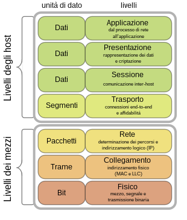

#### I 7 livelli di ISO/OSI

Il modello ISO/OSI si basa su **una struttura a 7 livelli** dal più alto, quello dell'applicazione, al più basso, quello fisico. I livelli sono numerati dal basso all'alto: Fisico (in basso) è il numero 1, Applicazione (in alto) è il numero 7,.  
Dato che i livelli sono in pila, si fa spesso riferimento all'insieme dei 7 livelli come **pila ISO/OSI** o **stack ISO/OSI**

I 7 livelli sono pensati in modo da rendere **flessibile** il processo: vengono eseguiti in sequenza, uno dopo l'altro, e ogni livello interagisce solo con i livelli ad esso adiacenti.

Ogni livello si occupa di **una fase della comunicazione**, prende l'output del livello ad esso precedente e passa i risultati al livello successivo in una specie di catena di montaggio.

Questa struttura a livelli rende il protocollo estremamente **flessibile** perché ogni livello si occupa <u>di un solo compito</u> ed è indipendente dagli altri nel funzionamento

!!! info "Sintassi - Flessibilità dei livelli"
    **Flessibilità dei livelli**

    Prendiamo ad esempio la trasmissione di dati su **Whatsapp** (o Google Chrome o Fortnite, una qualunque applicazione in realtà).

    Whatsapp agisce <u>esclusivamente</u> al livello Applicazione (livello 7 della pila ISO/OSI). <u>Non deve preoccuparsi</u> di come si effettua l'indirizzamento dei pacchetti (livello Rete, livello 3 della pila) o se i dispositivi sono connessi alla rete tramite Wi-Fi, Ethernet, ecc.. (livello Fisico, livello 1 della pila).
<!-- REVIEW: tipo di box da confermare -->

Non vedremo nel dettaglio lo scopo di ognuno dei 7 livelli: come detto ISO/OSI è un **modello teorico**. È fondamentale per la comprensione completa delle reti, ma in questo manuale verrà approfondito solo TCP/IP, che implementa i livelli di ISO/OSI ed è diventato lo **standard de facto** di tutte le comunicazioni su internet.

### 7.3.2 TCP/IP

La suite di protocolli **TCP/IP** implementa l'architettura teorica di ISO/OSI riducendo il numero di livelli da 7 a 4. Prima di vedere il dettaglio dei 4 livelli vediamo una Panoramica.

Il modello **TCP/IP** prende il nome dai due protocolli (TCP e IP) che occupano il livello 2 e 3 della pila. Sono stati i primi ad essere utilizzati per le trasmissioni su internet e sono alla base di tutte le comunicazioni.

#### Panoramica del protocollo

L'invio di dati sulla rete porta diverse sfide. Due tra queste sono

- **Gestione della larghezza di banda**: l'invio di dati sulla rete non deve congestionare la connessione e monopolizzare tutta la larghezza di banda.  
  Esempio: se l'invio richiede 10 minuti, non possiamo avere tutto il restante traffico bloccato per 10 minuti.

- **Fault-tolerance** (resistenza agli errori)  
  la trasmissione dei dati sulla rete è spesso soggetta ad errori, per interferenza, scarso segnale del Wi-Fi, scarsa larghezza di banda, ecc.. Occorre avere un modo per verificare e correggere gli errori

##### La divisione in pacchetti

Queste richieste sarebbero impossibili da soddisfare se inviassimo i dati in un blocco unico. <u>Occorre dividere i dati in segmenti più piccoli</u> (che chiamiamo **pacchetti)** e inviare ognuno di questi pacchetti separatamente

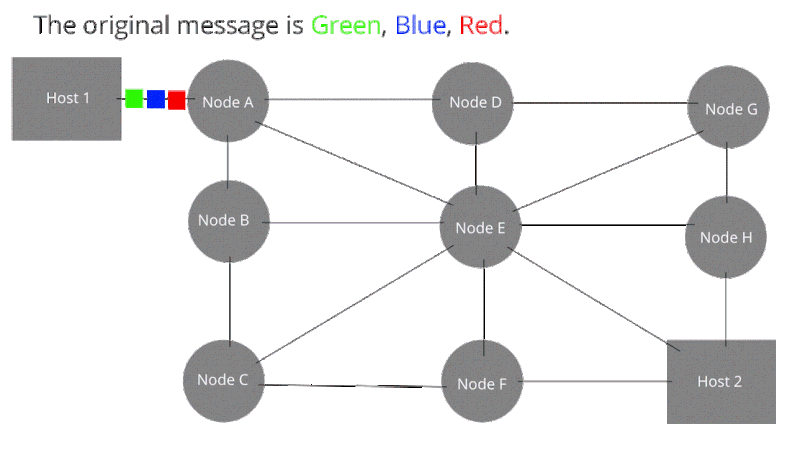

I vantaggi sono diversi:

- **Connessioni multiple.**  
  L'invio in diversi **pacchetti** fa sì che si possano gestire molte connessioni contemporaneamente, alternando l'invio dei pacchetti di diverse trasmissioni.  
    
  **Esempio:** navigare sul web non è impedito dall'invio di un video su WhatsApp. Se durante l'invio del video si richiede una pagina web, l'invio del video viene temporaneamente sospeso per permettere al browser di caricare la pagina. Questo è possibile perché il video non viene inviato come un unico grande file, ma è suddiviso in numerosi pacchetti. Così, l'invio può essere interrotto dopo un pacchetto e ripreso successivamente senza perdere dati.

- **Correzione degli errori.**  
  Nel caso di un errore durante l'invio, possiamo scartare il solo pacchetto in cui c'è stato l'errore invece che ricominciare da capo l'intero invio.

- **Migliore gestione della rete.  
  **Dividendo il messaggio in pacchetti possiamo inviare i pacchetti contemporaneamente su più strade. Ogni pacchetto troverà la strada più libera in quel momento.

##### La struttura a livelli

Come il precedente modello ISO/OSI, TCP/IP è strutturato su livelli. TCP/IP usa 4 livelli (o 5 secondo alcuni manuali).

Nel seguente schema vediamo sulla sinistra **la pila ISO/OSI**, con i suoi 7 livelli e sulla destra il protocollo **TCP/IP**, con i suoi 4 livelli. <u>Notare la corrispondenza con i 7 livelli di ISO/OSI.</u> 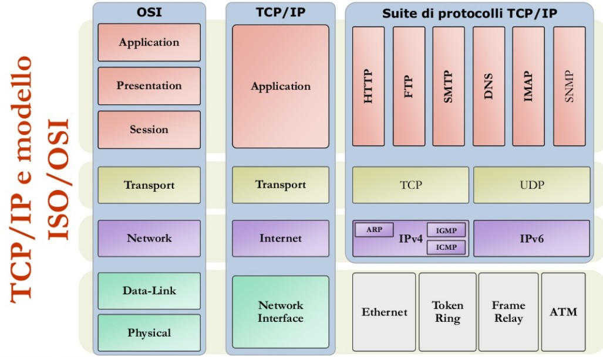

**I 4 livelli sono Applicazione, Trasporto, Internet e Accesso alla rete.**

Durante l'invio le quattro fasi vengono effettuate in sequenza, una dopo l'altra.  
Alla ricezione vengono eseguite le quattro fasi nell'ordine inverso.

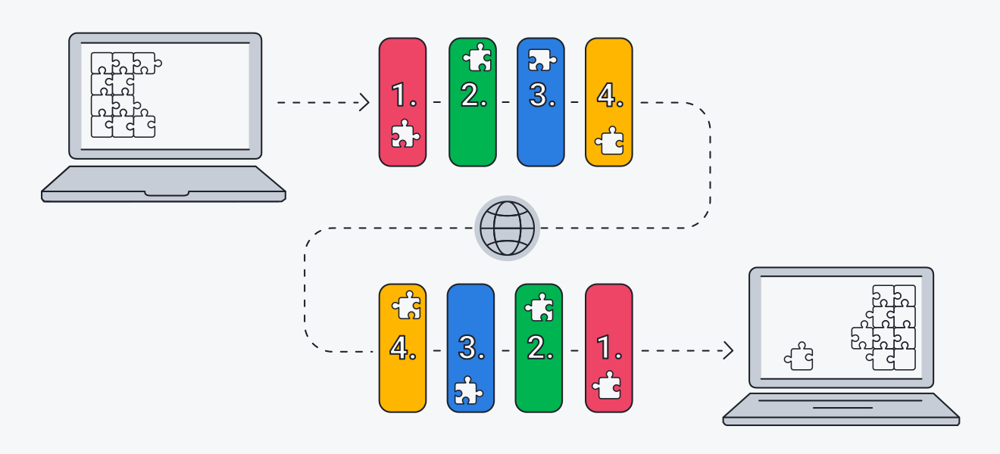

**Invio** (sul dispositivo del mittente)

| **1.** | **Applicazione**      | L'applicazione crea il **messaggio** da inviare (es: Chrome richiede una pagina).                                                                   |
|--------|-----------------------|-----------------------------------------------------------------------------------------------------------------------------------------------------|
| **2.** | **Trasporto**         | Il messaggio viene diviso in **segmenti** di breve lunghezza.                                                                                       |
| **3.** | **Internet**          | Ad ogni segmento viene assegnato l'indirizzo IP del destinatario. Il segmento con l'indirizzo IP prende il nome di **pacchetto**                    |
| **4.** | **Accesso alla rete** | i pacchetti sono <u>fisicamente</u> **inviati** sulla rete. A questo livello troviamo tutta la parte fisica della rete (cavi, switch, Wi-Fi, ecc..) |

**  
Ricezione** (sul dispositivo del destinatario)

| **4.** | **Accesso alla rete** | I pacchetti sono <u>fisicamente</u> ricevuti sulla rete.                                              |
|--------|-----------------------|-------------------------------------------------------------------------------------------------------|
| **3.** | **Internet**          | Dai pacchetti viene rimosso l'indirizzo IP del destinatario, otteniamo i segmenti di breve lunghezza. |
| **2.** | **Trasporto**         | I segmenti vengono **riordinati** e riassemblati *(a seconda del protocollo scelto)*                  |
| **1.** | **Applicazione:**     | L'applicazione **riceve il messaggio** inviato.                                                       |

!!! abstract "Definizione"
    **Approfondimento - L'incapsulamento**

    Nel dettaglio cosa fa ogni livello?

    Possiamo pensare al risultato di ogni livello come una scatola. Ad ogni passaggio vengono aggiunte delle informazioni e chiuse in una "scatola più grande", come una matrioska. Questo processo prende il nome di **incapsulamento.**

    **L'animazione in questa risorsa video è il modo migliore per visualizzare il processo.  
    ***<u>Nota: nell'animazione il modello TCP/IP è a 5 livelli. Gli ultimi due per noi sono accesso alla rete</u>***  
    **

    [<u>Data Encapsulation and De-encapsulation ( TCP/IP model ) Animation</u>](https://www.youtube.com/watch?v=FJIFfkpUO7o)  
    <u>(video di 1 minuto e 17 secondi. Da guardare)</u>

    Provando invece a fare una descrizione testuale avviene questo:

    All'invio:

    - Il livello **applicazione** crea i dati e li manda al livello trasporto.

    - Il **livello di trasporto** divide questi dati in segmenti. In ognuno di questi aggiunge un header che contiene delle informazioni aggiuntive necessarie alla gestione dell'invio. "Chiude ognuno in una scatola" *(la scatola è il segmento)*

    - Il **livello internet** prende la "scatola" che arriva dal pacchetto, aggiunge un header che contiene delle informazioni aggiuntive necessarie all'indirizzamento e "chiude in una scatola" *(la scatola è il pacchetto)*

    - Il **livello di accesso alla rete** trasforma e invia il pacchetto tramite una sequenza di segnali 0 e 1, in base alla tecnologia di trasmissione utilizzata

    Alla ricezione:

    - Il **livello di accesso alla rete** recupera i dati dalla rete, ottenendo il pacchetto

    - Il **livello internet** "apre la scatola" e rimuove l'header con l'indirizzo IP, ottenendo il segmento

    - Il **livello di trasporto** prende i segmenti ricevuti dal livello internet, rimuove l'header del trasporto, ricombina tutti i pacchetti e ottiene i dati che inoltra all'applicazione.

    - Il livello **applicazione** legge i dati

!!! abstract "Definizione"
    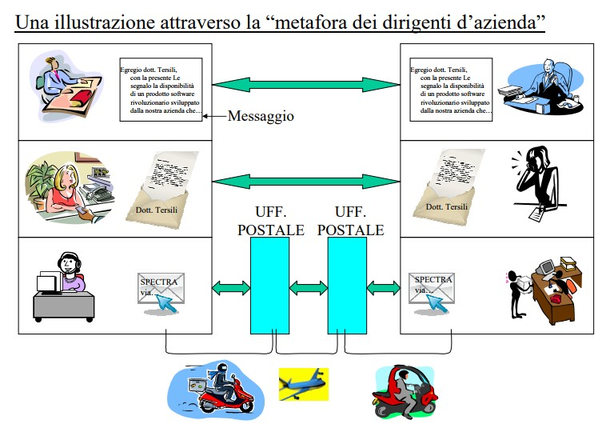

    Possiamo vedere un esempio esplicativo con una metafora che spiega ogni livello paragonandolo all'invio di un messaggio di posta tra dirigenti aziendali.  
    **INVIO:**

    - **Applicazione:** è il dirigente che scrive il testo del messaggio

    - **Trasporto:** è la segretaria che mette il messaggio in una busta (creazione segmenti)

    - **Internet:** viene messo l'indirizzo del destinatario sulla busta (aggiunta indirizzi IP)

    - **Accesso alla rete:** è il livello fisico, dove viene effettivamente recapitato il messaggio. Qui abbiamo i camion, motorini, aeroplani della posta che fanno effettivamente spostare la lettera

    **RICEZIONE:**

    - **Accesso alla rete:** il postino arriva nella sede del destinatario con la lettera

    - **Internet:** la portineria accetta la lettera dopo aver verificato l'indirizzo

    - **Trasporto:** la lettera viene tolta dalla busta e infine

    - **Applicazione:** il dirigente riceve il messaggio

#### I quattro livelli di TCP/IP

Vediamo adesso i quattro livelli nel dettaglio, uno per volta e vediamo, per ogni livello, quali sono i protocolli disponibili.

Analizziamo questo schema riassuntivo. Vediamo:

- Sulla sinistra **la pila ISO/OSI**, con i suoi 7 livelli

- Al centro il protocollo **TCP/IP**, con i suoi 4 livelli. Notare la corrispondenza con i 7 livelli di ISO/OSI.

- Sulla destra i **protocolli effettivi** che vengono utilizzati ad ogni livello.

  1.  **Applicazione:** sono indicati 6 protocolli, esempio di possibili applicazioni

  2.  **Trasporto:** i possibili protocolli sono TCP e UDP.

  3.  **Internet:** i possibili protocolli sono IPv4 e IPv6

  4.  **Accesso alla rete:** abbiamo Ethernet e altri che non vedremo

##### Applicazione

!!! abstract "Definizione"
    Il livello **applicazione** è quello più in alto nella pila, qui troviamo tutti i protocolli utilizzati dal software che vuole comunicare in rete.

Ogni software utilizza un suo protocollo, citiamo solo i più importanti:

- **HTTP (HyperText Transfer Protocol):** è il protocollo utilizzato dai **browser** per la navigazione delle pagine web. Ormai quasi sempre è sostituito da **HTTPS**, una versione crittografata dello stesso.

- **FTP (File Transfer Protocol):** Protocollo per il **trasferimento dei file**, spesso usato per il download o upload di file su server.

- **SMTP, IMAP, POP3:** Protocolli per invio e ricezione di **email**

- **DNS:** Protocollo per la comunicazione con i **server DNS** e conversione di nome di dominio in indirizzo IP

- **DHCP:** Protocollo per la comunicazione con i server DHCP e assegnazione di indirizzi IP in maniera dinamica

Ogni software, con il suo protocollo applicativo, crea il messaggio che vuole inviare sulla rete e lo passa al livello di trasporto.

##### Trasporto

!!! abstract "Definizione"
    Il livello di **trasporto** prende il messaggio creato dall'applicazione e lo **divide in sezioni più piccole** (dimensioni nell'ordine di grandezza del kilobyte) per prepararle all'invio.  
    A seconda del protocollo scelto (TCP o UDP) aggiunge informazioni per la gestione dell'invio e degli errori

!!! info "Sintassi - Nota"
    **Nota:** Spesso si fa riferimento alle sezioni create dal livello di trasporto come **pacchetti**, anche se tecnicamente si chiamano pacchetti solo dopo il livello di trasporto.  
    A questo livello si chiamano **segmenti** o **datagrammi** in base al protocollo.
<!-- REVIEW: tipo di box da confermare -->

A questo livello abbiamo due protocolli: **TCP** e **UDP**.

**TCP (Transmission Control Protocol)** è un protocollo che effettua il controllo degli errori ed è utilizzato per ottenere trasmissioni **<u>affidabili.</u>**

**UDP (User Datagram Protocol)** è un protocollo che non effettua alcun controllo degli errori ed è utilizzato per ottenere trasmissioni <u>**veloci**.</u>  
  
Nel dettaglio:

!!! info "Sintassi - TCP"
    **TCP** **UDP**

    Stabilisce una **connessione** prolungata tra mittente e destinatario prima di iniziare la comunicazione**  
    **

    **  

    All'invio:**

    - **Divide** il messaggio in sezioni chiamati **segmenti**, di lunghezza tra 500 e 1500 byte

    - Gestisce il **controllo degli errori** e reinvia al destinatario eventuali pacchetti persi

    **Alla ricezione:**

    - **Riordina** i pacchetti che arrivano in ordine sparso

    - Controlla se ci sono **errori** o pacchetti mancanti ed eventualmente richiede al mittente **un nuovo invio** dei pacchetti mancanti

    - Invia al mittente una **conferma di ricezione**

    Non stabilisce una connessione prolungata tra mittente e destinatario prima di iniziare la comunicazione, ogni pacchetto arriva separatamente e indipendentemente dagli altri.

    **All'invio:**

    - **Divide** il messaggio in sezioni chiamati **datagrammi**, di lunghezza tra 500 e 1500 byte

    **Alla ricezione:**

    - **Estrae** i dati dal datagramma e li passa all'applicazione

    **N.B.** Osserviamo che UDP non effettua controlli, non riordina, non richiede pacchetti persi.  
    <u>Non garantisce in alcun modo la correttezza della trasmissione</u>

    **Pro:**

    - **Garantisce accuratezza:  
      **I dati inviati arrivano per certo e nell'ordine richiesto

    **Contro:**

    - **Minore velocità:  
      **Tutti i controlli sugli errori costano del tempo aggiuntivo che si perde durante la trasmissione

    **Pro:**

    - **Maggiore velocità:  
      **Non effettuando controlli di alcun tipo UDP è più tempestivo nella trasmissione dei dati

    **Contro:**

    - **Nessuna accuratezza:  
      **Non c'è garanzia di trasmissione: i dati potrebbero arrivare corrotti o non arrivare affatto

    **Casi di utilizzo:**

    Tutti i software per cui è fondamentale la **<u>completezza</u>** della trasmissione:

    browser, email, messaggistica, ecc…

    **Casi di utilizzo:**

    Tutti i software per cui è fondamentale la **<u>tempestività</u>** della trasmissione:

    chiamate e videochiamate, streaming live, videogiochi, ecc..
<!-- REVIEW: tipo di box da confermare -->

!!! abstract "Definizione"
    **Risorsa video: confronto tra TCP e UDP  
    **Video che, con ottima animazione, spiega bene le differenze tra i due protocolli di trasporto. Da guardare.**  
    **[<u>TCP vs UDP Comparison</u>](https://www.youtube.com/watch?v=uwoD5YsGACg)

!!! abstract "Definizione"
    **Approfondimento - Le porte**
    >
    Abbiamo già visto (e specificheremo meglio nel livello Internet) come tutte le trasmissioni arrivano a destinazione utilizzando l'indirizzo IP del destinatario.
    >
    <u>Sulla stessa macchina però sono in esecuzione **diverse applicazioni**.  
    </u>Come fanno i computer a capire a quale delle applicazioni aperte è indirizzata la trasmissione?
    >
    Un esempio ancora più evidente è quando abbiamo **due schede aperte** dello stesso browser. Se in una scheda faccio richiesta della pagina www.google.it, quando la pagina mi viene inviata come fa il mio computer a distinguere qual è la scheda che ha fatto la richiesta?
    >
    Per poter permettere a più applicazioni di sfruttare la stessa connessione (**multiplexing**) nel livello di trasporto entrano in gioco le **porte di rete**
    >
    **Le porte di rete**
    >
    Quando un processo in esecuzione sul computer vuole comunicare in rete gli viene assegnato dal sistema operativo del computer una porta di comunicazione.
    >
    **La porta è un numero da 0 a 65535 che viene assegnato ad un processo dal sistema operativo.**
    >
    *Esistono alcune porte standard (21 per FTP, 80 per HTTP, 443 per HTTPS,ecc..), altre sono a libera disposizione del sistema operativo.*
    >
    Quando quell'applicazione vuole trasmettere dei dati e manda una richiesta con TCP/IP, **nel livello di trasporto viene aggiunto** al segmento (o datagramma) il riferimento alla **porta dell'applicazione** a cui il dato è destinato.
    >
    **TCP.** Nello specifico per TCP, prima dell'invio effettivo dei dati, **viene stabilita una connessione** e vengono stabilite una coppia di porte, una nel pc del mittente e una del destinatario, che saranno occupate per tutto lo scambio di dati.
    >
    **UDP.** Per quanto riguarda UDP, non viene stabilita una connessione prolungata, quindi la porta rimane disponibile e in ascolto per ricevere dati anche da più sorgenti.
    >
    **Risorsa video:  
    **[<u>Network Ports Explained</u>](https://www.youtube.com/watch?v=g2fT-g9PX9o&ab_channel=PowerCertAnimatedVideos)

##### Internet

!!! abstract "Definizione"
    Il livello **internet** prende i segmenti (o datagrammi) che arrivano dal livello di trasporto, vi aggiunge le informazioni necessarie all'indirizzamento (IPv4 o IPv6) e il risultato del processo sono i **pacchetti**

Questo livello del processo è quello che si occupa di far sì che i pacchetti arrivino al suo destinatario. <u>Su questo livello operano i router</u>, che identificando l'ip nel pacchetto sono in grado di instradarlo verso la rete corretta.

Nel livello di internet i protocolli disponibili sono IPv4 e IPv6

!!! info "Sintassi - IPv4"
    **IPv4** **IPv6**

    Indirizzo IP composto da 32 bit.

    **  
    L'indirizzo è rappresentato con 4 numeri da 0 a 255 separati da un .  
    **

    *Esempio*:

    192.168.0.15

    Indirizzo IP composto da 128 bit

    **L'indirizzo è rappresentato con 8 numeri da quattro cifre esadecimali separato da :**

    **  
    ***Esempio*:

    2001:0db8:85a3:0000:0000:8a2e:0370:7334

    **Numero di indirizzi disponibili:  

    **Con 32 bit abbiamo un numero di indirizzi IP pari a

    232=4.294.967.296**  

    Poco più di 4 miliardi di indirizzi IP.**

    Al mondo ci sono circa 8 miliardi di persone. Ci sono diverse tecniche per risparmiare indirizzi IP, ma anche così stiamo esaurendo. L'unica soluzione sarà passare a IPv6.

    **Numero di indirizzi disponibili:**

    Con 128 bit abbiamo un numero di indirizzi IP pari a 2128, il cui risultato è difficile da scrivere. È un numero con 38 cifre.**  

    Svariati miliardi di miliardi di miliardi di….**

    Una quantità di indirizzi IP che sarà impossibile da esaurire.
<!-- REVIEW: tipo di box da confermare -->

Con riferimento a IPv4, vediamo nel dettaglio come funziona un indirizzo IP.  
In base alla grandezza della rete che si vuole creare si distinguono due parti dell'indirizzo IP: una parte che identifica la **rete**, una parte che identifica **l'host** all'interno della rete.

Per stabilire quale parte dell'indirizzo IP indica la rete si utilizza la cosiddetta **maschera di rete**

!!! abstract "Definizione"
    **Maschere di rete e classi di indirizzi IP**
    >
    La maschera di rete è una sequenza di quattro cifre da 0 a 255 separate da un punto. <u>Non vedremo le sottoreti</u>, ma vedremo soltanto le classi principali A,B,C:

    - Nel punto in cui troviamo 255 intendiamo che quella posizione nell'indirizzo IP è riservata alla rete

    - Nel punto in cui troviamo 0 intendiamo che quella posizione nell'indirizzo IP è riservata all'host.

    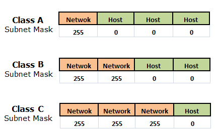

    - **Classe A: 255.0.0.0,** poche reti, di grandissime dimensioni (128 diverse reti, con circa 17 milioni di host ognuna)

    - **Classe B: 255.255.0.0** Organizzazioni di medie dimensioni (16384 diverse reti, con 65536 host ognuna)

    - **Classe C: 255.255.255.0** Reti di piccole dimensioni, tipicamente la maschera della rete locale (circa 2 milioni di diverse reti, con 256 host ognuna)

    Vediamo degli esempi:
    >
    **Classe A**- con maschera di rete **255**.0.0.0, solo il primo numero identifica la rete, tutti gli host che condividono quel primo numero fanno parte della stessa rete.

    - Gli indirizzi IP **100**.1.2.3 e **100**.5.145.25 **sono** nella stessa rete perché condividono lo stesso primo numero

    - Gli indirizzi IP **95**.5.145.25 e **100**.5.145.25 **non sono** nella stessa rete perché non condividono lo stesso primo numero

    **Classe B**- con maschera di rete **255.255**.0.0, i primi due numeri identificano la rete, tutti gli altri host fanno parte della stessa rete.

    - Gli indirizzi IP **145.5**.1.195 e **145.5.**145.25 **sono** sulla stessa rete perché condividono gli stessi primi due numeri.

    - Gli indirizzi IP **145.1**.2.3 e **145.5.**145.25 **non sono** nella stessa rete perché **non** condividono gli stessi primi due numeri.

    **Classe C**- con maschera di rete **255.255.255**.0, i primi tre numeri identificano la rete, tutti gli altri host fanno parte della stessa rete. È la classica maschera di rete delle reti locali.

    - Gli indirizzi IP **192.168.0**.195 e **192.168.0**.25 **sono** sulla stessa rete perché condividono gli stessi primi due numeri.

    - Gli indirizzi IP **192.168.0**.195 e **192.168.1**.25 **non sono** nella stessa rete perché **non** condividono gli stessi primi due numeri.

    **Approfondimento: le subnet mask**

    Il concetto di classi di indirizzi IP è stato superato perché poco flessibile ed efficiente nella gestione delle reti.  
    Se ad esempio io avessi bisogno di due reti da 100 host, dovrei *'sprecare'* due reti di classe C, ognuna delle quali può tenere 256 host. Perdo l'assegnazione di quasi 300host.

    Tramite subnet mask possiamo dividere ulteriormente una rete di classe C in due reti più piccole.

    Non vedremo i dettagli, lascio un ottimo video di approfondimento

    [**<u>Subnet Mask - Explained</u>**](https://www.youtube.com/watch?v=s_Ntt6eTn94)

!!! abstract "Definizione"
    ###### Importante - Come IPv4 risparmia indirizzi IP

    Come abbiamo visto, con IPv4 abbiamo alpiù 4,3 miliardi di indirizzi IP. Se contassimo tutti i dispositivi (PC, smartphone, tablet, televisori, ecc..) connessi alla rete si arriverebbe facilmente a molto più di 4 miliardi.
    >
    **Non possiamo permetterci di assegnare un indirizzo IP pubblico univoco ad ogni dispositivo.**
    >
    **Indirizzi IP privati e indirizzi IP pubblici**
    >
    Invece di assegnare un indirizzo IP pubblico ad ogni dispositivo, assegniamo un <u>unico indirizzo IP pubblico all'intera rete locale.  
    </u>All'interno della rete locale ogni dispositivo avrà un suo indirizzo **IP privato**, ma tutti i dispositivi nella rete locale condividono lo stesso **IP pubblico.**
    >
    Sarà il [<u>router</u>](#router), tramite NAT (Network Address Translation) a fare la traduzione tra IP privato e IP pubblico.
    >
    **Risorsa video:  
    **Video che, con ottima animazione, spiega bene le differenze tra l'indirizzo IP di un dispositivo sulla rete locale (**indirizzo privato**) e l'indirizzo IP del dispositivo sulla rete internet (**indirizzo pubblico**)**  
    **[<u>Public vs Private IP Address</u>](https://www.youtube.com/watch?v=po8ZFG0Xc4Q&ab_channel=PowerCertAnimatedVideos)

##### Accesso alla rete

!!! abstract "Definizione"
    Il livello **accesso alla rete,** noto anche come livello fisico o collegamento dati, è quello in cui avviene la trasmissione dei dati vera e propria.

    A questo livello troviamo i protocolli di trasmissione dati delle diverse tecnologie.

Vediamo in un elenco puntato, senza approfondimento, alcuni dei protocolli:

- **Ethernet:** è il protocollo più diffuso nelle reti locali, per estensione il cavo utilizzato nelle trasmissioni con protocollo Ethernet viene chiamato cavo Ethernet.

- **Wi-Fi:** più precisamente IEEE 802.11 seguito da diverse lettere in base alla versione utilizzata. Protocollo di trasmissione wireless su brevi distanze

- **ATM** (Asynchronous Transfer Mode): tecnologia di rete che organizza i dati digitali in pacchetti di dimensioni fisse chiamate celle e trasmette su reti a banda larga.

### 7.3. Domande di comprensione

#### Domande a crocette

**1. Cosa si intende per "protocollo di comunicazione" in una rete?**

A\) Il tipo di cavo utilizzato per collegare i computer.
>
B\) La velocità massima di connessione a Internet.
>
C\) Un insieme di regole formali che definiscono come due o più dispositivi devono comunicare tra loro.
>
D\) Il software antivirus installato sui computer.

**2. Qual è uno dei vantaggi principali nel dividere i dati da inviare in rete in pacchetti più piccoli?**

A\) Aumentare la sicurezza fisica della rete.
>
B\) Permettere più comunicazioni contemporanee
>
C\) Ridurre il numero di indirizzi IP necessari.
>
D\) Evitare l'uso del protocollo TCP.

**3. Il modello TCP/IP, lo standard più usato su Internet, organizza la comunicazione in:**

A\) 7 livelli ben distinti, come il modello teorico ISO/OSI.
>
B\) Un unico livello che gestisce tutta la comunicazione.
>
C\) 2 livelli: uno per l'invio e uno per la ricezione.
>
D\) 4 livelli principali (Applicazione, Trasporto, Internet, Accesso alla rete) che collaborano in sequenza.

**4. Quale livello del modello TCP/IP si occupa di prendere i dati dall'applicazione (es. browser o email) e dividerli in segmenti più piccoli, aggiungendo informazioni per la gestione della trasmissione (come le porte)?**

A\) Livello Internet
>
B\) Livello Accesso alla rete
>
C\) Livello Trasporto
>
D\) Livello Applicazione

**5. Qual è la differenza fondamentale nel modo di operare tra il protocollo TCP e il protocollo UDP?**

A\) TCP è usato per connessioni wireless, UDP per quelle via cavo.
>
B\) UDP è più veloce ma non garantisce che tutti i dati arrivino correttamente e in ordine, mentre TCP è più lento ma affidabile perché controlla gli errori e l'ordine dei pacchetti.
>
C\) TCP usa indirizzi IPv6, UDP usa indirizzi IPv4.
>
D\) UDP serve per inviare file di grandi dimensioni, TCP solo per messaggi brevi.

**6. In quale situazione è generalmente preferibile usare il protocollo UDP invece di TCP?**

A\) Per scaricare un file importante da un sito web, dove ogni singolo bit deve essere corretto.
>
B\) Per inviare una email, assicurandosi che il testo arrivi completo.
>
C\) Per una videochiamata o lo streaming live, dove la velocità e la tempestività sono più importanti della garanzia assoluta che ogni singolo pacchetto arrivi.
>
D\) Per la connessione a un database aziendale.

**7. Il livello Internet del modello TCP/IP ha come compito principale:**

A\) Gestire la connessione fisica (cavi, Wi-Fi).
>
B\) Assicurarsi che i pacchetti arrivino senza errori e nel giusto ordine.
>
C\) Aggiungere l'indirizzo IP del destinatario ai dati per permettere l'instradamento dei pacchetti attraverso le reti.
>
D\) Fornire l'interfaccia per le applicazioni utente come i browser.

**8. Quale delle seguenti affermazioni riguardo agli indirizzi IPv4 è corretta?**

A\) Ogni dispositivo connesso a Internet ha un indirizzo IPv4 pubblico univoco a livello mondiale.
>
B\) Gli indirizzi IPv4 sono esauriti, quindi non vengono più utilizzati su Internet.
>
C\) L'uso di indirizzi IP privati all'interno delle reti locali (LAN) e del NAT aiuta a risparmiare indirizzi IPv4 pubblici.
>
D\) Un indirizzo IPv4 è composto da 8 gruppi di cifre esadecimali.

**9. Cosa identifica la "maschera di rete" (es. 255.255.255.0) in un indirizzo IPv4?**

A\) Il tipo di dispositivo (PC, smartphone, stampante) che si connette alla rete.
>
B\) La tipologia di porta fisica che il dispositivo offre per connettersi alla rete. Può prevedere uno o più connettori nella stessa scheda.
>
C\) Quale parte dell'indirizzo IP identifica la rete e quale parte identifica l'host all'interno di quella rete.
>
D\) Lo schema utilizzato dalle aziende produttrici per generare un indirizzo MA.

**10. Quale dei seguenti protocolli opera tipicamente al livello Applicazione del modello TCP/IP?**

A\) TCP
>
B\) HTTP.
>
C\) IP
>
D\) Ethernet

#### Domande Vero/Falso

1.  Un protocollo di comunicazione è semplicemente il tipo di cavo usato per connettere due computer. **V/F**

2.  Il modello ISO/OSI è quello effettivamente utilizzato oggi per tutte le comunicazioni su Internet, mentre TCP/IP è solo un modello teorico. **V/F**

3.  Dividere i dati in pacchetti permette di inviare più cose contemporaneamente sulla stessa linea e, in caso di errore, di ritrasmettere solo il pacchetto sbagliato. **V/F**

4.  Quando si inviano dati, il livello Applicazione del modello TCP/IP è l'ultimo ad essere eseguito, subito prima che i dati partano sul cavo o via Wi-Fi. **V/F**

5.  Il protocollo UDP è preferibile a TCP quando è fondamentale che tutti i dati arrivino a destinazione senza errori e nello stesso ordine in cui sono partiti. **V/F**

6.  Le "porte di rete" (numeri come 80 per HTTP o 443 per HTTPS) aiutano il computer a capire a quale specifica applicazione (tra le tante in esecuzione) sono destinati i dati ricevuti. **V/F**

7.  Il livello Internet del modello TCP/IP si occupa di aggiungere l'indirizzo MAC del mittente e del destinatario ai pacchetti. **V/F**

8.  Gli indirizzi IPv6 sono stati introdotti perché gli indirizzi IPv4 stavano finendo, e IPv6 offre un numero enormemente più grande di indirizzi possibili. **V/F**

9.  La maschera di rete serve a capire se due indirizzi IP appartengono alla stessa rete locale o a reti diverse. **V/F**

10. Il protocollo Ethernet e il protocollo Wi-Fi operano al livello Trasporto del modello TCP/IP. **V/F**

#### Domande di rielaborazione

<u>Queste domande testano la vostra conoscenza e la vostra abilità di rielaborazione in un formato discorsivo, come potrebbe essere una domanda di un'interrogazione o una traccia di un esame di stato</u>

1.  Spiega cos'è un **protocollo di comunicazione** di rete e perché è fondamentale standardizzare le regole di comunicazione. Illustra il concetto di **architettura a livelli** (stratificazione), facendo riferimento ai modelli ISO/OSI e TCP/IP e spiegando i vantaggi di tale approccio.

2.  Descrivi il ruolo e le principali differenze tra i protocolli **TCP e UDP** nel livello di Trasporto del modello TCP/IP. Spiega in quali scenari applicativi è preferibile utilizzare TCP e in quali UDP, motivando la scelta in base alle caratteristiche di affidabilità e velocità.

3.  Illustra la funzione del **livello Internet** nel modello TCP/IP, soffermandoti sul ruolo dell**'indirizzamento IP**. Spiega brevemente le differenze tra IPv4 e IPv6 e perché si è reso necessario il passaggio a IPv6.

4.  Spiega il concetto di **suddivisione dei dati in pacchetti per la trasmissione in rete**. Quali sono i principali vantaggi derivanti da questa suddivisione rispetto all'invio di dati in un blocco unico?

5.  Descrivi le **funzioni principali svolte dai 4 livelli del modello TCP/IP (Applicazione, Trasporto, Internet, Accesso alla rete)** durante il processo di invio e ricezione di dati. Fornisci almeno un esempio di protocollo per ciascun livello (escluso Accesso alla rete).

**Risposte corrette. Evidenziare con il mouse per vedere le risposte**

**Crocette**

**1**. C **2**. B **3**. D **4**. C **5**. B **6**. C **7**. C **8**. C **9**. C **10**. B

**Vero/Falso:**

1.  **Falso** (Un protocollo è un insieme di regole per la comunicazione ).

2.  **Falso** (È il contrario: TCP/IP è lo standard de facto di Internet, ISO/OSI è il modello di riferimento teorico ).

3.  **Vero**.

4.  **Falso** (Il livello Applicazione è il primo quando si inviano dati; l'ultimo è Accesso alla rete).

5.  **Falso** (È TCP che garantisce affidabilità e ordine; UDP è veloce ma senza garanzie).

6.  **Vero**.

7.  **Falso** (Il livello Internet aggiunge gli indirizzi IP; gli indirizzi MAC sono usati a livelli più bassi, tipicamente nel livello Accesso alla rete per la consegna nella LAN).

8.  **Vero**.

9.  **Vero**.

10. **Falso** (Operano al livello Accesso alla rete, che gestisce la trasmissione fisica).
